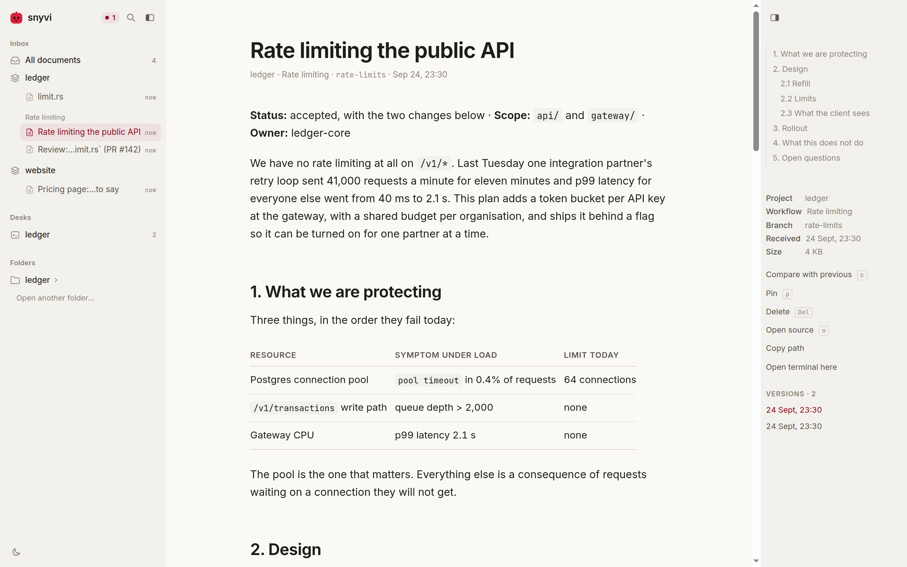

<p align="center">
  
</p>

<h1 align="center">snyvi</h1>

<p align="center">A fast, beautiful viewer for the documents your agents produce, with real shells beside them.</p>

<p align="center">
  <a href="https://github.com/snymrova/snyvi/releases/latest"></a>
  <a href="https://github.com/snymrova/snyvi/actions/workflows/ci.yml"></a>
  
  <a href="LICENSE"></a>
</p>

<!-- The film is docs/media/demo.mp4, cut in film/ -- see film/README.md.
     GitHub plays a video inline only from a user-attachments URL, so after a
     re-cut the file is dropped into a comment box once and the link it gives
     replaces this one. -->

https://github.com/user-attachments/assets/21f7e4b9-f2e6-441a-975c-c876504ed583

<p align="center">
  <picture>
    <source media="(prefers-color-scheme: dark)" srcset="docs/media/plan-dark.webp">
    
  </picture>
</p>

Ask Claude Code (or any agent) for a plan, and it opens in snyvi:
rendered, searchable, and filed under its project. Markdown, diagrams and
source code. Read a folder as it is on disk, and — in the desktop window —
open a **desk** on it: up to four real shell panes, rooted at that folder, so
the terminal you would have answered the plan in is in the window that holds
the plan. Everything stays on your machine.

## Install

**Windows**: download [`snyvi-windows-x64-setup.exe`][win] and double-click
it. That's it: it connects Claude Code (if you have it) and opens snyvi.
(Windows warns that the installer isn't signed: *More info* → *Run anyway*.)

**macOS**:

```
brew install --cask snymrova/snyvi/snyvi
snyvi init-claude --auto
```

Without Homebrew, download [Apple silicon][mac-arm] or [Intel][mac-x64].

**Debian / Ubuntu**: download [`snyvi-linux-x64.deb`][deb-x64]
([arm64][deb-arm]), then:

```
sudo dpkg -i snyvi*.deb
snyvi init-claude --auto
```

**Any other Linux**: [`snyvi-linux-x64.tar.gz`][tgz-x64]
([arm64][tgz-arm]) — one static binary, nothing to install.

Every file above is on the [latest release][rel] with a `.sha256` beside it.
`cargo install snyvi` and the native window on Linux: see the
[install guide](docs/GUIDE.md#install).

[win]: https://github.com/snymrova/snyvi/releases/latest/download/snyvi-windows-x64-setup.exe
[mac-arm]: https://github.com/snymrova/snyvi/releases/latest/download/snyvi-macos-arm64.tar.gz
[mac-x64]: https://github.com/snymrova/snyvi/releases/latest/download/snyvi-macos-x64.tar.gz
[deb-x64]: https://github.com/snymrova/snyvi/releases/latest/download/snyvi-linux-x64.deb
[deb-arm]: https://github.com/snymrova/snyvi/releases/latest/download/snyvi-linux-arm64.deb
[tgz-x64]: https://github.com/snymrova/snyvi/releases/latest/download/snyvi-linux-x64.tar.gz
[tgz-arm]: https://github.com/snymrova/snyvi/releases/latest/download/snyvi-linux-arm64.tar.gz
[rel]: https://github.com/snymrova/snyvi/releases/latest

## Use it

In Claude Code, ask for a plan. It opens in snyvi by itself.

`init-claude --auto` sends every Markdown file Claude writes. Leave out
`--auto` and Claude sends only when it decides to, or when you ask.

Other agents are one command each:

```
snyvi init codex       # also: cursor, claude-desktop, gemini, windsurf, vscode, zed
```

From a terminal:

```
snyvi send PLAN.md     # open a file (or stdin) and print its link
snyvi watch PLAN.md    # and again every time it is saved
snyvi app              # open the viewer
snyvi status           # what is running and what is connected
```

In the viewer: `⌘K` / `Ctrl+K` searches everything, `n` opens the next new
document, `c` shows what changed since the last version, `/` searches inside
the one you are reading, `?` lists every key.

**Desks.** Open a folder, then its `+` — or right-click it, or ask the palette
for *New desk here* — and the folder becomes a desk: a named workspace of up
to four shell panes in the same window as the documents. Eight panes in total,
2 MB of scrollback each. The layout survives a restart and the processes do
not. Desks need the desktop window, because a browser tab cannot be allowed to
start a process on your machine; a tab says so where the desks would be.
[How it works](docs/DESK.md).

## Update and remove

Install the new version over the old one. On Linux, run `snyvi restart`
afterwards; on macOS use `brew upgrade`; the Windows installer handles it.
To remove snyvi: `snyvi uninstall-claude`, then uninstall it the way you
installed it. Your documents are kept until you run `snyvi reset`.

## More

- [Guide](docs/GUIDE.md): every platform, command, agent and key.
- [Desks](docs/DESK.md): the model, the caps, and what a browser tab is kept out of.
- [Roadmap](docs/ROADMAP.md): what shipped, and why.
- Fast: a send takes about 13 ms, and `snyvi bench --check` holds every number
  to a budget on every push ([numbers](docs/GUIDE.md#measured-so-far)).

MIT licensed.
