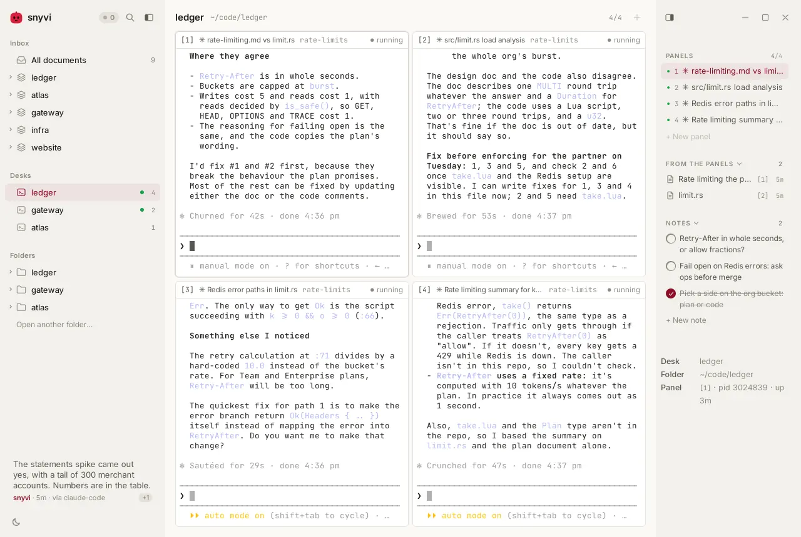
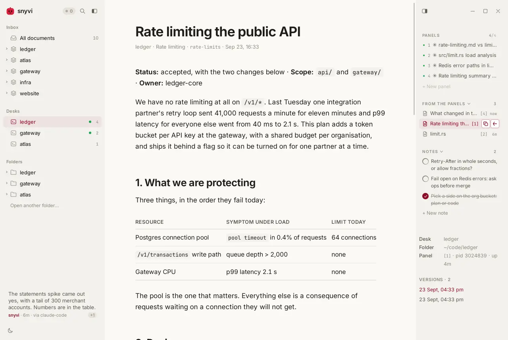
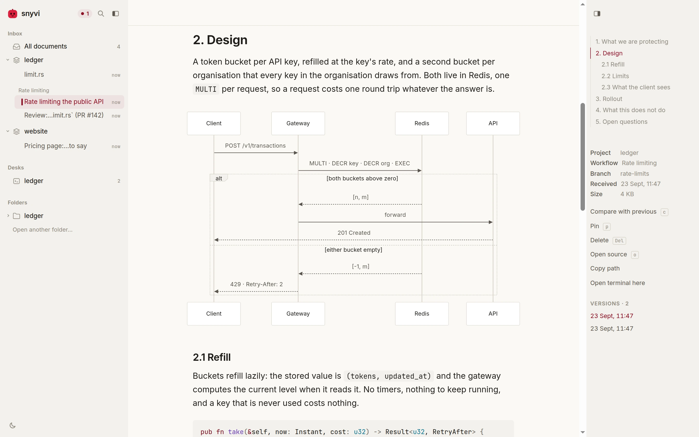
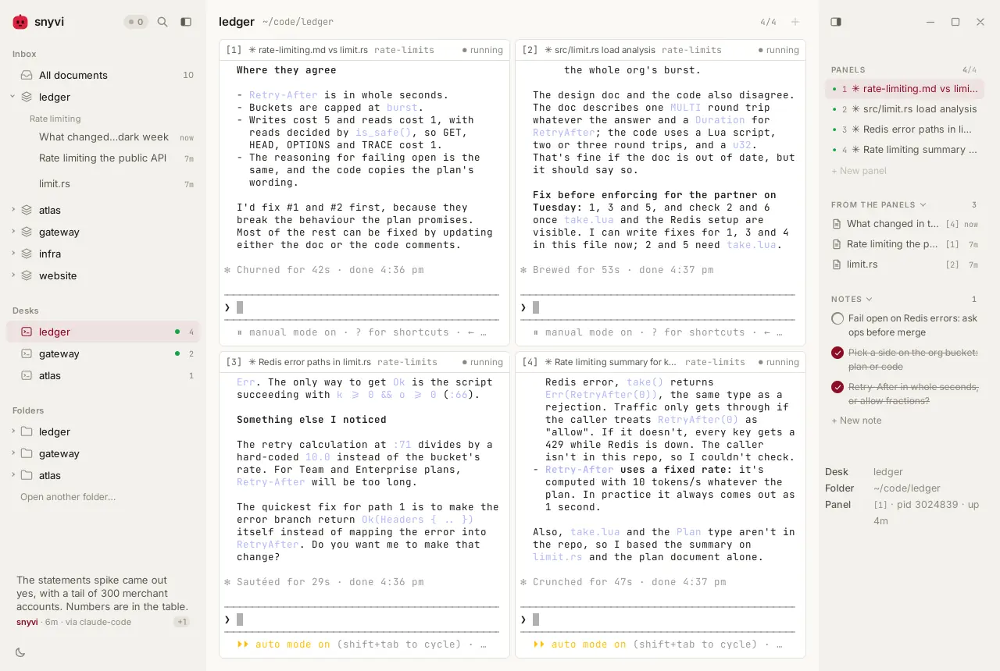
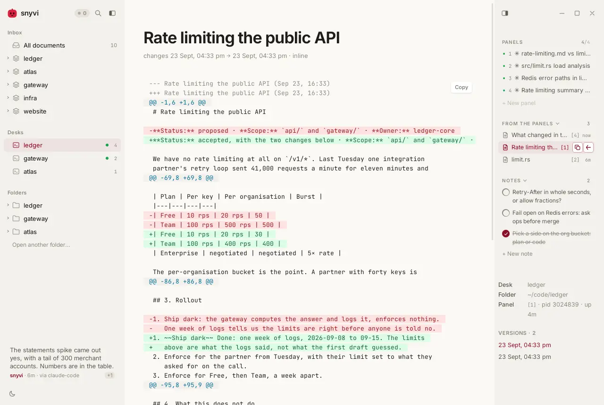
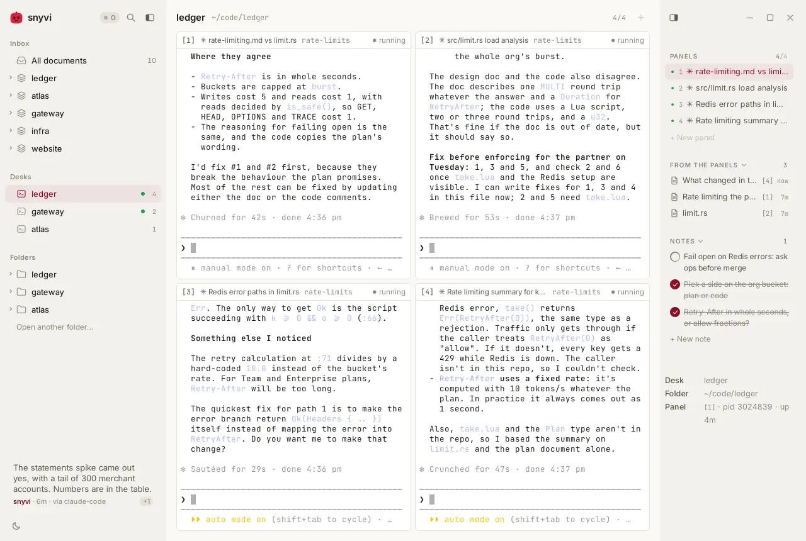
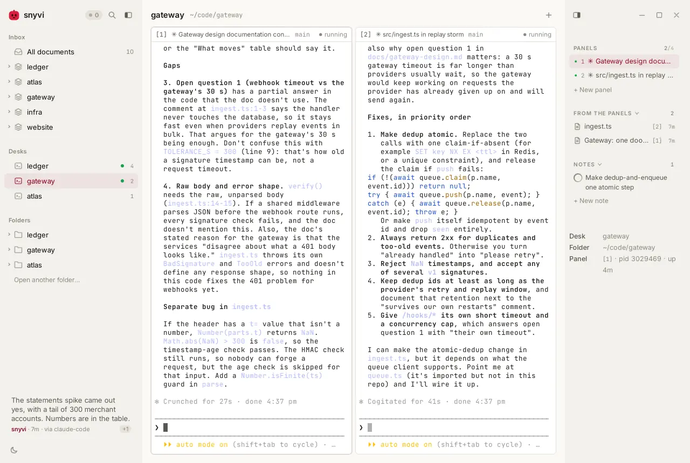
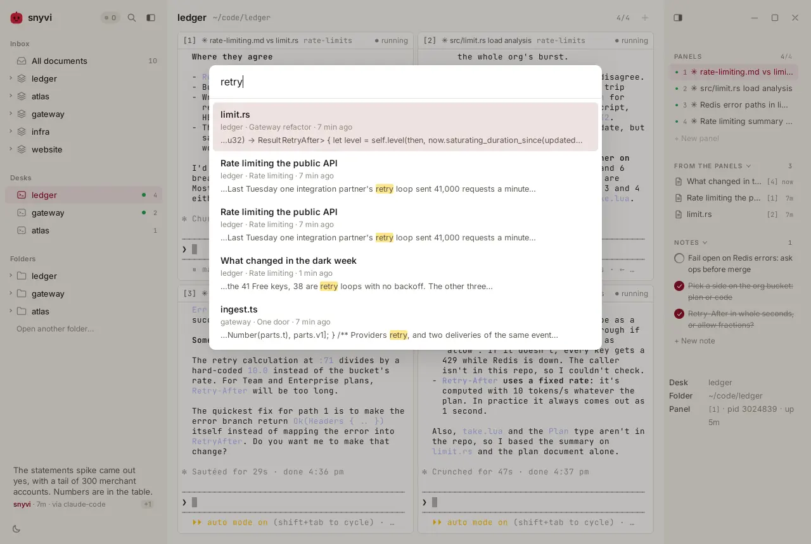
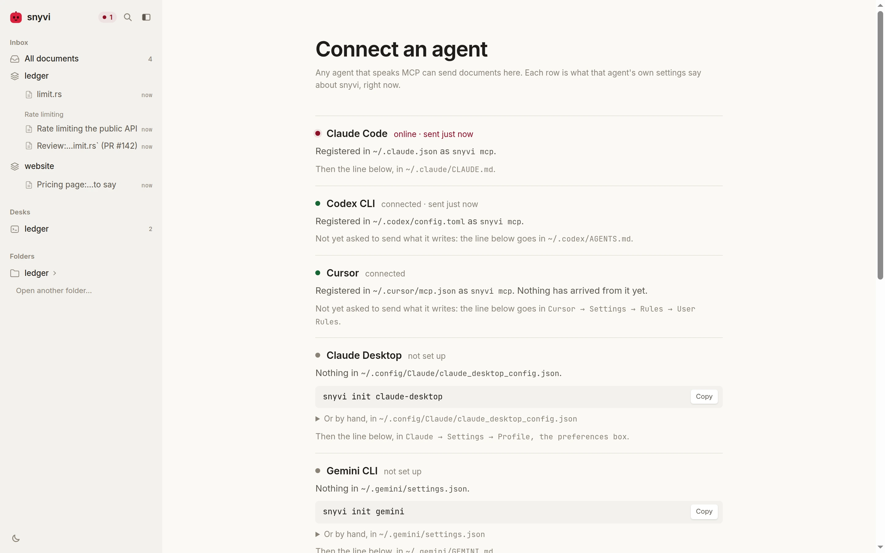

<p align="center">
  
</p>

<h1 align="center">snyvi</h1>

<p align="center"><b>All your passion projects, in one calm place.</b></p>

<p align="center">
  <a href="https://github.com/snymrova/snyvi/releases/latest"></a>
  <a href="https://github.com/snymrova/snyvi/actions/workflows/ci.yml"></a>
  
  <a href="LICENSE"></a>
</p>

<!-- The film is docs/media/demo.mp4, cut in film/ -- see film/README.md.
     GitHub plays a video inline only from a user-attachments URL, so after a
     re-cut the file is dropped into a comment box once and the link it gives
     replaces this one.

     The desk pictures below (desk, over, filed, versions, notes, switch,
     palette) are the film's own frames: film/shoot.mjs, live Claude Code in
     every panel. The rest are bench/media.mjs. -->

https://github.com/user-attachments/assets/fb6ee0de-a5ce-437c-b2a3-d354081ca727

<p align="center">
  <picture>
    <source media="(prefers-color-scheme: dark)" srcset="docs/media/desk-dark.webp">
    
  </picture>
</p>

You have more passion projects than hours in the day. And now, with coding
agents, you can finally build them all, at the same time.

But the work scatters. Plans get lost in terminal scrollback. What's left to
do lives in your head. And every project pulls you away from the last.

snyvi keeps it all in order. It is a desktop app with **one desk for each
project** — its folder, and up to four agents side by side, each in its own
panel — and everything your agents write, kept where you can read it:
rendered, filed under its project, and searchable with everything else that
ever arrived.

One small app, on your own machine. Nothing to configure, nothing to sign in
to, and nothing leaves your computer.

## Install

**Windows**: download [`snyvi-windows-x64-setup.exe`][win] and double-click
it. That's it: it connects Claude Code (if you have it) and opens snyvi.
(Windows warns that the installer isn't signed: *More info* → *Run anyway*.)

**macOS**:

```
brew install --cask snymrova/snyvi/snyvi
snyvi init-claude --auto
```

Without Homebrew, download [Apple silicon][mac-arm] or [Intel][mac-x64].

**Debian / Ubuntu** (most Linux desktops — Intel or AMD, so `x64`):

```
curl -LO https://github.com/snymrova/snyvi/releases/latest/download/snyvi-linux-x64.deb
curl -LO https://github.com/snymrova/snyvi/releases/latest/download/snyvi-app-linux-x64.deb

sudo dpkg -i snyvi-linux-x64.deb            # snyvi itself: the daemon, the CLI, the MCP server
sudo apt install -y ./snyvi-app-linux-x64.deb   # the window, which desks need — apt, so webkit resolves
snyvi init-claude --auto
snyvi app
```

On an ARM machine — a Raspberry Pi, an ARM server — swap `x64` for `arm64` in
both file names. `uname -m` tells you which you are on: `x86_64` is `x64`,
`aarch64` is `arm64`.

The second package is the one to notice. **snyvi runs in your browser without
it, and desks do not run at all** — a browser tab is not allowed to start a
process on your machine, so the panels are refused there and the sidebar says
so. It is about 4 MB, it is the only piece that links a browser engine, and
it adds to snyvi rather than replacing it.

**Any other Linux**: [`snyvi-linux-x64.tar.gz`][tgz-x64]
([arm64][tgz-arm]) — one static binary, nothing to install. The window is
[`snyvi-app-linux-x64.deb`][app-x64] ([arm64][app-arm]) on a Debian-based
system, or built from source elsewhere.

Every file above is on the [latest release][rel] with a `.sha256` beside it.
`cargo install snyvi` and building the window yourself: see the
[install guide](docs/GUIDE.md#install).

[win]: https://github.com/snymrova/snyvi/releases/latest/download/snyvi-windows-x64-setup.exe
[mac-arm]: https://github.com/snymrova/snyvi/releases/latest/download/snyvi-macos-arm64.tar.gz
[mac-x64]: https://github.com/snymrova/snyvi/releases/latest/download/snyvi-macos-x64.tar.gz
[deb-x64]: https://github.com/snymrova/snyvi/releases/latest/download/snyvi-linux-x64.deb
[deb-arm]: https://github.com/snymrova/snyvi/releases/latest/download/snyvi-linux-arm64.deb
[tgz-x64]: https://github.com/snymrova/snyvi/releases/latest/download/snyvi-linux-x64.tar.gz
[tgz-arm]: https://github.com/snymrova/snyvi/releases/latest/download/snyvi-linux-arm64.tar.gz
[app-x64]: https://github.com/snymrova/snyvi/releases/latest/download/snyvi-app-linux-x64.deb
[app-arm]: https://github.com/snymrova/snyvi/releases/latest/download/snyvi-app-linux-arm64.deb
[rel]: https://github.com/snymrova/snyvi/releases/latest

## A desk for each project

A **desk** is a project's folder with real shells in it: up to four panels in
a fixed grid, rooted where the work is, in the same window as everything the
work produces. Open a folder and press its `+`, right-click it, or ask the
palette for *New desk here*.

A panel is a shell, so it runs what a shell runs: Claude Code, Codex, the
tests the plan asks for, a `git log`. The picture above is four Claude Code
sessions on one project, each on its own part of it, with the rail beside them
listing who is working and what they have sent.

Nothing a document contains is ever typed into a panel. There is no "run this
block" and no fan-out to four shells: the shells are yours, and what an agent
wrote reaches them only when you type it. Desks need the desktop window,
because a browser tab cannot be allowed to start a process on your machine;
a tab says so where the desks would be. [How it works](docs/DESK.md).

## Nothing scrolls away

When an agent writes a plan or a review, it doesn't vanish up the terminal.
It lands on the desk under **Documents**, marked with the panel that
wrote it, and opens as a clean page over the desk — the agents still listed
beside it, still working.

<p align="center">
  <picture>
    <source media="(prefers-color-scheme: dark)" srcset="docs/media/over-dark.webp">
    
  </picture>
  <br><em>A plan from panel 1, open over the desk it came from.</em>
</p>

A document arrives and nothing moves. It joins a queue — a row in the
sidebar, a mark in the tree, a count in the bar above what you are reading —
and `n` opens the next one when you are ready for it.

Markdown, tables, Mermaid diagrams, and source in eighty-odd languages, each
rendered once on receipt and served already made. A diagram is its own
viewport: ⌘/Ctrl + scroll zooms toward the cursor, a drag pans, `f` fills the
screen and `0` fits it back. Code arrives highlighted, with its functions and
types in the rail.

<p align="center">
  <picture>
    <source media="(prefers-color-scheme: dark)" srcset="docs/media/diagram-dark.webp">
    
  </picture>
  <br><em>Diagrams draw themselves, in the page's own colours.</em>
</p>

## Filed, and kept

Every document files itself by project, in one inbox, without being asked:

```
Project      the sender's working directory, by its git root
└── Workflow   one agent session, named after the first document it sent
    └── Document   immutable, rendered once, kept with every other version of itself
```

<p align="center">
  <picture>
    <source media="(prefers-color-scheme: dark)" srcset="docs/media/filed-dark.webp">
    
  </picture>
  <br><em>ledger's plan, filed under ledger, beside the desk that wrote it.</em>
</p>

Documents are never edited in place. When an agent revises a plan it sends it
again, and both are kept: `c` shows exactly what changed, and every snapshot
of that file — across every session, from every agent — is listed in the rail.

<p align="center">
  <picture>
    <source media="(prefers-color-scheme: dark)" srcset="docs/media/versions-dark.webp">
    
  </picture>
  <br><em><code>c</code> shows what changed since the version before.</em>
</p>

Both names in the tree are guesses, so both can be corrected in place, and
nothing underneath moves when you do. `Del` deletes, and the row it leaves
behind offers it back for eight seconds, as does ⌘/Ctrl Z. Nothing here is
unrecoverable except `snyvi reset`, which asks you to type the number of
documents before it agrees.

A folder is a first-class thing too: `snyvi browse .`, or the row under
**Folders**, reads a directory as it is on disk — nothing copied, nothing
imported — with the same highlighting, the same outline and the same `/`.

## Out of your head

Each desk keeps its own notes, so what's left to do stays with the project,
not in your head. Add one from the rail, tick it off when it is done, and it
is still there, struck through, the next time you sit down at that desk.

<p align="center">
  <picture>
    <source media="(prefers-color-scheme: dark)" srcset="docs/media/notes-dark.webp">
    
  </picture>
  <br><em>What ledger still owes you, on ledger's desk.</em>
</p>

Agents get a line of their own as well: a **note** is 280 characters at the
foot of the sidebar, for the sentence that is not a document — *the
statements spike came out yes*.

## Just as you left it

Move between projects and each desk is exactly as you left it: its panels,
its documents, its notes. The agents on the desk you walked away from keep
working, and the sidebar's dot says so. The layout survives a restart; the
processes do not, because a daemon that respawned eight shells at login is a
daemon nobody leaves running.

<p align="center">
  <picture>
    <source media="(prefers-color-scheme: dark)" srcset="docs/media/switch-dark.webp">
    
  </picture>
  <br><em>Another project, another desk — its own agents, documents and notes.</em>
</p>

`⌘K` / `Ctrl+K` finds anything, across all of them: every document every
agent has ever sent, full text, code included. `p:project` and
`kind:md|code|diff|text` narrow it.

<p align="center">
  <picture>
    <source media="(prefers-color-scheme: dark)" srcset="docs/media/palette-dark.webp">
    
  </picture>
  <br><em>One keystroke reaches every project.</em>
</p>

## Any agent

Claude Code, Codex, Cursor, Gemini, or anything that speaks MCP: `snyvi mcp`
is a plain stdio MCP server, and each agent is one command.

```
snyvi init-claude --auto   # Claude Code, and every Markdown file it writes
snyvi init codex           # also: cursor, claude-desktop, gemini, windsurf, vscode, zed
snyvi init                 # every agent at once, and what each already has
```

Leave out `--auto` and Claude sends only when it decides to, or when you ask.
The viewer says the same thing from the inside: an empty library is a page of
agents — connected, not set up, or pointing at a binary that has moved — each
with the line that fixes it.

<p align="center">
  <picture>
    <source media="(prefers-color-scheme: dark)" srcset="docs/media/connect-dark.webp">
    
  </picture>
</p>

The channel goes one way. Agents send; snyvi shows. Nothing here can be read
back by an agent.

From a terminal, the same thing without an agent:

```
snyvi send PLAN.md     # open a file (or stdin) and print its link
snyvi watch PLAN.md    # and again every time it is saved
snyvi app              # open the window
snyvi status           # what is running and what is connected
```

## Private, and fast

One static binary and one small window, on your own machine. The daemon
listens on 127.0.0.1 only: no account, no hosted mode, no telemetry. It is up
11 ms from cold, a send takes about 13 ms, and `snyvi bench --check` fails a
push that misses any budget ([numbers](docs/GUIDE.md#measured-so-far)).

## Keys

`⌘K` / `Ctrl+K` searches everything · `n` opens the next new document · `c`
compares with the previous version · `/` finds inside what you are reading ·
`t` and `\` hide the rail and the sidebar · `?` lists every key there is.

## Update and remove

Install the new version over the old one. On Linux, run `snyvi restart`
afterwards; on macOS use `brew upgrade`; the Windows installer handles it.
To remove snyvi: `snyvi uninstall-claude`, then uninstall it the way you
installed it. Your documents are kept until you run `snyvi reset`.

## More

- [Guide](docs/GUIDE.md): every platform, command, agent and key.
- [Desks](docs/DESK.md): the model, the caps, and what a browser tab is kept out of.
- [Roadmap](docs/ROADMAP.md): what shipped, and why.
- [The film](film/README.md): how the demo above is shot, voiced and cut.

MIT licensed.
