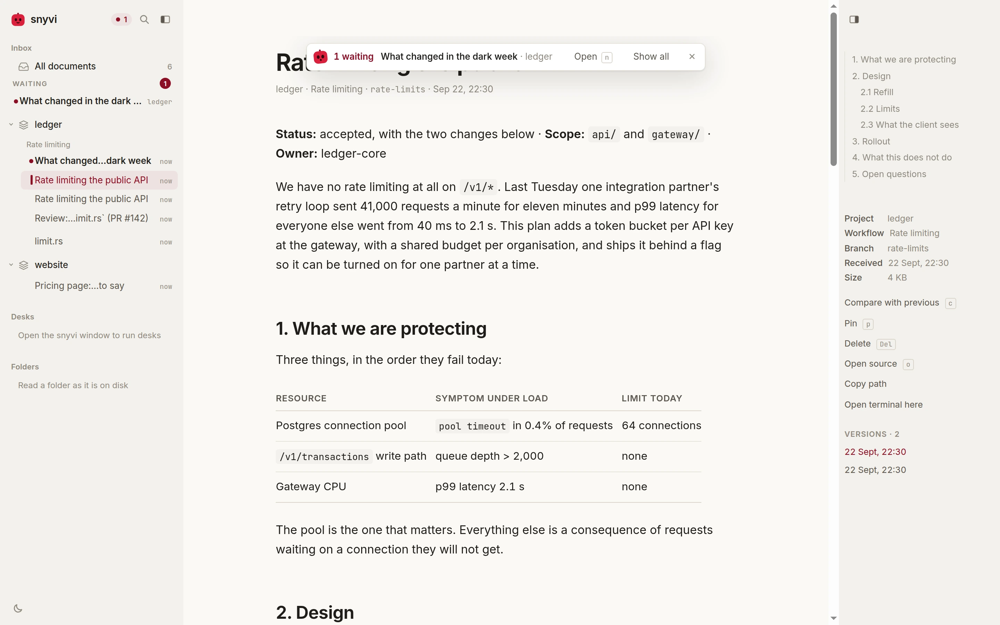
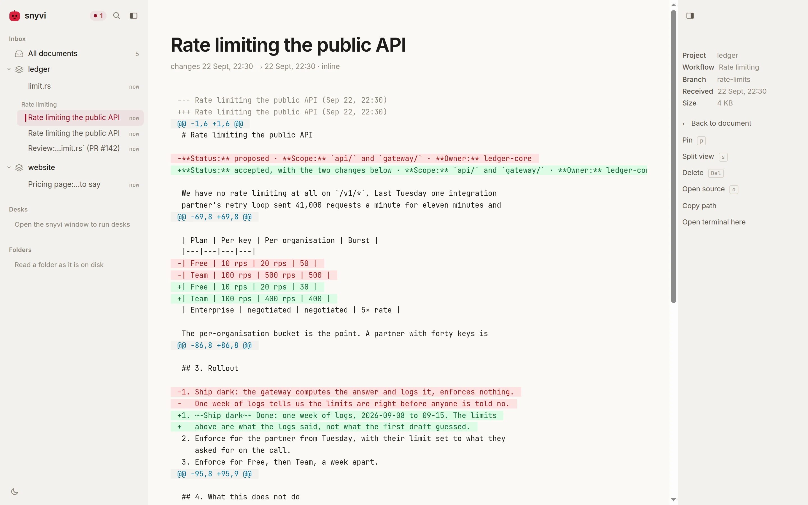
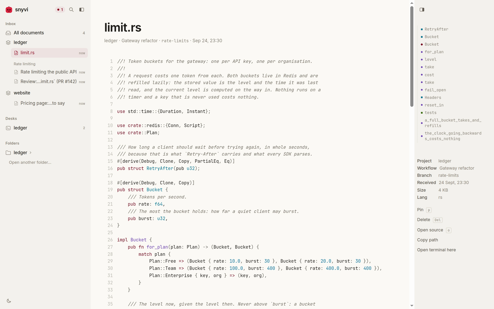
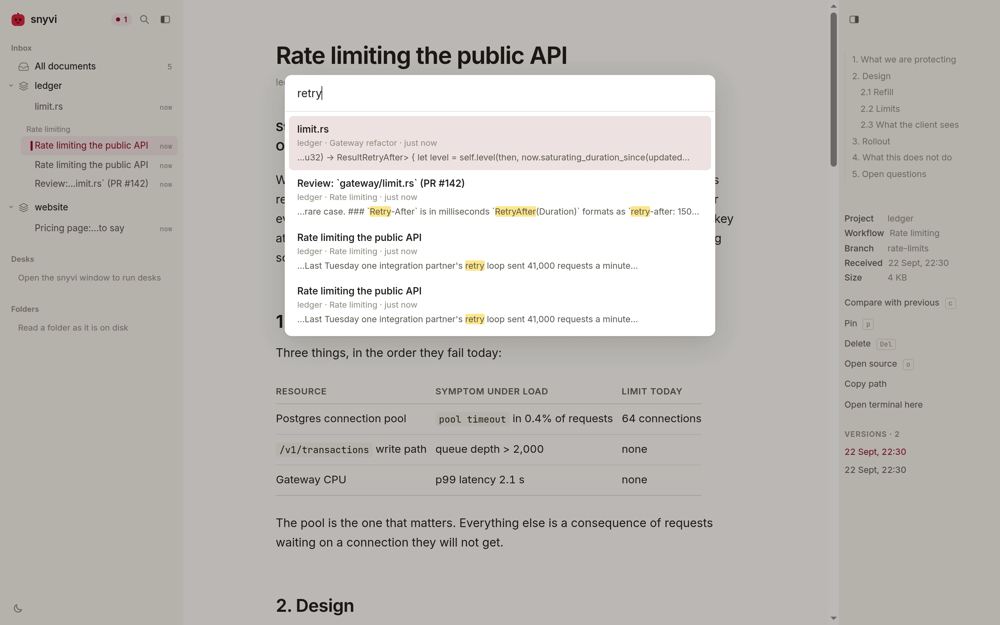

<p align="center">
  
</p>

<h1 align="center">snyvi</h1>

<p align="center">A fast, beautiful viewer for the documents your agents produce.</p>

<p align="center">
  <a href="https://github.com/snymrova/snyvi/releases/latest"></a>
  <a href="https://github.com/snymrova/snyvi/actions/workflows/ci.yml"></a>
  
  <a href="LICENSE"></a>
</p>

<!-- The film is docs/media/demo.mp4, taken by bench/media.mjs. GitHub plays a
     video inline only from a user-attachments URL, so after a re-take the file
     is dropped into a comment box once and the link it gives replaces this one. -->

https://github.com/user-attachments/assets/2c5a9345-0d1c-4b90-b1ac-c3e050f79aa8

<p align="center">
  <picture>
    <source media="(prefers-color-scheme: dark)" srcset="docs/media/plan-dark.webp">
    
  </picture>
</p>

You ask Claude Code for a plan. It writes one. With snyvi, Claude sends
the document and replies with a link; by the time you read the reply, the
plan is already open in the viewer, rendered, and filed under the project.
Markdown and every kind of source file. One direction only: agents send,
snyvi shows.

Any agent that speaks MCP can send. Claude Code, Codex, Cursor, Claude
Desktop, Gemini CLI, Windsurf, VS Code and Zed are one command each.

## Install

One static binary, no dependencies; a second, small package for a native
window if you want one. The [guide](docs/GUIDE.md#install) has every
platform at length; this is the short form.

**Debian and Ubuntu** — from the [releases page](https://github.com/snymrova/snyvi/releases/latest):

```
sudo dpkg -i snyvi_*.deb
snyvi send README.md         # starts the daemon, prints a link
snyvi init-claude            # register with Claude Code
```

**macOS** — unpack the tarball, drag `snyvi.app` into Applications, then:

```
/Applications/snyvi.app/Contents/MacOS/snyvi install-cli
snyvi send README.md
snyvi init-claude
```

**Windows** — unzip into a folder of its own, then from a terminal there:

```
.\snyvi install-cli
snyvi send README.md
snyvi init-claude
```

**Any other Linux** — `install -m 755 snyvi ~/.local/bin/snyvi`, then the same two commands.

Updating is `snyvi restart` after installing over the old one. Nothing
phones home; the daemon listens on `127.0.0.1` only.

## What it looks like

Every picture here is taken by `bench/media.mjs` from a seeded library,
so they are the current release and not a memory of one.

<table>
<tr>
<td width="50%" valign="top">
<picture>
  <source media="(prefers-color-scheme: dark)" srcset="docs/media/arrival-dark.webp">
  
</picture>
<p><b>An arrival never takes the page away.</b> It joins a queue at the top; <code>n</code> reads down the line. Unread is the daemon's, so it survives a restart.</p>
</td>
<td width="50%" valign="top">
<picture>
  <source media="(prefers-color-scheme: dark)" srcset="docs/media/diff-dark.webp">
  
</picture>
<p><b>What changed since the last version.</b> <code>c</code> compares a document with the one before it; <code>s</code> splits the view. Sends of the same file are versions, not copies.</p>
</td>
</tr>
<tr>
<td width="50%" valign="top">
<picture>
  <source media="(prefers-color-scheme: dark)" srcset="docs/media/diagram-dark.webp">
  
</picture>
<p><b>Diagrams, drawn in the page's colours.</b> Mermaid, drawn when it comes into view and kept; one over about 150 nodes is offered rather than drawn, so a page never freezes on it. <code>f</code> fills the screen with the one in view.</p>
</td>
<td width="50%" valign="top">
<picture>
  <source media="(prefers-color-scheme: dark)" srcset="docs/media/source-dark.webp">
  
</picture>
<p><b>Source files, with an outline.</b> Everything syntect ships and a dozen more, from one grammar pack; the rail lists the functions. A 10,000-line file highlights in 143 ms.</p>
</td>
</tr>
<tr>
<td width="50%" valign="top">
<picture>
  <source media="(prefers-color-scheme: dark)" srcset="docs/media/search-dark.webp">
  
</picture>
<p><b>Search across everything.</b> <code>⌘K</code> is full-text over the library, code included, with each match in its context; <code>p:</code> narrows to a project, <code>kind:</code> to a type.</p>
</td>
<td width="50%" valign="top">
<picture>
  <source media="(prefers-color-scheme: dark)" srcset="docs/media/connect-dark.webp">
  
</picture>
<p><b>Which agents are here.</b> One row per agent, read from the agent's own settings: online now, connected, or not set up, with the command that fixes it. The count beside the mark is how many are here this moment.</p>
</td>
</tr>
</table>

## How it works

`snyvi` is a daemon on `127.0.0.1:7777` with a SQLite library behind it
and a page in front. `snyvi mcp` is a stdio MCP server that exposes one
tool, `send_document`; `snyvi init <agent>` puts it in the agent's own
settings file and takes it out again on `uninstall`. A send renders the
document once, stores it under the project it came from (the git root of
the sender's working directory), and pushes it to every open page over
an event stream. Nothing is ever pulled: agents send, snyvi shows.

```
snyvi send PLAN.md                 # a file, or stdin; prints the link
snyvi watch PLAN.md                # send now, and again on every save
snyvi browse [dir]                 # read a folder from disk, nothing stored
snyvi app                          # a native window, when snyvi-app is installed
snyvi init <agent>                 # claude, codex, cursor, claude-desktop, gemini, windsurf, vscode, zed
snyvi status                       # what is running, what is registered
```

With the window up, an agent's link opens in it; without one, it opens
in a browser. On a desktop where the window is installed the link is
`snyvi://d/…`, which the desktop hands to the app.

## Keys

| Key | Action |
|---|---|
| `⌘K` | search everything |
| `n` | open the next document waiting |
| `j` / `k` | next / previous document |
| `c` | compare with the previous version |
| `/` | find in document |
| `f` | fill the screen with the diagram |
| `t` / `\` | toggle contents / sidebar |
| `p` | pin (kept by `prune`) |
| `Del` | delete (`⌘Z` undoes it) |
| `?` | all of them |

## Measured

`snyvi bench --check` fails when a number goes over its budget, and runs
on every push. These are a Linux dev box's; the
[guide](docs/GUIDE.md#measured-so-far) has the three desktops side by side.

| Case | Result | Budget |
|---|---|---|
| Binary size, `snyvi` | 12.4 MB | 15 MB |
| Daemon cold start, to first health | 11 to 14 ms | 100 ms |
| Daemon resident, three documents in | 40 MB | 60 MB |
| Send, 100 KB Markdown, round trip | 12 to 14 ms | 100 ms |
| Document page, time to first byte | 1 to 2 ms | 30 ms |
| Render Markdown, 1 MB | 108 ms | 400 ms |
| Highlight Rust, 10k lines | 143 ms | 500 ms |

The page is measured the same way: `bench/ui.mjs` drives Chromium through
every key and every view above on every push, and fails the build when
something the page should do, it does not.

## Read more

- [The guide](docs/GUIDE.md) — install on each desktop, every command,
  connecting each agent, the window, arrivals, the rail, where things live.
- [ROADMAP.md](docs/ROADMAP.md) — what shipped in each release and why,
  what is next, and what is not planned.
- [BRAINSTORM.md](docs/BRAINSTORM.md) — the reasoning behind the
  architecture and the budgets.
- [DIAGRAMS.md](docs/DIAGRAMS.md) — how a 3193 ms diagram became 66.

MIT.
