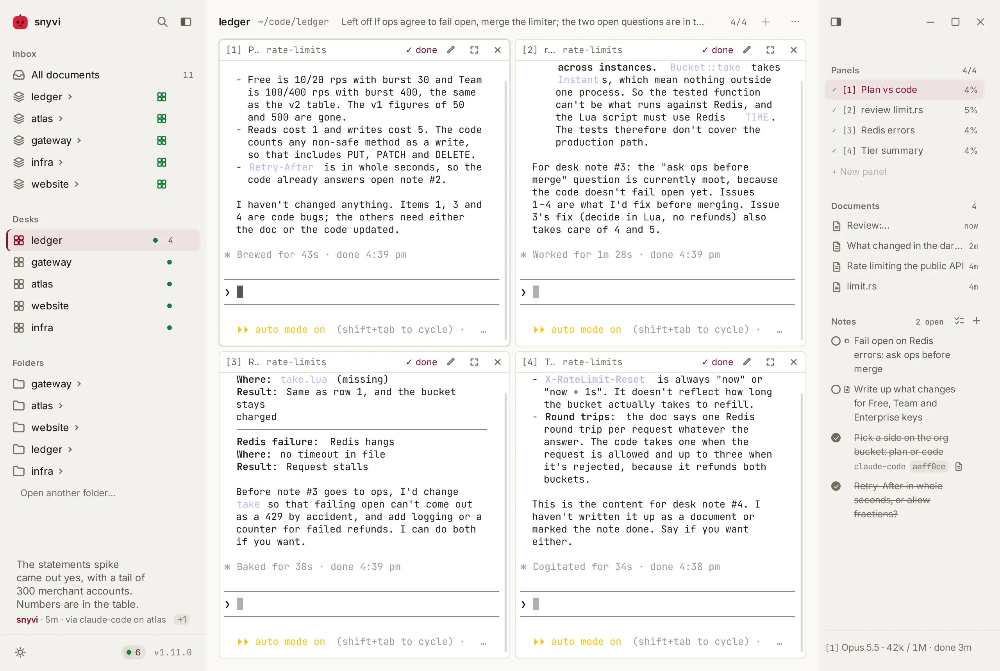
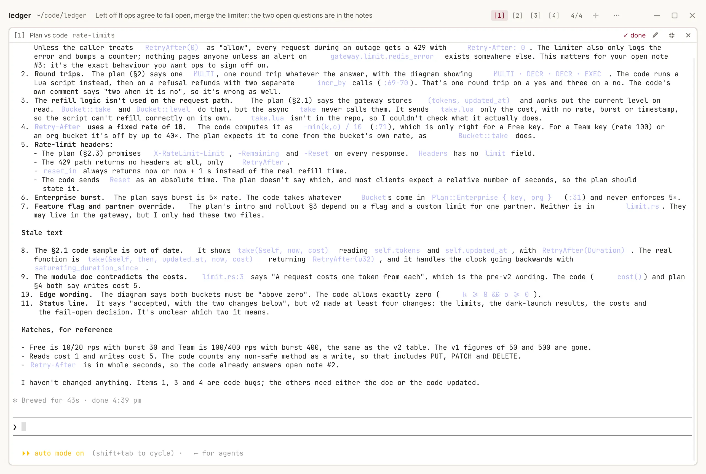
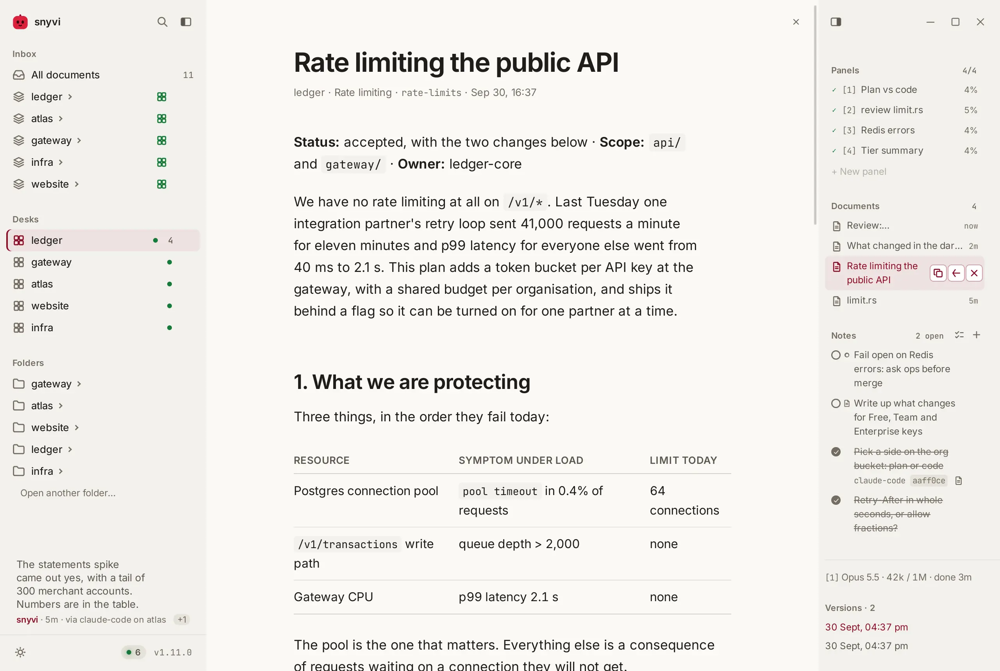
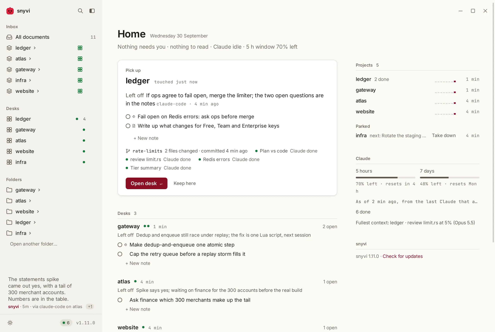
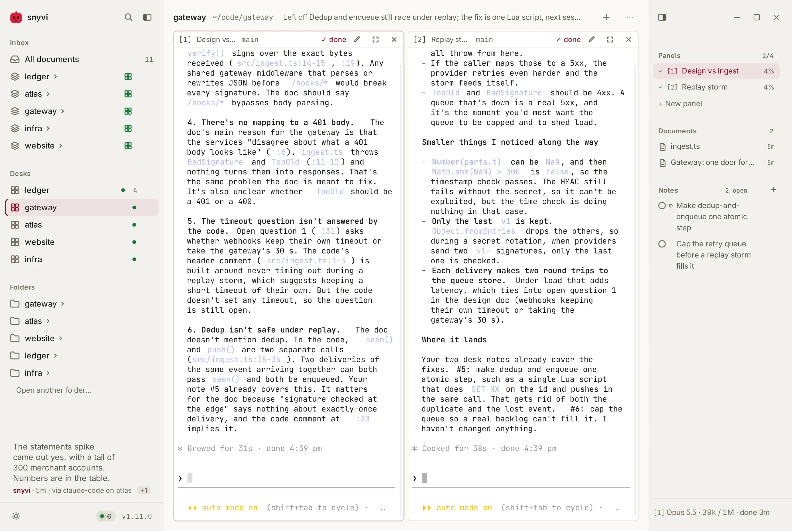
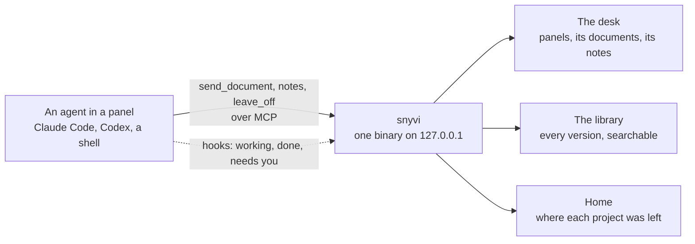
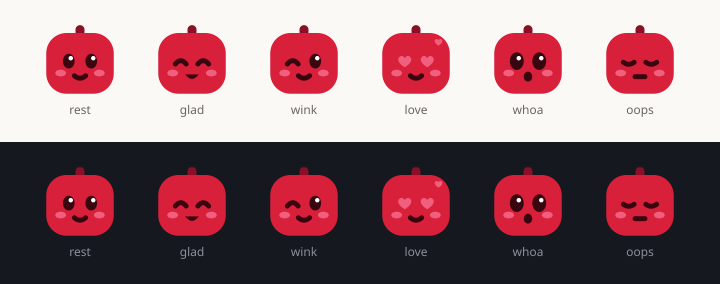

<p align="center">
  
</p>

<h1 align="center">snyvi</h1>

<p align="center"><b>All your passion projects, in one calm place.</b></p>

<p align="center">
  A desktop app where your coding agents work, one desk for each project,<br>
  and everything they write is kept as a page you can read.
</p>

<p align="center">
  <a href="https://github.com/snymrova/snyvi/releases/latest"></a>
  <a href="https://github.com/snymrova/snyvi/stargazers"></a>
  <a href="https://github.com/snymrova/snyvi/actions/workflows/ci.yml"></a>
  
  <a href="LICENSE"></a>
</p>

<p align="center">
  <a href="#install"><b>Install</b></a> &nbsp;·&nbsp;
  <a href="#one-desk-for-each-project">Tour</a> &nbsp;·&nbsp;
  <a href="#how-it-works">How it works</a> &nbsp;·&nbsp;
  <a href="docs/GUIDE.md">Guide</a> &nbsp;·&nbsp;
  <a href="#questions">Questions</a>
</p>

<!-- The film is docs/media/demo.mp4, cut in film/ -- see film/README.md.
     GitHub plays a video inline only from a user-attachments URL, so after a
     re-cut the file is dropped into a comment box once and the link it gives
     replaces this one.

     The pictures below are the film's own camera: film/shoot.mjs against the
     release binary, live Claude Code in every panel, at 2x in both themes. -->

https://github.com/user-attachments/assets/71a5b82e-3eaa-4529-9160-dbe453b6b430

You have more passion projects than hours in the day. With coding agents,
you can finally build them all, at the same time.

But the work scatters. Plans get lost in terminal scrollback. What's left to
do lives in your head. And every project pulls you away from the last.

**snyvi keeps it all in order.** One desk for each project, its agents side
by side, and everything they write kept where you can read it. It runs on
your machine, with no account and nothing to configure.

## Install

| | |
|---|---|
| **macOS** | `brew install --cask snymrova/snyvi/snyvi` |
| **Linux** | `curl -fsSL https://raw.githubusercontent.com/snymrova/snyvi/main/install.sh \| sh` |
| **Windows** | `scoop bucket add snyvi https://github.com/snymrova/scoop-snyvi` then `scoop install snyvi`, or the [installer][win] |

Then open snyvi from your apps, or run `snyvi app`. It asks what you're
working on, makes that project's first desk, and connects Claude Code from
the window. From then on it updates itself, once a day, when you're not
looking.

The one-liner works on a Mac too, with no root on Linux. It checks every
download against its checksum. [Read it first](install.sh).
`.deb`, `cargo install snyvi` and the rest are in the [install guide](docs/GUIDE.md#install).

[win]: https://github.com/snymrova/snyvi/releases/latest/download/snyvi-windows-x64-setup.exe

## One desk for each project

A project's folder with up to four real shells in it: Claude Code, Codex,
your tests, a `git log`. Every agent on the project works in view, and each
panel says whether its agent is working, done, or waiting on you.

<p align="center">
  <picture>
    <source media="(prefers-color-scheme: dark)" srcset="docs/media/desk-dark.webp">
    
  </picture>
</p>

## Room to focus

When one agent needs all of you, fold the sidebar and the rail away and give
its panel the whole window. `⌃⌥Z` puts it back in the grid. The others keep
working, and their tabs say when one needs you.

<p align="center">
  <picture>
    <source media="(prefers-color-scheme: dark)" srcset="docs/media/focus-dark.webp">
    
  </picture>
</p>

## Nothing scrolls away

Plans and reviews land on the desk that wrote them, marked with the panel
they came from, and open as clean pages. They're filed under their project
and kept with every earlier version. `c` shows what changed.

<p align="center">
  <picture>
    <source media="(prefers-color-scheme: dark)" srcset="docs/media/over-dark.webp">
    
  </picture>
</p>

## Out of your head

Each desk keeps its own notes, so what's left to do stays with the project.
The agents at that desk read them, say how far they've got, and tick one off
with the commit it went into. Home shows every desk's list and where each was
left.

<p align="center">
  <picture>
    <source media="(prefers-color-scheme: dark)" srcset="docs/media/home-dark.webp">
    
  </picture>
</p>

## Just as you left it

Switch projects and each desk is exactly as you left it. The agents you
walked away from keep working. `⌘K` searches everything any agent ever sent.

<p align="center">
  <picture>
    <source media="(prefers-color-scheme: dark)" srcset="docs/media/switch-dark.webp">
    
  </picture>
</p>

## Any agent

Claude Code, Codex, Cursor, Gemini, and anything else that speaks MCP.

```
snyvi init-claude --auto   # Claude Code
snyvi init codex           # also cursor, claude-desktop, gemini, windsurf, vscode, zed
```

## How it works


```mermaid
flowchart LR
  A["An agent in a panel<br/>Claude Code, Codex, a shell"] -- "send_document, notes, leave_off<br/>over MCP" --> D["snyvi<br/>one binary on 127.0.0.1"]
  A -. "hooks: working, done, needs you" .-> D
  D --> K["The desk<br/>panels, its documents, its notes"]
  D --> L["The library<br/>every version, searchable"]
  D --> H["Home<br/>where each project was left"]
```

snyvi runs the panels itself, so an agent in one is a real terminal session
on your machine. What the agent writes arrives over MCP, is filed by the
folder it came from, and lands on the desk of the panel that sent it. A
document sent from anywhere else lands in the inbox, under its project.

## Private, and fast

- One static binary, listening on `127.0.0.1` only.
- No account, no telemetry, and nothing leaves your machine.
- Up in 11 ms, and [every budget is checked](docs/GUIDE.md#measured-so-far) on every push.
- Updates are signed, and checked before they're applied.

## Questions

<details>
<summary><b>Is it free?</b></summary>

Yes, and open source under the MIT licence. There is no paid tier.
</details>

<details>
<summary><b>Does anything leave my machine?</b></summary>

No. snyvi listens only on `127.0.0.1`, has no account and sends no
telemetry. The one request it makes to the outside is the daily update
check, and `snyvi update off` turns that off.
</details>

<details>
<summary><b>Do I have to work in desks?</b></summary>

No. Any agent anywhere can send snyvi what it writes, and it lands in the
inbox under its project. Desks are for when you want the agents in view.
</details>

<details>
<summary><b>Windows says it "protected your PC".</b></summary>

The Windows installer isn't signed yet, so SmartScreen asks once: *More
info*, then *Run anyway*. Scoop installs without the prompt.
</details>

<details>
<summary><b>Can I use the faces?</b></summary>

The one in the corner is snyvi, and the app icon is the same drawing. It has
six faces and speaks only when spoken to. They're MIT like the rest, so use
them for anything about snyvi.

<p align="center"></p>
</details>

---

<p align="center">
  <a href="docs/GUIDE.md">Guide</a> ·
  <a href="docs/DESK.md">Desks</a> ·
  <a href="docs/ROADMAP.md">Roadmap</a> ·
  <a href="film/README.md">The film</a> ·
  MIT
</p>
