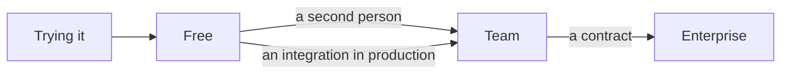

# Pricing page: what the copy needs to say

Notes from reading the current page against the three plans, before the
rewrite.

## The page today

- Three columns, but the middle one is the only one with a button. A
  reader who wants Free scrolls to the footer to find it.
- "Unlimited API calls" on Enterprise is about to become untrue when
  rate limiting ships. Say "negotiated limits" and link to the docs.
- The comparison table has 31 rows. Eleven of them are the same tick in
  all three columns.

## What each plan is for

The arrows are the copy. Each column should say what moves you to the
next one, not list what you get.

## Draft

**Free** — for one person, one project, and finding out whether it fits.
10 requests a second.

**Team** — for a product that depends on it. 100 requests a second per
key, 400 for the organisation, and someone to email.

**Enterprise** — for when the numbers above are a conversation.
