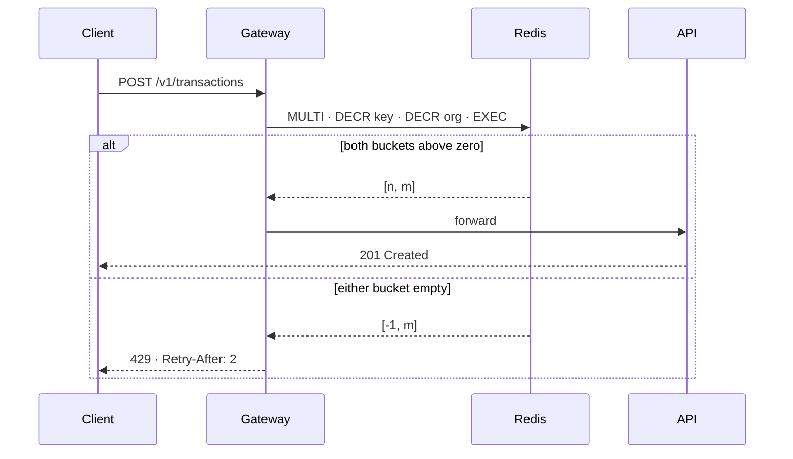

# Rate limiting the public API

**Status:** proposed · **Scope:** `api/` and `gateway/` · **Owner:** ledger-core

We have no rate limiting at all on `/v1/*`. Last Tuesday one integration
partner's retry loop sent 41,000 requests a minute for eleven minutes and
p99 latency for everyone else went from 40 ms to 2.1 s. This plan adds a
token bucket per API key at the gateway, with a shared budget per
organisation, and ships it behind a flag so it can be turned on for one
partner at a time.

## 1. What we are protecting

Three things, in the order they fail today:

| Resource | Symptom under load | Limit today |
|---|---|---|
| Postgres connection pool | `pool timeout` in 0.4% of requests | 64 connections |
| `/v1/transactions` write path | queue depth > 2,000 | none |
| Gateway CPU | p99 latency 2.1 s | none |

The pool is the one that matters. Everything else is a consequence of
requests waiting on a connection they will not get.

## 2. Design

A token bucket per API key, refilled at the key's rate, and a second
bucket per organisation that every key in the organisation draws from.
Both live in Redis, one `MULTI` per request, so a request costs one round
trip whatever the answer is.



### 2.1 Refill

Buckets refill lazily: the stored value is `(tokens, updated_at)` and the
gateway computes the current level when it reads it. No timers, nothing
to keep running, and a key that is never used costs nothing.

```rust
pub fn take(&self, now: Instant, cost: u32) -> Result<u32, RetryAfter> {
    let elapsed = now.duration_since(self.updated_at).as_secs_f64();
    let level = (self.tokens as f64 + elapsed * self.rate).min(self.burst as f64);
    if level < cost as f64 {
        let wait = (cost as f64 - level) / self.rate;
        return Err(RetryAfter(Duration::from_secs_f64(wait.ceil())));
    }
    Ok((level - cost as f64) as u32)
}
```

### 2.2 Limits

| Plan | Per key | Per organisation | Burst |
|---|---|---|---|
| Free | 10 rps | 20 rps | 50 |
| Team | 100 rps | 500 rps | 500 |
| Enterprise | negotiated | negotiated | 5× rate |

The per-organisation bucket is the point. A partner with forty keys is
still one partner; today each key looks like a separate customer.

### 2.3 What the client sees

- `429 Too Many Requests` with `Retry-After` in whole seconds.
- `X-RateLimit-Limit`, `X-RateLimit-Remaining`, `X-RateLimit-Reset` on
  every response, including the ones that were allowed, so a well-behaved
  client can pace itself before it is told to.
- The body is the same JSON error envelope as every other 4xx.

## 3. Rollout

1. Ship dark: the gateway computes the answer and logs it, enforces nothing.
   One week of logs tells us the limits are right before anyone is told no.
2. Enforce for the partner from Tuesday, with their limit set to what they
   asked for on the call.
3. Enforce for Free, then Team, a week apart.
4. Delete the flag.

## 4. What this does not do

- No per-endpoint limits. `/v1/transactions` and `/v1/health` cost the
  same token. Weighting endpoints is a follow-up once we have the logs.
- No limit on WebSocket connections; those are counted, not bucketed.
- Nothing changes for internal callers on the service mesh.

## 5. Open questions

- Should `Retry-After` be sub-second? The RFC says seconds; every SDK we
  ship rounds up anyway.
- Redis is a new hard dependency for the gateway. It already caches
  sessions there, so this is not new infrastructure, but it is the first
  time a Redis outage would turn into refused requests rather than slow
  ones. Fail open, fail closed, or fail open with an alarm?
