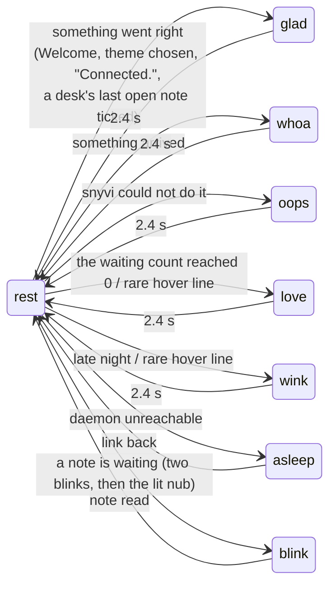
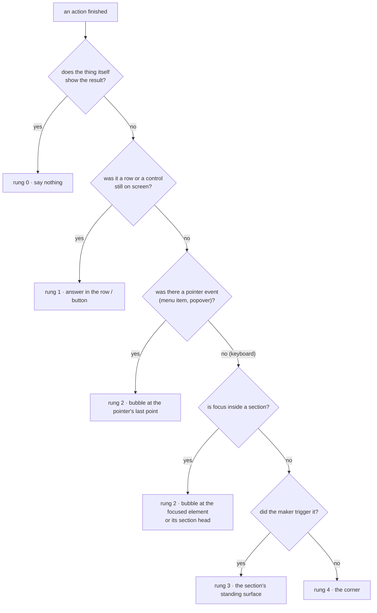
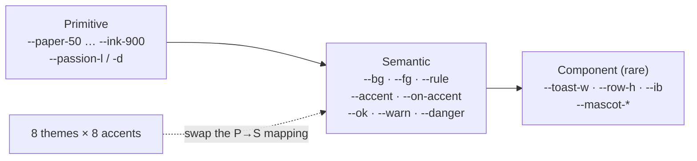

# snyvi design system

2026-09-28, written against snyvi 1.7.2 for the 1.8 branch and after. It
rests on draft 1 and its audit of every stylesheet and CSS string in `ui/`;
the whole-app audit of 1.7.1 against that draft; the hover audit; and how
Linear, Vercel Geist, Raycast, GitHub Primer, Mailchimp, Apple HIG, NN/g,
Teenage Engineering and Nothing write theirs.

**What this is for.** Every UI change is checked against this page before
it's built. It records rules the user has already set ([undo where the click
was], [row anatomy], [never delete], [never scan ~], [the passion story
leads]), turns the habits that are already consistent into rules, and names
the debt (§10) so it can be paid down on purpose. Draft 1's questions were
answered on 2026-09-28 (§11).

**How it's organised:**

1. Principles
2. Personality: the persona and the mascot
3. Voice and words
4. Feedback: *the answer appears where the question was asked*
5. The look: futuristic, minimal, techy
6. Tokens
7. Motion
8. Components
9. The workflow: checklists and enforcement
10. The debt
11. Decisions

---

## 1. Principles

Seven imperatives. When two collide, the higher one wins.

1. **Their project, not our plumbing.** Every screen answers a question
   about the maker's work. Setup, agents and updates appear only when
   they're needed, and where they're needed.
2. **The work is the hero; the chrome recedes.** Documents and panels
   get the contrast. The sidebar, rail and headers sit "a few notches
   dimmer" (Linear), and structure is felt, not seen.
3. **The answer appears where the question was asked.** Feedback lives
   at the point of action (§4). The corner is for news nobody asked for.
4. **Nothing is lost.** Remove, never delete; Undo, never "Are you sure?".
   A failure puts back what it changed and keeps what was typed. After the
   Undo window, **Removed · Show** still brings it back until prune. The
   only asks are closing a desk (it ends every panel at once) and Reset.
5. **Instant, or it's a bug.** Every interaction takes under 100 ms, and
   first paint is capped at 56 KB (`bench/bytes.mjs`). Motion is there to
   explain, never to wait on.
6. **Warm, and it only ever answers.** The personality lives in small
   moments the maker has earned. It never interrupts, never instructs,
   and never grades.
7. **Keyboard first, and every setting is a button.** Every action has a
   key or a palette entry, and focus always lands somewhere. A setting
   changes the window under your hand, not a form.

---

## 2. Personality

### 2.1 The persona: snyvi is…

Written in Aarron Walter's form ("X but not Y"). These traits define the
voice (§3) and the mascot's behaviour. Accepted as written.

| snyvi is… | …but not |
|---|---|
| **a calm workshop** | a dashboard shouting numbers |
| **warm** | cute for its own sake |
| **dry and quick** | jokey, sarcastic or "unhinged" |
| **precise, like an instrument** | cold, like a log file |
| **on your side** | a coach, a nag, or a judge |
| **quietly proud of your progress** | handing out streaks, badges or confetti |

### 2.2 The mascot

**Anatomy** (icons/icon.svg, 32 grid). A rounded-square head (rx 9) with a
nub on top, two tall oval eyes (at 11 and 21) with shine dots, pink cheeks,
and a small smile. Below 48 px it drops the shine and cheeks. Every face,
the 72 px peek included, is built from `FACES` and its parts (`EYE`, `UP`,
`SMILE`, `HEART_EYE`) in one module: `mascotHead` for the face and mark
slots, `mascotPeek` (the same, with shine and cheeks) for the peek, handed
to the chunks that show them. **Never redraw it freehand.** The expression
sheet, `docs/media/faces.svg`, is drawn from `FACES` by `bench/faces.mjs`;
the two static pages with no stylesheet (the desktop's first frame, the
daemon's 404) copy the paths and say so.

**Colour:** `--mascot` (body, set per accent) · `--mascot-nub` = `--brand` ·
`--mascot-ink` (eyes, mouth) · `--mascot-shine` (never a raw `#fff`) ·
`--heart` (blush, hearts) · `--mascot-peek` (opacity behind a card).

**Sizes.** Five slots, nothing in between (today's 21 and 23 px faces
become 22):

| Slot | Size | Where |
|---|---|---|
| mark | 20 px | the sidebar brand |
| face | 22 px | toasts, the queue bar, ⌘K's "Nothing here yet" |
| peek | 72 px, tilted | behind the aside card and the sidebar's update card (not Home's copy) |
| hero | 44 px | Welcome, the empty Inbox, the desktop's first frame (asleep), the daemon's 404 (oops) |
| icon | 16–512 | app icon, favicon (redrawn per accent) |

**The state machine.** The list of faces is closed:



`blink` is two blinks and four pulses of the nub, then the nub stays lit
for as long as the aside waits: a signal that outlives its welcome is every
mascot's failure. It is the lit nub alone under reduced motion or the quiet
switch. `love` is the waiting count
reaching 0; `n` on an empty queue gets `rest`. On an aside hover the mark
stays at rest and the peek speaks ("glad + heart" goes); the peek shows
`rest`, or `glad` for snyvi's own first asides, never a face picked by id.

Adding a face means adding it to this diagram *and* to `FACES` in
`app.js`, with a reason.

### 2.3 When the mascot appears, and when it never does

**It appears (earned moments):** empty states; first run and Welcome;
something arriving; the queue emptying; a small failure snyvi is sorry
about; the aside card; the hover line, only when you point at it;
milestones: a desk's last open note ticked, said by the mark in the
sidebar with one hop and "Notes done · 5 of 5" on Home, never on the desk
(later: a rung ticked, a project shipped); the daemon's own 404, which is
snyvi's miss.

**It never appears:**

- **on a desk**: the panels are the work, so no face in panel heads, the
  terminal, desk toasts or the queue bar there (`:root[data-view="desk"]`
  hides `.qb-who`);
- on **destructive** or **irreversible** flows (Reset, closing a desk);
- on **security** (tokens, capabilities, permissions, the link gate);
- on **data-loss** errors ("Too late to undo"): a straight face;
- on anything that **blames the maker**. `oops` means *snyvi* could not.
  The maker's own misses ("No line 42", "Nothing selected", a ⌘K search
  that finds nothing) get **no face**;
- **as a second expressive face.** At most one per moment; the 20 px mark
  at rest doesn't count. While a toast has a face, the queue bar's rests.

The face comes from the toast's `kind` and `face` (§4.2), **never from the
words in its title**. `feelFor` goes in 1.8.

### 2.4 How it speaks: "it only ever answers"

- **It speaks when spoken to.** The hover line appears only on a pointer
  resting on the mark. Nothing opens on its own.
- **It never instructs.** Teaching is done by snyvi's own asides in plain
  words, with the face peeking behind them. The mascot's own lines are one
  to three lowercase words ("good to see you" becomes "glad you're here").
- **Its lines are rationed by weight.** "love you" stays rare enough to
  mean something. A new line gets a weight.
- **It never talks over an agent.** An unread agent aside silences snyvi's
  own lines.
- **It answers what just happened, for an hour.** "all done" after a
  desk's list is cleared, "now 1.9.0" after an update landed; then the
  lines are the usual ones again.
- **Outside the page, only when asked.** `snyvi hi` prints the face with
  the version and the address, and is not in the help. Never in an
  install's last line, never in a hook.

This is how snyvi keeps the Mailchimp/GitHub "mascots never talk" rule: it
doesn't *explain* anything, and it only *answers* you.

### 2.5 The quiet switch

A **Quiet mascot** toggle in ⌘K and on the mark's menu, stored with the
other looks as `data-mascot="quiet"`. Faces stay at `rest`; no hops, blinks
or hearts (a waiting note is the lit nub); no hover lines; no peek. Under
`prefers-reduced-motion` the creature keeps its faces and loses its
movement (§7.3).

Its sibling for agents is **Asides** in About, stored as `asides-off` in
the settings folder: off, the daemon refuses every agent's aside with
"asides are off in About", which the agent reads back and is told not to
try again. snyvi's own first lines are not agents' and still show. The
quiet switch quiets the creature; this one quiets the agents.

---

## 3. Voice and words

### 3.1 Voice (fixed)

- **Plain, warm, dry.** Clear before clever: "it's always more important
  to be clear than entertaining" (Mailchimp).
- **Second person, present tense.** "Your first document." "A panel is
  waiting on you."
- **British spelling:** colour, favourite, maximise.
- **No exclamation marks and no emoji,** anywhere in the UI.
- **Sentence case** for every button, menu item, title, label and section
  head. Never Title Case, never UPPERCASE. Contractions are fine.
- **Punctuation:** `·` separates items and replaces em dashes and
  semicolons in chrome; `…` means *pending*, or *a second step follows*
  (menus only); `:` joins a claim to its detail. A sub-line after `·` is a
  lowercase fragment with no full stop.
- **Numbers are digits:** "2 panels", "12 waiting". Plurals are real
  (`plural()` in Rust), never `(s)`.
- **No plumbing words.** "daemon" and "capability" appear only in the
  Connect disclosure, where they're asked for. To the maker it's "snyvi".

### 3.2 Tone shifts with the moment

| Moment | Maker feels | Tone | Mascot | Example |
|---|---|---|---|---|
| First run | curious | welcoming, one question | hero, glad | "What are you working on?" |
| Arrival | interrupted | brief, factual | whoa | "Plan: CSV export · ledger" |
| Small failure | mildly annoyed | own it, offer the fix | oops | "Could not open the folder · it moved or was renamed" |
| Data at risk | anxious | straight, exact | **none** | "Reset deletes 142 documents. Type 142 to confirm." |
| Milestone | proud | quiet, specific | glad or love | "Shipped. 5 of 5." |
| Waiting on you | busy | direct, with a name | none | "gateway · panel 3 needs you" |
| Late night | tired | gentle, once | wink | "late one?" (hover only) |

### 3.3 One word per thing

| Thing | Say | Never say |
|---|---|---|
| taking a row out of view | **Remove** (… from the sidebar / from the list) | Delete, Let go, Put away, Take off, Remove from inbox |
| ending something that runs | **Close** (desk, panel, folder, aside) | Kill, Quit, Remove |
| ending a panel's process, keeping the panel | **Stop** / **Start** | Kill |
| hiding an offer | **Not now** | Close panel, Put this away |
| permanently erasing | **Delete**, only in Reset and prune | anywhere else |
| ticked notes out of view | **Remove done notes** | Clear done |
| a terminal on a desk | **panel** (UI, MCP text, `client.rs`) | pane, tab |
| one panel filling the desk | **Full view** / **Back to the grid** | the other four names |
| making a desk | **New desk** | the other five names |
| changing a note | **Edit** | Rename |
| a cap | **a desk holds N** | limit, max |
| what an agent sends | **document** | doc (in UI copy) |
| unread documents | **waiting** | unread, new |
| the maker's list | **notes** / a **note** | todos, tasks |
| marking a note done | **tick** / **done** | complete, check |
| bringing back | **Undo** | Restore, Revert |
| the app | **snyvi**, lowercase, always | Snyvi, SNYVI |

Reset is the one place that **deletes** ("This deletes 142 documents").
Everything that can be undone **removes**. Both are true in 1.7.2.

Agents read snyvi's words too, and it says "waiting in snyvi", not "queue".
The MCP aside description lets an agent speak about the person at the work,
not only the work -- four evenings on the migration, a late hour with the
tests green -- on one rule: cite something that happened here, or say
nothing. A line that reads the person rather than the record is wrong the
first time it is slightly off.

### 3.4 Patterns

- **Failure:** `Could not <verb> <the thing>` + `· <why, in words> [· Retry]`.
  The title names what didn't happen ("Could not compare the versions",
  never "Compare failed" or "Could not do that"). **Never a raw
  `String(e)` or `e.message`:** `sayErr(e)` (in `app.js`, shared through
  `ctx`) returns `{why, raw}`:
  fetch failed → "snyvi is not answering" · token or capability → "this
  window lost its link to snyvi · reopen it" · a chunk → "part of snyvi did
  not load" · 5xx → "something went wrong in snyvi" · 404/410 → "it is not
  there any more" · the daemon's own `error` → shown without `Error: `.
  `why` is the sub-line; `raw` stays reachable in the error's tip. Pages
  too: an unsigned update reads as safety ("1.7.3 was not signed by snyvi,
  so it was not installed"), Reset maps the daemon's strings ("Could not
  reset · 3 documents arrived since you looked · type 145"), a diagram
  shows Mermaid's first error line and folds the rest into `<details>`.
- **Success:** usually **nothing**, because the thing itself changed.
  Speak only when the result isn't visible (a copy, a background write).
- **Copy:** `copied(btn)` **awaits** the clipboard, then the button says
  "Copied" for 1.2 s (never "✓", "copied" or "Link copied"). A failure
  says "Could not copy · select and press Ctrl C". A menu copy answers at
  the pointer.
- **Shortcuts:** always through `keyHint(combo)`: `mod+k` is `⌘K` on macOS
  and `Ctrl K` on Linux and Windows; key names are title-cased (Esc, Del,
  Ctrl, Shift). Tips, menus, the palette, the help card, toasts and text
  all use it; `data-mod` goes. In a tip or menu the key sits on the right
  in `kbd`; in text, `Label · Ctrl K`. Never "(Esc)", two spaces, or a
  hard-coded ⌘.
- **Empty state:** **one sentence + one button**, plus the `hero` mascot
  when the page is otherwise empty (Welcome, the Inbox).
- **Ask twice:** one `armed(btn, {label, sub})`, one 3 s constant. The
  button reads "Close desk?"; its tip "Ends 3 panels · click again", with
  the real count.
- **Undo:** "Undo", with no seconds in any text; the drain bar shows time.
- **Tips** (§8.1), five rules:
  1. A tip is a **name**: at most 4 words, sentence case, no full stop.
  2. **One** sub-line, only if it changes what you'd do ("nothing is
     deleted", "Ends 3 panels · click again").
  3. The shortcut on the right in `kbd`, via `keyHint()`, never in
     brackets.
  4. Never a sentence that explains a feature: that goes in the empty
     state or the help.
  5. Never repeat visible text. A labelled button needs no tip unless it
     has a shortcut.

---

## 4. Feedback: the answer appears where the question was asked

The user's rule (2026-09-23, [undo where the click was]), generalised.
NN/g's proximity and change-blindness research and Primer's retirement of
toasts back it.

### 4.1 The feedback ladder

Pick the **lowest rung** that works:

```
  ┌───────────────────────────────────────────────────────────────┐
  │ 0  THE THING ITSELF CHANGES     tick fills · row moves · pin   │  ← default
  │    no message at all                                          │
  ├───────────────────────────────────────────────────────────────┤
  │ 1  IN PLACE                     "Copied" in the button         │
  │    the control or row answers   row → ghost "Removed · Undo"   │
  ├───────────────────────────────────────────────────────────────┤
  │ 2  AT THE POINT                 bubble at the control, or at   │
  │    anchored, when the control   the pointer if it vanished     │
  │    has gone                     (menus, closed popovers)       │
  ├───────────────────────────────────────────────────────────────┤
  │ 3  IN THE SECTION               queue bar · rail note ·        │
  │    a standing surface           "Could not reach snyvi · Retry"│
  ├───────────────────────────────────────────────────────────────┤
  │ 4  THE CORNER                   arrivals · daemon events       │
  │    only for news with no click  (nothing was pressed)          │
  └───────────────────────────────────────────────────────────────┘
```

Toasts are **anchored bubbles with a tail** pointing at their control or
point; the corner is only for rung 4. A **tip is not a rung**: it describes
a control, and gives way to any answer anchored there (§8.1).

### 4.2 Where an anchored answer goes



**`toast()` v2:**

```
toast(title, { sub, at, kind, action, retry, face, life, go })
  at:   Element | DOMRect | {x, y} | null      null = the corner
  kind: "answer" (default) | "error" | "undo" | "news"
  go:   makes the whole bubble a button (an arrival's "open it")
```

- **The anchor is captured at the action and passed with it**, never
  guessed from "whatever was pressed in the last 3 s". A global
  `pointerdown` records `{x, y, t}`, a `keydown` records the focused
  element. `menu.js` takes the item's rect **before** `close()`; handlers
  that redraw take `getBoundingClientRect()` first.
- **Keyboard answers** anchor to the focused element or its section head
  (a panel's head), never to an idle pointer. A theme picked in ⌘K answers
  under the palette input or not at all; ⌃=/⌃- answer at focus, not at the
  sidebar foot.
- **Placement** measures the real width, flips and clamps at the edge, and
  points the tail at the anchor. The tip shares it.
- **Kinds:** `answer` replies at its anchor; `error` persists (§4.3);
  `undo` is the one offer (§4.4); `news` goes to the corner and never
  replaces a live answer, error or undo: it waits.

### 4.3 Errors

True in 1.7.2, and the rule:

- **Errors don't fade.** An error stays until its ✕ or until the fix is
  tried: no timer, `role="alert"`, a Retry or next step when one exists, no
  face when data is at stake (NN/g: a fading error cost a user 5 minutes).
  **Any toast whose title starts "Could not" is an error.** News never
  replaces an error or a live Undo.
- **Success shows only after the daemon says ok** (a pin draws its ● after
  `r.ok`; Mark all read never claims a failed POST).
- **A failure puts back what it changed** and says so **in the row that
  acted**, naming the verb ("Could not close panel 2 · Retry"). A refused
  note or name comes back in its field, the error under it until the next
  keystroke.
- **A failed Undo keeps its Undo** ("Could not bring it back · Retry"). A
  document prune already took (410) settles, with no face.
- **A failed load says so, never "empty":** "Could not reach snyvi · Retry"
  in the section's place (rung 3), never Welcome or an empty list.

### 4.4 Undo, and the rare ask

| Kind | Pattern |
|---|---|
| Remove from view (row, project, document, note, aside, point, done notes) | a **ghost with Undo** |
| An edit that empties a note | the ✕'s path: ghost + Undo |
| A document with several versions | ghost + Undo, saying "· 3 versions" |
| Close a panel (the process ends, the text is kept) | ghost + Undo |
| Stop a panel's process | ghost **"Stopped · Start"**, no ask |
| Close a folder; Mark all read ("Marked 12 read · Undo") | ghost + Undo (true in 1.7.2) |
| Close a desk (ends N processes) | **ask twice**: "Close desk?" · "Ends 3 panels · click again" |
| Reset (erases the library) | typed count, no mascot, `--danger` |

- **One window: 6 s**, everywhere: `UNDO_MS` in JS, written once, passed to
  CSS as `--undo-ms`.
- **One `.ghost`**: the drain bar, `role="status"`, a `.btn-undo`. The
  clock runs in JS in both motion modes and pauses on hover and focus; the
  bar only draws it (via `--undo-left`). Under reduced motion the bar is
  still, and still shows what's left.
- **Only the newest offer stands, across every kind.** One `offer` module
  holds it; a new offer settles the last; ⌘Z calls only `offer`.
- **A removal by key puts focus on its Undo.** Its tip's sub-line says
  "nothing is deleted".
- **After the window: Removed · Show.** `GET /api/removed` lists, newest
  first until prune, the documents (one row per lineage), desk notes,
  closed panels and dismissed asides that can come back, each with its
  restore route. The Inbox foot shows "N removed · Show" (like the
  projects' way-back row); the desk rail shows "N removed" under Notes and
  Panels. Both open a list with Undo on each row.

---

## 5. The look: futuristic, minimal, techy

### 5.1 "An instrument, not an ornament"

Teenage Engineering's exposed engineering, Nothing's restraint, Linear's
dimmed chrome, Geist's accent used as punctuation. **Techy comes from
precision, not from effects.**

| Do | Don't |
|---|---|
| **Mono for machine facts** (paths, versions, counts, keys, percentages, times, sizes: `~/projects/ledger · v1.7.2 · 62%`) through one `.fact` (mono, `--fs-micro`, `tabular-nums`) | mono for prose or labels; one count mono here and sans there |
| **Status as an LED:** a small dot, one colour with one meaning, a soft glow *only* on the dot while live | glows on surfaces or whole cards, neon, gradient text |
| **Hairline structure:** `--rule` at 1 px, space doing most of the grouping | boxes around boxes |
| **Tabular numerals** on every count and meter (pills stay sans) | numbers that jiggle as they change |
| **Meters as segmented bars** (`▓▓▓▓░░`) for quota and context | pie charts, rings |
| **One accent, as punctuation:** the current row, the primary button, unread, the mascot | accent backgrounds on large areas |
| **Keyboard hints on hover or focus**, in the tip's `kbd` | permanent hint clutter |
| Warm near-neutrals (Paper `#faf9f6`, Ink `#15181f`) | pure black or white grounds, purple-to-blue gradients, glassmorphism, grain |

**No pure black or white grounds, except Contrast.** Paper's raised
surface (`--bg-raise`, `#fff`) stays: it sits on a warm ground; it isn't
one.

### 5.2 Status LEDs: one colour, one meaning

These tokens already exist in all 8 themes and the bench measures them.
Components **use** them.

```
 ●  --ok       live / working / connected / done-and-good  (glow while live)
 ●  --warn     needs you / waiting on you / amber age      (steady)
 ●  --danger   failed / died mid-turn                       (steady)
 ●  --info     arrived                                      (one wash, 700 ms)
 ●  --accent   current · unread                             (steady)
 ○  --fg-3     idle / stopped / off
```

- **Live is `--ok`**, everywhere, never the accent. **The accent means
  "current"**, and marks unread; nothing else.
- Diff colours (`--add`, `--del`) are **for diffs only**. The 7 places they
  stand in for status move to `--ok` / `--danger`.
- The lit aside gets an LED dot, not a glow around its card.
- Colour is never the only signal: running, waiting and the tabs carry
  visually hidden words.

---

## 6. Tokens

### 6.1 Three tiers



**The rule:** components read **semantic** tokens only. A raw `#hex`,
`rgb()`, `ms`, px font size or z-index outside `:root` / `themes.css` is a
lint finding (§9.3), bar its allow-list.

**Contrast:** every text pair clears 4.5:1 (7:1 on Contrast) across 8
themes × 8 accents. `bench/page.mjs` measures `--fg-2`/`--fg-3` on `--bg`,
`--bg-side` and `--bg-raise`; `--on-accent` on `--accent` and `--danger`;
and `--accent` on its own wash. A new pair gets a row before it ships.

### 6.2 The scales

They replace 21 font sizes, 16 radii, 4 raw shadows and 13 z-index values.

**Type.** Seven chrome steps, and a reading size per font:

| Token | px | Use |
|---|---|---|
| `--fs-micro` | 11 | section labels, meta, kbd, `.fact` |
| `--fs-small` | 12 | secondary rows, tips, rail |
| `--fs-ui` | 13 | **default chrome**: rows, buttons, menus; `body` |
| `--fs-body-s` | 14 | dialogs, cards |
| `--fs-h3` | 20 | card and dialog titles |
| `--fs-h2` | 26 | page titles (Inbox, Desks) |
| `--fs-h1` | 34 | document title |
| `--fs-read` | 17 · 18 · 15 | prose, by `data-font`: Inter 17, serif 18, mono 15 |

Prose sits outside the chrome scale. `body` moves from 15 to `--fs-ui`, so
unsized chrome never inherits a reading size.

**Weights:** 400 · 500 · 600 · 650 (headings only), plus `--fw-row` 450, a
named exception for sidebar rows, the most-read chrome. 550 and 700 go.

**Section labels:** one `.label`: `--fs-micro`, sentence case, weight 600,
`--fg-3`. `.t-label`, `.inbox-sec`, `#history h4`, the sidebar's "WAITING"
and the code block's language label adopt it; UPPERCASE heads go.

**Space.** A 4-point scale, with 10 and 20 kept as steps:

```
--sp-1 2 · --sp-2 4 · --sp-3 6 · --sp-4 8 · --sp-5 10 · --sp-6 12
--sp-7 16 · --sp-8 20 · --sp-9 24 · --sp-10 32 · --sp-11 48
```

Everything else snaps to the nearest step that fits: 3 → 2 or 4, 5 → 4 or
6, 14 → 12 or 16, 40 → 32 or 48.

**Radius:** `--r-xs` 4 (focus rings, kbd) · `--r-sm` 6 (rows, buttons,
inputs, tips; today's `--radius`) · `--r-md` 10 (menus, popovers, cards,
dialogs, toasts) · `--r-pill` 999 (counts, pills).

**Elevation**, per theme (Parchment keeps its warm shadow; Contrast maps all
three to its ring): `--shadow-1` raised row, card · `--shadow-2` popover,
menu, tip, toast · `--shadow-3` dialog.

**Layers**, named (a local 0-5 inside one component is allowed):

```
--z-base 0 · --z-sticky 10 (queue bar, heads) · --z-rail 20 · --z-dialog 30
--z-pop 40 (menus, popovers) · --z-tip 50 · --z-toast 60 · --z-over 70 (fullscreen diagram, game)
```

A change: toasts used to sit under dialogs. Now an answer is never hidden
by the dialog that caused it, and the tip sits between pop and toast.

**Semantic tokens beyond the theme colours:** `--on-accent`, text on an
accent or `--danger` fill, is `var(--bg)` in every theme (true in 1.7.2;
4.96:1 at worst across 64 pairs; never `#fff`) · `--focus`, the one ring ·
`--led-glow`, the only glow · `--mascot-shine` · `--undo-ms` (from
`UNDO_MS`) · `--fw-row`.

Paper's `--fg-3` is `#736c61` (true in 1.7.2), 4.60-5.19:1 on its
surfaces. Nothing stacks opacity on `--fg-3`, bar decorative code line
numbers.

### 6.3 Format

The tokens stay CSS custom properties in `app.css :root` and `themes.css`.
No build step, which keeps the byte budget. An optional `docs/tokens.json`
in W3C DTCG 2025.10 format can come later, generated from the CSS.
`docs/THEMES.md` describes the tiers.

---

## 7. Motion

### 7.1 Tokens

| Token | Value | Use |
|---|---|---|
| `--dur-instant` | 80 ms | menus opening, hover fills, tips, opening a document |
| `--dur-quick` | 140 ms | **default** (today's `--t`): colour, background, small moves |
| `--dur-move` | 220 ms | panels sliding, dialogs rising, toasts in |
| `--dur-moment` | 400–900 ms | **mascot and arrival wash only** |
| `--ease-out` | cubic-bezier(.2,.7,.2,1) | entering |
| `--ease-in` | cubic-bezier(.4,0,1,1) | leaving (exits ~20% shorter) |
| `--ease-spring` | cubic-bezier(.3,1.6,.5,1) | **mascot only** |

### 7.2 Frequency tiers (Emil Kowalski, NN/g)

| How often | Motion |
|---|---|
| 100+ times a day (switching desks, ⌘K, opening a doc, typing, reading the queue) | **none**, or a `--dur-instant` fade |
| tens a day (toasts, ghosts, menus, tips) | `--dur-quick` / `--dur-move`, transform and opacity only |
| a few a day (arrival, queue emptied, update) | `--dur-moment` allowed, one mascot face |
| rare (first run, shipped) | the mascot's full moment |

**Keyboard-initiated actions don't animate their own result.** Opening a
document is an 80 ms fade (none by key); ⌘K and the sidebar fold don't
move; a waiting row fades, never `max-height`; the queue face moves only
for an arrival or an emptied queue, and so do toast hops (plus small
failures). Toasts enter `--dur-move --ease-out`, leave `--ease-in`. Never
animate layout.

### 7.3 Reduced motion: fade, don't freeze

True in 1.7.2, and the rule:

- The global rule covers `*, *::before, *::after`. Plain `*` never reached
  pseudo-elements, which is how the diagram spinner and the Undo drain kept
  running.
- **Nothing may depend on an animation running in order to become
  visible.** The skeleton rests at opacity `.07`; its fade-in is an extra.
- Movement and scale become an **opacity fade** at `--dur-quick`, or
  nothing. Loops stop: the diagram spinner goes ("Drawing…" is enough), and
  the working dots are static.
- Mascot faces still change (no hop); `blink` becomes the lit nub.
- The arrival wash and a jump's `.flash` become an outline. Scrolls are
  instant.
- The Undo clock pauses on hover and focus in both modes (§4.4).
- The game's respawn blink is 250 ms or slower, and follows the setting.

### 7.4 Loading

Two forms only: a **skeleton** (rows) for content, and the **working dots**
(●●○) for a process. The bare "…", the desk and diagram spinners and the
"Connecting…", "Resetting…", "Restarting…" and "Checking…" texts become
one of the two.

---

## 8. Components

One base per family. The audit counted **46** button styles; the target is
five kinds plus the icon button.

```
 BUTTONS  .btn +                                      ICON BUTTONS  .ib
 [ Primary ]   -primary    accent fill, --on-accent, r-sm   --ib: 28 chrome · 22 row · 18 inline
 [ Secondary ] -secondary  --rule-2 border, --fg           one hover: --rule · one focus ring
   Text        -text       no border, --fg-2 → --fg        disabled: opacity .45
 [ Danger ]    -danger     --danger outline; fill only when armed ("Close desk?")
   Undo        -undo       text in --accent, inside a .ghost
```

- **Buttons:** one hover, one `--focus` ring (7 local copies go), one
  disabled look. **Disabled with a reason** is `aria-disabled` + `.dim` and
  stays focusable, so the keyboard reaches the reason; plain `disabled`
  only when there's nothing to say. `.w-btn` and `.copy` are defined once.
- **Rows:** 28 px (`--row-h`, folder rows too), 8 px padding, `--r-sm`,
  `--fw-row`, hover `--rule`, current `--accent-bg` + accent. Icon → label
  → chevron, one chevron style ([row anatomy]). Tools are **siblings** of
  the row's `<a>`/`<summary>`, never nested, and show on hover or the row's
  `:focus-within`.
- **Ghost:** `.ghost`, the one removed-row component (§4.4).
- **Cards** (the aside; later Home and the update card): `--bg-raise`,
  `--r-md`, `--shadow-1`, 16 px padding, a `.label` title, at most one
  primary action.
- **Menus** (`#ctx` is the model): arrows, Home/End, typeahead; Esc or a
  chosen item returns focus to the row it came from, unless the item moves
  focus itself (Rename, Show desk, Open). Order: open → change → rule →
  copy/reveal → rule → danger last (`role="separator"`); Remove done notes
  and Stop are danger items; keys on the right in `kbd`. `#pop` (closes on
  `focusout`) and the foot column (`role=toolbar`) keep the same contract.
- **Palette:** a combobox with `aria-activedescendant`. There and in
  `#ctx`, hover is `--rule`, selection `--accent-bg`, and `pointermove`
  moves the selection, so one row lights and Enter acts on it.
- **Dialogs:** one `.dlg-title` (`--fs-h3`), `--r-md`, `--shadow-3`; Esc
  closes (the game and the Connect ask too) and focus returns to the
  opener. The diagram's full screen takes focus, makes the page inert, and
  reads "Exit full screen" with `aria-pressed`. Welcome and Start focus
  their `h1`.
- **Pills and counts:** `--r-pill`, `--fs-micro`, tabular numerals,
  `--on-accent` on accent. **LED dot:** 6 px, §5.2's colours.
  **Meters:** segmented bars, the figure in `.fact`.
- **kbd:** one rule at `--fs-micro`, plus a boxless modifier for `#ctx`.
- **Empty state:** `.empty-state`: one sentence, one button, the optional
  hero, with a sidebar-row variant, used by all 14 ("No files here" for an
  empty folder).
- **Accessibility:** `aria-pressed` on wide and wrap; icon `svg`s
  `aria-hidden`; each panel a named region ("Panel 2 · ledger"); `#live`
  built from its count ("2 agents connected").

### 8.1 The snyvi tip

One tip component. **Never `title`.** A tip is a name, plus an optional
sub-line and a shortcut; it shows on hover and on focus.

```
  ✕ ◂┌─────────────────────────────┐
     │ Remove from the sidebar  Del │   name: --fs-small, --fg · key: kbd, --fg-3
     │ nothing is deleted           │   sub-line: --fs-micro, --fg-3; facts in mono
     └──────────────────────────────┘
```

- **One `#tip` element**, reused, `role="tooltip"`, linked by
  `aria-describedby` while it shows.
- **Markup:** `data-tip`, optional `data-tip-sub` and `data-key`
  (`mod+alt+w`, drawn by `keyHint()`); `aria-label` stays.
  `data-tip-mono` sets a fact tip (a path, a key) in mono;
  `data-tip-overflow` shows only while the element (or its
  `data-tip-cut` child) is cut off; `data-tip-live` marks a setting whose
  tip names what it is set to (theme, accent, Aa, width, wrap) -- after a
  click it shows again at once, updated, and that is the click's answer. **No `title`
  attribute anywhere in `ui/`** (bar `document.title` and `iframe[title]`),
  or the OS draws its own box over ours. The rail's `data-label` +
  `::after` moves onto it.
- **Surface:** `--bg-raise`, 1 px `--rule`, `--r-sm`, `--shadow-2`, padding
  4/8, the toast's 8 px tail, on `--z-tip`. **Placement:** sidebar, rail
  and foot → right; top chrome and panel heads → below; the desk's right
  rail → left; flips and clamps with `toast()`'s code.
- **Timing:** 450 ms on first hover, then **instant for 600 ms**; at once
  on `:focus-visible`. `pointerdown`, scroll, a key or Esc hide it. A
  `--dur-instant` fade and 2 px slide; the fade only under reduced motion.
- **It gives way to answers:** a toast anchored to the same control hides
  it.
- **No tip** on touch (`hover: none`) or on a row that isn't truncated; an
  overflow tip shows only when `scrollWidth > clientWidth`, with the full
  value, paths in mono. Status tips put their facts in mono.
- **Cost:** `ui/tip.js` is a lazy chunk; first paint carries ~15 lines of
  CSS and one delegated listener.

### 8.2 Parts the OS draws

snyvi draws its own chrome. Where the engine would draw instead:

- native controls get snyvi's look (the Reset "also pinned" checkbox is the
  prose checkbox, `--danger` when ticked), with `:root { accent-color:
  var(--accent) }` as the safety net;
- one `::placeholder { color: var(--fg-3) }`; `<details>` markers become
  `.s-chev`; row links get `-webkit-user-drag: none`; rename and note
  fields get `autocomplete="off"`;
- scrollbars get one shared rule, plus a `::-webkit-scrollbar` fallback if
  a look in the window on Ink shows it's needed;
- the context menu is snyvi's own on rows, panels and chrome. Text fields,
  document selections and the browser build keep the native one, on
  purpose.

### 8.3 Icons

One SVG set, **1.5 px rendered stroke** at any size (drawn on a 24 grid,
the stroke scaled to the size asked for), 16 px in the chrome and 14 px
in the rail, from one `icon(name)` (and `glyph(name)` for a button's
icon) in `app.js`: first paint draws rows with them, so the set rides
there rather than in a chunk, and the chunks that draw their own carry
the same drawings. No text
glyphs as icons: each OS draws those in its own font. One glyph per
concept:

| Concept | Glyph | Replaces |
|---|---|---|
| close / remove | svg ✕ | text "✕", three SVG x's |
| rename / edit | svg pen | "✎" |
| start / resume | svg ▶ / ↻ | text ▶ ↻ |
| add | svg + | "+ New", ".s-add +" |
| done | svg ✓ | "✓", the CSS tick |
| go to | svg → | "▸" (which also meant folder) |
| mark all read | svg ✓✓ | "✕" (which also meant close) |
| zoom in / out | svg ± | "+" (which also meant add), "−" |
| pin | svg pin | "●" (which also meant running) |
| search, maximise, back to the grid | svg | two drawings, text ⛶, ad-hoc glyphs |
| desk | svg 2×2 panels | the terminal prompt |
| terminal / shell | svg prompt | — (only for an actual shell) |

A tool keeps its slot: each is 22 px in a row and 28 px in the chrome,
there at rest and on hover alike. Hidden is opacity 0 in the slot, never
`width: 0`, `display: none` or a negative margin; hover and focus change
opacity and colour only.

---

## 9. The workflow

### 9.1 Checklist for any UI change

```
 □ Principle check     which of §1 does it serve; does it break a higher one?
 □ Tokens only         no raw hex / rgb / ms / px font size / z-index outside :root
 □ Contrast            a new text pair → a bench/page.mjs row; 4.5 (7 on Contrast)
 □ Feedback rung       lowest rung that works (§4.1); anchor captured at the action
 □ Truth               success only after r.ok; a failure puts back what it changed
 □ Errors              Could-not pattern; sayErr(), never String(e); persists with Retry
 □ Words               §3.3 vocabulary; sentence case; keyHint() for every shortcut
 □ Removal             recoverable; .ghost + Undo on the one offer; asks only for a desk / Reset
 □ Tips                no title; the tip reads as a name (§3.4); shows on focus
 □ Motion tier         §7.2; transform/opacity only; reduced motion fades, never hides
 □ Keyboard            key or palette entry; focus returns; focus-visible ring
 □ Themes              looked at in Paper, Ink, Contrast (+ one accent other than Passion)
 □ Budget              bench/bytes.mjs ≤ 56 KB first paint; new code in a chunk
 □ Bench rows          bench/ui.mjs row for the behaviour; screenshot row if visual
 □ Lint                bench/lint-ui.mjs: no count went up
```

### 9.2 Checklist for adding personality

```
 1  Moment      earned (empty, first run, arrival, milestone, cleared, small failure)?
                desk / data at stake / destructive / security / the maker's miss → STOP, no face
 2  Feeling     write one line: what does the maker feel right now?
 3  Frequency   100+/day → no mascot · tens/day → face only, no hop · rare → full moment
 4  Face        from §2.2's list, by kind, never by the title's words
                new face = diagram + FACES + reason
 5  Words       persona check (§2.1): warm not cute, dry not jokey; readable the 50th time?
                mascot's own words: ≤3 lowercase words, only as an answer
 6  Place       at the point of action (§4); one expressive face per moment
 7  Motion      --dur-moment max, --ease-spring only here; quiet switch + reduced motion honoured
 8  Cap         once per moment per session unless it answers the maker directly
 9  Verify      screenshot row for the face; bench still under paint budget
```

### 9.3 Enforcement (cheap and local)

**`bench/lint-ui.mjs`** arrives with this document, as the next commit. It
scans `ui/*.css`, the CSS strings and markup in `ui/*.js`, and
`index.html`. It runs **in CI** next to `bytes.mjs`, in **report mode**: it
prints each count against `bench/lint-ui.baseline.json` and **fails only
when a count goes up**. A change that pays debt lowers the baseline in the
same commit.

| Check | Baseline (1.7.1 audit) |
|---|---|
| raw colours outside `:root` / `themes.css` | 19 |
| `font-size` px not in the type scale | 62 declarations |
| raw `ms` / `s` durations | 85 |
| `z-index` numbers (a local 0-5 is allowed) | 13 values |
| `outline: none` without a replacement | 1 of 11 sites |
| `title=` / `.title =` (not `document.title`, `iframe[title]`) | 118 |
| `String(e)` / `e.message` in visible text | 0 after 1.7.2 |
| banned strings: Let go, Take off, Put away, Clear done, `Undo for \d`, `\(Esc\)`, two spaces before a key, `⌘` outside `keyHint` | per the words audit |
| `<button>` inside `<a>` / `<summary>` | 5 templates |
| toast titles: `^(Could not\|[A-Z])`, no `!`, no Title Case in labels | set on first run |

**Allow-list:** `white-space` (a colour-word grep hits it 60+ times); the
`#fff` behind previewed HTML; the `#000` in a `mask-image`; the xterm
256-colour cube in `desk.js`; the colour serialisers in `boot.js` and
`mmd.js`; the derivation block in `app.css :root`; the terminal zoom
`SIZES`; print `pt`; prose `em`; a local z-index 0-5.

**`bench/page.mjs`** holds the contrast rows (§6.1); **`bench/ui.mjs`**
the behaviour rows and a **screenshot matrix** (desk, document, menu,
toast, tip, each face × Paper, Ink, Contrast), compared on request, not as
a pixel gate.

---

## 10. The debt

1.7.2 paid the bugs a maker could hit: work lost on a failed save, Undo or
desk switch; unreadable text on the accent and in Paper's faint ink; the
invisible skeleton; keyboard dead ends; raw errors; Remove and Delete
swapped. What's left is the 1.8 refactor. The counts are the 1.7.1 audit's;
once it lands, **`bench/lint-ui.baseline.json` is the running count**.

| Area | What the code still does |
|---|---|
| Tokens | 21 font sizes, 16 radii, 4 raw shadows, 13 z-index values, 85 raw durations, 19 raw colours; 37% of px spacing off the scale; toasts under dialogs |
| Look | 7 label styles, 4 UPPERCASE; machine facts in sans; diff tokens as status in 7 places; the lit aside glows around its card |
| Feedback | anchors guessed from time (10 of 69 `toast()` calls on the right rung); keyboard answers ignore focus; 9 redundant success toasts; copy answers on two rungs; the toast assumes 330 px, the CSS caps it at 288 |
| Undo | 8 s (`UNDO_MS`, `BACK_MS`) and 4 s (`GHOST_MS`) windows, "Undo for 4 s" in tooltips; one offer per kind, not overall; ⌘Z knows documents and asides only; Stop has no Undo; no "· 3 versions"; no `GET /api/removed` |
| Words | 9 shortcut notations, ⌘ on Linux, no `keyHint()`; 4 ask-twice wordings; 5 names for Full view, 6 for making a desk; "panes" in MCP and `client.rs`; "daemon" and "capability" in maker text |
| Tips, OS parts | 118 `title` sites, one button drawn two ways (open sidebar vs rail); 4 paragraph tooltips; placeholders, `<details>` markers, drag ghosts; 8 of 12 scrolling areas unstyled |
| Components | 46 button styles; 7 kbd definitions; 5 SVG sets, none at 1.5 px, and text glyphs; `<button>` inside `<a>`/`<summary>` in 5 templates; 1 of 14 empty states on the component; 4 dialog title styles; full screen takes no focus |
| Mascot | paid in 1.8 and 1.9: faces by kind, none on desks, data loss or security; one peek drawing (`mascotPeek`) behind the aside card and the update card; `love` on the queue reaching 0; `rest`; the quiet switch; the blink capped |
| Motion | motion on 100+/day actions (opening a doc, ⌘K, the sidebar fold, `max-height`, the queue face); spring outside the mascot in 4 places; no working dots, two spinners, five "…ing…" texts |

**Order:** one 1.8 branch, one push: this page; the lint; tokens and the
sweep by file; `toast()` v2; `offer`, `.ghost` and Removed · Show; words;
the tip, then the titles out by file; components; mascot and motion. Home
and the update card come after 1.8, built on this from their first line.

---

## 11. Decisions

Decided 2026-09-28, and folded into the rules above.

| # | Question | Decision | Where |
|---|---|---|---|
| Q1 | Where does this page live? | `docs/DESIGN.md`, first commit of 1.8 | — |
| Q2 | One Undo window? | 6 s everywhere, with the drain bar: `UNDO_MS` in JS, `--undo-ms` in CSS | §4.4 |
| Q3 | Toasts as anchored bubbles? | yes, with a tail; the corner only for rung 4 | §4.1 |
| Q4 | Section labels? | sentence case, weight 600, `--fg-3` | §6.2 |
| Q5 | A quiet mascot switch? | yes: `data-mascot="quiet"`, in ⌘K and the mark's menu | §2.5 |
| Q6 | A lint in CI? | `bench/lint-ui.mjs`, report mode, fails only when a count goes up | §9.3 |
| Q7 | The persona | as written | §2.1 |
| Q8 | Shortcut notation | glyphs on macOS, words ("Ctrl K") on Linux and Windows, via `keyHint()` | §3.4 |
| Q9 | Home and the update card | after 1.8, built on it | §10 |
| Q10 | Removed · Show | ships in 1.8, with `GET /api/removed` | §4.4 |
| Q11 | Stop | a ghost "Stopped · Start", no ask | §4.4 |
| Q12 | Live and unread colours | live = `--ok`; unread stays the accent; the accent means "current" | §5.2 |
| Q13 | Sidebar row weight 450 | kept, as the named `--fw-row` | §6.2 |
| Q14 | Spacing 10 / 20 / 40 | 10 and 20 are steps; the rest snap | §6.2 |
| Q15 | Paper's pure `#fff` raised surface | stays; the rule is "no pure black or white grounds, except Contrast" | §5.1 |
| Q16 | Tip timing | 450 ms, then instant for 600 ms; overflow tips only when truncated | §8.1 |
| Q17 | Onboarding before 1.7.2 | moot: already merged | — |

---

### Sources

**snyvi:** draft 1 and its audit of `ui/`; the whole-app audit of 1.7.1
(`053be5a`) and its five appendices; the hover audit (093251ff4a); the
implementation plan (7c5f81607f), Part B and its decisions; `FACES`,
`feelFor`, `SAYS` and `OWN` in `app.js`; ROADMAP.md, BRAINSTORM.md §7,
ONBOARDING-PLAN.md, film/DESIGN.md; src/mcp.rs.

**Outside:** Linear (method, the design refresh); Vercel Geist (colours,
design guidelines, the font); Raycast; Warp; GitHub Primer (content,
notification messaging, accessible notifications) and its mascot guidance;
Mailchimp (voice and tone, Freddie); Atlassian voice and tone; Apple HIG
alerts; NN/g (indicators and notifications, change blindness, Fitts's law,
delight, animation duration); A List Apart ("Never use a warning",
personality in design); Material 3 (snackbar, motion tokens); Carbon
motion; Emil Kowalski; Radix and macOS tooltip timing; U.S. Graphics
(Berkeley Mono); WCAG 2.3.3 / C39; W3C DTCG 2025.10; EightShapes token
naming; google-labs-code/design.md.

*Weaker sources:* the Nothing, Teenage Engineering, Arc, Things, Stripe and
Duolingo write-ups (secondary), and Claude Code's `/buddy` details (source
analysis).
