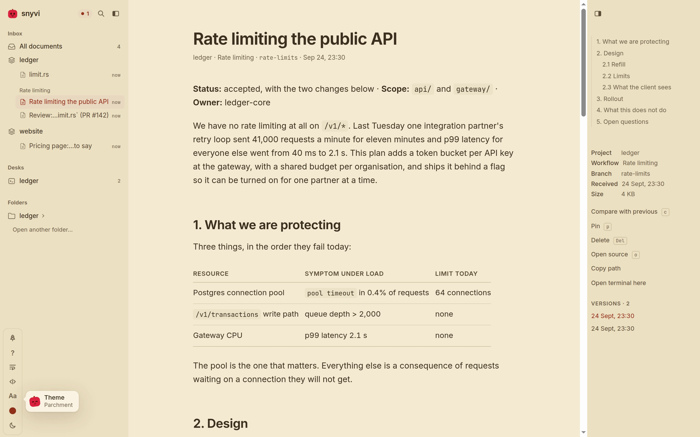

# snyvi, in full

Everything the [README](../README.md) shows, at the length it takes to say
how it works: the install on each desktop, updating and uninstalling,
every command, connecting each agent, the window, the desks, the keys, and
what each part of the page does and why. The numbers at the end are the
ones `snyvi bench` reads.

snyvi is for the person with more passion projects than hours in the day,
building several of them at once with coding agents. It keeps each project
in order: a [desk](DESK.md) per project — its folder, and up to four real
panels rooted at it, each running an agent or a shell — and everything those
agents write, kept where you can read it.

You ask Claude Code for a plan. It writes one. With snyvi, Claude sends
the document and replies with a link; by the time you read the reply, the
document is already open in the viewer, rendered, filed under the project,
and listed on the desk beside the panel that wrote it. Markdown and every
kind of source file. Each desk keeps its own notes, and each is exactly as
you left it when you come back.

One direction only: agents send, snyvi shows. The rule is about the channel,
not the window: no document in snyvi can be read back by an agent, and
nothing a document says is ever typed into a panel. The one thing that goes
the other way is a desk's own notes, to the agent working in that desk's
panel, and only to read ([Asides](#asides) says where the line is).

## Install

### One line

On Linux and macOS, [`install.sh`](../install.sh) does what the sections
below say to do by hand, choosing the path for the machine it is on:

```
curl -fsSL https://raw.githubusercontent.com/snymrova/snyvi/main/install.sh | sh
```

With Homebrew it installs the cask; on a Mac without it, `snyvi.app` goes
into Applications and `snyvi` onto your `PATH`. On Debian and Ubuntu it
installs both packages, snyvi and the window, with `sudo` for `dpkg`; on
any other Linux the static binary goes into `~/.local/bin`. Every download
is checked against the `.sha256` published beside it, and Claude Code is
connected if it is installed. Run it again to update: a daemon that was
running is restarted on the new version, and nothing you sent is touched.

```
sh install.sh --tar              the static binary even where dpkg exists
sh install.sh --no-app           on Debian, without the window package
sh install.sh --no-init          without registering with Claude Code
sh install.sh --version 1.3.0    a particular release
sh install.sh --bin-dir DIR      where the static binary goes
```

The same flags after `sh -s --` when piping from `curl`. Windows has no
shell to pipe into; it has [Scoop](#windows) and the installer.

### Cargo

With a Rust toolchain on any platform:

```
cargo install snyvi
snyvi init-claude --auto
```

That builds snyvi from [crates.io](https://crates.io/crates/snyvi): the
daemon, the CLI, the MCP server and the hook, which is everything but the
window. The window links a browser engine — WebKitGTK on Linux, WebView2
on Windows, WebKit on macOS — so it is not in the crate; on Debian it is
the `snyvi-app` package below, and elsewhere it is built from source as
[Desktop](#desktop) describes. `cargo install snyvi` again updates it.

### Debian and Ubuntu

Download `snyvi_<version>_amd64.deb` (or `_arm64.deb`) from the
[releases page](https://github.com/snymrova/snyvi/releases):

```
sudo dpkg -i snyvi_*.deb
snyvi send README.md                              # starts the daemon, prints a link
snyvi init-claude                                 # register with Claude Code
snyvi status                                      # what is running, what is registered
```

The package depends on nothing at all — the binary is static — so it
installs on any Debian or Ubuntu of that architecture without pulling in
a library. Besides the command it gives you an application menu entry and
a systemd user service, neither of them started by default.

That is the whole install. If you later want the viewer in a native
window rather than a browser one, add a second small package — it is an
addition, not a different snyvi:

```
sudo apt install ./snyvi-app_*.deb   # apt, so webkit resolves
snyvi app                            # now a window of its own
```

`snyvi-app` is one executable, about 4 MB, and it is the only piece that
links a browser engine. Everything else — the daemon, `send`, the MCP
server, the hook — stays the static binary above. Nothing changes about
snyvi until you install it, and removing it just puts you back in a
browser. See [Desktop](#desktop) for what the window costs.

### Windows

With [Scoop](https://scoop.sh):

```
scoop bucket add snyvi https://github.com/snymrova/scoop-snyvi
scoop install snyvi
snyvi init-claude --auto
```

That is the zip below, unpacked into Scoop's own folder and shimmed onto
your `PATH`, with both executables in it, so `snyvi app` opens the window
as it does from the installer. `scoop update snyvi` updates it, stopping
the daemon and the window first; `scoop uninstall snyvi` removes it and
leaves your documents. The bucket is written by the same release run that
publishes the zip, so it cannot say a version that has not shipped.

Without Scoop, download `snyvi-<version>-x86_64-pc-windows-msvc-setup.exe`
from the same page and double-click it. That is the install:

- snyvi goes into `%LOCALAPPDATA%\Programs\snyvi`, for you alone, so there
  is no administrator prompt;
- *snyvi* appears in the Start menu (and on the desktop, if you tick it);
- the folder is added to your `PATH`, so `snyvi` runs in any terminal you
  open afterwards;
- `snyvi init-claude --auto` is run for you, if the box is left ticked and
  Claude Code is installed: snyvi is registered with Claude Code, and every
  Markdown file Claude writes is sent to the viewer;
- *Open snyvi* at the end starts the daemon and the window.

Nothing more to type. From a terminal, the same commands as everywhere:

```
snyvi send README.md                              # prints a link
snyvi init codex                                  # any other agent
snyvi status                                      # what is running, what is registered
```

Upgrading is running the newer installer: it stops the daemon and the window
first, replaces both, and keeps everything else. Uninstalling is *snyvi* in
Settings → Apps: it stops snyvi, takes it back out of Claude Code and off
`PATH`, and leaves your documents in `%LOCALAPPDATA%\snyvi`. `snyvi reset`,
before uninstalling, removes those too.

The installer and the executables are not signed, so the first time the
installer runs Windows shows a SmartScreen sheet saying it protected your
PC. *More info*, then *Run anyway*, once.

Both executables are in the one download. `snyvi.exe` is everything —
daemon, CLI, MCP server, hook — and `snyvi-app.exe` is the native window.
There is no separate package for the window the way there is on Linux,
because it uses WebView2, which is part of Windows 10 and 11 rather than
a library to go and install.

**Without the installer.** The release also has
`snyvi-<version>-x86_64-pc-windows-msvc.zip`, for a folder you manage
yourself. Unzip it somewhere of its own, keep the two executables together
(`snyvi app` looks for the window beside itself), and from a terminal in
that folder:

```
.\snyvi install-cli                               # puts this folder on your PATH
snyvi init-claude                                 # in a new terminal
```

### macOS

Download `snyvi-<version>-aarch64-apple-darwin.tar.gz` on Apple silicon
or `-x86_64-apple-darwin` on Intel from the same page, unpack it, and
drag `snyvi.app` into Applications. Both executables are inside the
bundle: the window, which is what a double-click on the icon opens, and
`snyvi` itself. The command line is a link to that one, which the
bundle writes for you:

```
/Applications/snyvi.app/Contents/MacOS/snyvi install-cli
snyvi send README.md                              # starts the daemon, prints a link
snyvi init-claude                                 # register with Claude Code
snyvi app                                         # the window, from the terminal
```

`install-cli` links into `/usr/local/bin` when that can be written and
into `~/.local/bin` otherwise, and says so when the one it used is not
on your `PATH` yet. (A fresh Mac has no writable `/usr/local/bin`, and
an Apple silicon one has none at all until Homebrew makes it; that is
why this is a command and not an `ln -s` to type.)

Opening the app with nothing running does what `snyvi app` does: starts
the daemon, then the window. The window uses the WebKit that is part of
macOS, so as on Windows there is nothing to install for it.

The bundle is signed, but not by an identity Apple knows — that takes a
developer account — so the first open is refused as being from an
unidentified developer. Either take the quarantine off the download,
which is what Gatekeeper is reading:

```
xattr -dr com.apple.quarantine /Applications/snyvi.app
```

or open it once from System Settings → Privacy & Security → Open Anyway.
A tarball unpacked with `tar` from a terminal carries no quarantine at
all.

With Homebrew, `brew install --cask snymrova/snyvi/snyvi` does all of the
above in one command: it puts `snyvi.app` in Applications, links `snyvi`
onto your `PATH`, and takes the quarantine off the app it installed.
`brew upgrade` stops the daemon before it swaps the binary; `brew zap`,
and only `brew zap`, deletes the library.

### Any other Linux

Download the tarball for your architecture from the same page:

```
tar xzf snyvi-*-linux.tar.gz
install -m 755 snyvi-*/snyvi ~/.local/bin/snyvi   # or /usr/local/bin
snyvi send README.md
snyvi init-claude
```

If `~/.local/bin` is not on your `PATH`, `snyvi init-claude` writes the
binary's full path into Claude Code's settings and says so; run it again
after moving the binary, and the registration follows.

### Updating

snyvi runs as a background daemon, so a new binary on disk does not take
effect until the old process exits. Install over the old one the way you
installed it — the one-liner again, `brew upgrade`, `scoop update snyvi`,
`cargo install snyvi`, `sudo dpkg -i snyvi_*.deb` — and, unless that
already restarted it for you (the one-liner, Homebrew and Scoop do), then:

```
snyvi restart
```

That is the whole update. Your documents, database and token are kept,
and the schema migrates itself. If you forget, any snyvi command tells
you:

```
note: snyvi 0.2.0 is still running but this binary is 0.3.0.
Run `snyvi restart` to pick up the new version.
```

`snyvi status` shows both versions, `snyvi stop` shuts the daemon down,
and both work against daemons old enough to predate the stop command.
Under systemd use `systemctl --user restart snyvi` instead.

### Uninstalling

```
snyvi uninstall-claude        # the MCP server, the hooks, the CLAUDE.md line
snyvi stop                    # the daemon
sudo apt remove snyvi-app snyvi   # or delete the binary, the .app, the folder
```

That leaves your documents and index in `~/.local/share/snyvi` and the
token in `~/.config/snyvi` (the Windows and macOS places are under
[Where things live](#where-things-live)); delete those two directories
if you want nothing left. `uninstall-claude` takes out exactly what
`init-claude` put in and nothing else in Claude Code's settings.

To start over rather than leave, `snyvi reset` puts the install back to
the way it was: every document and version, the index, the token and
the page's preferences go, and the agents stay registered, so the next
document an agent sends lands in an empty library. `--agents` takes the
registration out as well. It is the one thing snyvi does that cannot be
undone, so it asks for the number of documents to be typed back rather
than a "yes" -- `--dry-run` prints the sentence and stops, `--yes` is
for scripts, and a pinned document refuses it until `--pinned` says so.
The same dialog is at the foot of the `?` box in the viewer.

It is fully static (musl), so it runs on any x86_64 or aarch64 Linux
without extra packages. To build from source instead:

```
cargo install --path .
```

One binary, no runtime, no network access ever. It embeds its own UI,
fonts, and syntax grammars.

To keep the daemon resident from login rather than letting the first
send start it, enable the user service. The `.deb` already ships one:

```
systemctl --user enable --now snyvi
```

From the tarball, write it first:

```
mkdir -p ~/.config/systemd/user && cat > ~/.config/systemd/user/snyvi.service <<'UNIT'
[Unit]
Description=snyvi document viewer
[Service]
ExecStart=%h/.local/bin/snyvi serve
Restart=on-failure
[Install]
WantedBy=default.target
UNIT
systemctl --user enable --now snyvi
```

## Use

```
snyvi send PLAN.md                 # send a file, print its link
cat notes.md | snyvi send -t Notes # send stdin
snyvi watch PLAN.md                # send now, and again on every save
snyvi browse [dir]                 # read a folder from disk, nothing imported
snyvi open                         # open the viewer, in the window if one is up
snyvi app                          # native window (see Desktop below)
snyvi init <agent> [--instructions]  # register with claude, codex, cursor, claude-desktop, gemini, windsurf, vscode or zed
snyvi init                         # every agent, and what each has of snyvi
snyvi uninstall <agent>            # take that registration back out
snyvi init-claude [--auto] [--claude-md]  # the same as `init claude`, with its hook
snyvi install-cli [dir]            # put `snyvi` on PATH
snyvi prune --days 30 [--dry-run]  # delete what you deleted, and unpinned documents older than N days
snyvi reset [--dry-run] [--agents]  # back to a fresh install; asks for the number of documents
snyvi status                       # daemon health and version
snyvi restart                      # after installing a new binary
snyvi stop                         # shut the daemon down
snyvi bench [--check]              # render speed on synthetic documents
```

The first `send` starts the daemon in the background; it stays resident
(about 25 MB) so every later send and every page open is instant. It
listens on `127.0.0.1:7777` only. Set `SNYVI_PORT` to change the port.

### Connecting an agent

`snyvi mcp` is a plain stdio MCP server, so any agent that speaks MCP can
send documents here. `snyvi init <agent>` puts the entry in the agent's
own file -- `~/.claude.json`, `~/.codex/config.toml`, `~/.cursor/mcp.json`,
Claude Desktop's, Gemini CLI's, Windsurf's, VS Code's or Zed's -- after
reading what is there: it says "already registered" when there is
nothing to do, re-registers when the entry names a binary that has
moved, and leaves everything else in the file as it found it (Codex's
TOML keeps its comments; a JSON file with comments in it, which snyvi
cannot parse, is left alone and the snippet printed instead).
`--instructions` adds one line to the agent's instructions file, where
it has one, asking it to send what it writes; `snyvi uninstall <agent>`
takes the entry and the line back out.

The viewer says the same thing. When the library is empty the page is
*Connect an agent*: one row per agent, read by the daemon from the
agent's own file, saying whether it is connected, not set up, or
registered under a path that no longer exists, with the command or the
snippet that fixes it and, once a document has come from it, when. An
agent whose session is open this moment says *online* instead -- the
MCP server holds a connection to the daemon from the agent's first
message until its process ends, so the row is as live as the session
-- and the count beside the mark in the sidebar says how many are, on
every page. It is reachable at any time from the foot of the `?` box
and from that count, and `snyvi init` with no agent prints the same rows.

### Claude Code

`snyvi init-claude` (or `snyvi init claude`) runs `claude mcp add --scope user snyvi -- snyvi mcp`.
That exposes two MCP tools, and a third inside a desk. `send_document` is
the one that matters: it takes a file path or inline content and returns a
URL. `send_aside` is the small one, and [Asides](#asides) below says what it
is for. `read_desk_notes` is offered only to a Claude running in a desk's
panel, and reads that desk's notes. The tool
descriptions tell Claude when to use each; a line in your global
`CLAUDE.md` helps it remember:

> When you produce a document for me to read (plan, review, summary),
> send it to snyvi with send_document and give me the link.

`snyvi init-claude --claude-md` writes that line for you, once. The
command is safe to run as often as you like: it reads what Claude Code
already has before touching anything, says "already registered" when
there is nothing to do, and when the binary has moved -- an update, a
tarball tidied into `~/.local/bin` -- it re-registers and points the
hooks at the new place rather than leaving them failing quietly on
every tool call. `snyvi status` ends with a line saying what is
registered and whether it still points at a binary that exists, and
`snyvi uninstall-claude` takes all of it back out.

`snyvi init-claude --auto` additionally installs a `PostToolUse` hook in
`~/.claude/settings.json`, so every Markdown file Claude writes or edits
is sent without the model having to decide. Rapid edits to the same file
within three minutes overwrite the latest snapshot instead of piling up;
an explicit `send_document` of the same file always creates a new
version, and sending unchanged bytes returns the existing document.
Set `SNYVI_HOOK_EXT=md,txt,rst` to widen the filter.

### Watching a file

For editors and agents that have no hooks, `snyvi watch` does what the
hook does from the outside:

```
snyvi watch PLAN.md            # prints the link, then sends on every save
snyvi watch notes.md draft.md  # several files, one process
```

It sends the file at once, prints the link, and sends it again whenever
the file changes on disk, until you stop it. A file caught halfway
through a write is left alone until it has held still. Saves coalesce
exactly like the hook's edits do, with each other and with the hook: a
tab that has the document open swaps the new version in where it is,
keeping your place, and a save within three minutes of the last
overwrites that snapshot rather than adding one. A file that goes away
is noted and watched for its return.

### Desktop

`snyvi app` opens the viewer in a window of its own, and takes the best
window it can find:

1. a native window, if the `snyvi-app` executable is installed beside
   snyvi or on `PATH` — WebKitGTK on Linux, WebView2 on Windows;
2. failing that, a Chromium-family browser in app mode — no tabs, no
   address bar, its own entry in the task switcher;
3. failing that, your default browser.

Nothing needs configuring to move between them. Install `snyvi-app` and
the first rung appears; remove it and you are back on the second.

The native window is worth having if you would rather not keep a browser
on the machine, or you want the window to remember where you left it:
size and position are restored on the next run.

It also puts snyvi in the tray. Closing the window hides it rather than
quitting — showing it again is instant, where starting a browser engine
is the ~150 ms below — and the tray icon brings it back. Its menu has
two items, show and quit, because everything about the library and the
daemon belongs to `snyvi` itself. On Windows a left click on the tray
toggles the window and a right click opens the menu; Linux's tray
protocol sends no clicks, so there the menu answers both. Running
`snyvi app` again also just shows the window you already have.

And from anywhere, without finding the tray: ⌘⇧Space on a Mac,
Ctrl+Shift+Space on Windows and Linux, shows the window — or hides it,
when it is the one in front. The key is a default and not a decision,
because a global shortcut wins over any program's own use of the same
chord, and some have one (a spreadsheet selects its sheet with it):
`SNYVI_SHORTCUT=Alt+F9` names another, in the usual spelling, and
`SNYVI_SHORTCUT=0` registers none. A key another program already holds
is reported on the terminal and left with it. On a Wayland session
there is no shortcut, since the interface it needs is X11's; the
desktop's own keyboard settings do the same job there — bind a key to
`snyvi app`, which shows the window that is already up rather than
opening another.

The window has no title bar of the system's. The page is the frame: the
sidebar's brand row, the rail's top, and a desk's header row drag the
window and maximise it on a double-click, and the three buttons a bar
had sit in the top right corner, whatever the panes are doing. The
edges still resize it. On a Mac the traffic lights are the system's,
over the brand row. `SNYVI_FRAME=1` keeps the system's frame, for a
desktop whose title bars should all look alike or a window manager that
draws its own. And if the window ever shows a page older than itself —
a daemon upgraded on disk and not yet restarted — the frame comes back
on its own, since that page has nothing to drag by.

On a Linux desktop with no `libayatana-appindicator3`, there is no tray —
snyvi says so, and closing the window goes back to meaning close.

GNOME is the case where the library is there and the tray still is not:
it has no tray of its own, so the indicator is published and nothing
draws it. What draws it is a shell extension, which the `snyvi-app`
package recommends and Ubuntu normally has enabled already. If the tray
is missing on a GNOME desktop and `snyvi app` reported no error, that is
what to look for:

```
gnome-extensions list --enabled | grep -i appindicator   # nothing? then:
sudo apt install gnome-shell-extension-appindicator
gnome-extensions enable ubuntu-appindicators@ubuntu.com
```

Log out and back in afterwards; under Wayland the shell cannot reload
extensions in place.

What the window costs is what a browser engine costs, and it costs it
**only in the window's own process**:

| | snyvi | snyvi-app |
|---|---|---|
| what it is | daemon, CLI, MCP server, hook | the window, nothing else |
| binary | 12.3 MB, static | 4.3 MB, links webkit |
| download | 5.5 MB | 1.2 MB |
| dependencies | **none** | webkit2gtk-4.1, gtk3, glibc 2.34+ |
| runs on | any Linux, both architectures | Ubuntu 22.04+, Debian 12+, both architectures |
| resident | 35 MB | ~380 MB while a window is open |

Those are the Linux numbers, where the two are packaged separately. On
Windows both are in the one zip and the window costs whatever WebView2
already costs the machine; on macOS both are in the one bundle and the
window costs whatever the system's WebKit does.

That separation is the point. Before 0.6 the window was compiled into
snyvi itself, so a machine that wanted one got an engine linked into the
daemon too, and `snyvi serve` sat at 66 MB having never opened a window.
Now it is 35 MB whether or not you have the window installed, and the
engine is paid for only while you are looking at something.

From source, `cargo build --release` gives you snyvi alone; add
`--features desktop` to get `snyvi-app` beside it.

### Keys

The single-letter keys start asleep, so a `j` or a `Del` meant for a
terminal beside snyvi can't move the page or delete a document. Press
**⌃B** to turn them on. A pill at the bottom of the window reads
*Keys on · esc* while they're on, and blinks each time a key acts. They go
back to sleep on Esc, on ⌃B again, on a click, when a text field or a
panel takes the focus, or after ten seconds with no key pressed. The pill
dims just before that happens. Inside a panel, ⌃B belongs to the program
running there (tmux, the shell), and snyvi leaves it alone. Keys with a
modifier, like ⌘K, ⌃\` and alt ←/→, always work.

| Key   | Action                                     |
|-------|--------------------------------------------|
| ⌃B    | turn the letter keys on / off               |
| ⌘K    | search everything                           |
| j / k | next / previous document                    |
| [ / ] | older / newer version in the same workflow  |
| c     | compare with the previous version           |
| s     | split / inline view for diffs               |
| v     | preview a page or PDF / back to source      |
| /     | find in document                            |
| w     | maximise width                              |
| z     | wrap long lines                             |
| p     | pin (kept by `prune`)                       |
| n     | open the next document waiting              |
| Del   | delete document (⌘/ctrl Z undoes it)        |
| i     | inbox                                       |
| f     | fill the screen with the diagram            |
| 0     | fit the diagram                             |
| t     | toggle contents                             |
| \     | toggle sidebar                              |
| o     | open source                                 |
| ?     | show keys                                   |
| alt ← / → | back / forward                          |

Everything the keys do, a finger can do too: on a screen with no
pointer the controls that appear on hover -- copy, rename, the `#`
beside a heading, a code block's language -- are simply there, and
the `?` button at the top of the window opens the same box. Tab reaches
every control in the order they are on the page; the search palette and
the keys box keep focus inside them while open and give it back to
where it was on Escape, and the find count is read out as it changes.

The foot of the keys box has two lines. *About snyvi* says what this
is, the version and the commit the daemon is running -- read from the
daemon, so it is the number `snyvi --version` prints -- where the
documents and the settings live, what Claude Code has of it, the
license and the repository. *Reset snyvi…* is described under
[Uninstalling](#uninstalling).

## Appearance

Five buttons sit at the foot of the sidebar -- theme, accent, Aa, width,
wrap -- and what each one does is kept for next time.

There are eight themes, four light and four dark, each designed rather
than derived from another. The light ones: **Paper**, the warm
near-white the window opens in; **Snow**, a cool near-white;
**Sage**, a soft green-grey that is easy on the eyes over a long day;
and **Parchment**, a sepia page with brown ink for long reads and a
bright room in the evening. The dark ones: **Ink**, the deep grey-blue
for night; **Midnight**, a deep navy; **Espresso**, a warm brown-black,
the dark side of Parchment; and **Contrast**, white on black at 7:1
everywhere, with rules at full weight and no faint washes. Each has its own syntax colours and its own
terminal palette, so code and the shells on a desk look like part of the
page, and every colour a theme draws text in is measured on every
surface it sits on -- 4.5:1 or better, 7:1 for Contrast -- with each
of the eight accents, on every build.

Paper and Ink come with the window itself, so it opens at full speed;
the other six load in the background a moment later. Whichever you
choose, the window opens in it with no flash of another theme first.

The **theme** button steps through the eight, the way the accent button
steps through its colours: the four light ones, then the four dark, and
round again. Its icon shows whether a click lands on a light or a dark
one, and its tooltip names the one showing and the one a click brings.
To jump straight to one, press `⌘K` and type `theme`: the eight appear as
rows, each drawn in its own colours, and moving the highlight puts that
theme on the window behind the box, so the page is the preview. Enter
keeps it; Esc puts the window back.

Either way, the theme you land on is remembered as your light or your
dark one, so when your system switches between light and dark the
window moves between those two. A system asking for more contrast gets
Contrast as its dark theme until you choose one, and Paper with heavier ink in the light.




**Aa** steps through the reading faces: Inter, Source Serif, Literata,
Atkinson Hyperlegible, JetBrains Mono. The first three are a matter of
taste; the last two are not. Atkinson Hyperlegible was drawn by the
Braille Institute to keep letters that blur into one another apart --
`1` and `l`, `O` and `0`, `rn` and `m` -- and JetBrains Mono sets prose
the way it sets code, which some readers prefer for a specification. It
sets prose only: code is always mono and diffs and tables are left
alone.

The **swatch** steps through eight accent colours -- passion, crimson,
rose, violet, blue, teal, green, graphite -- one per click, the whole
window repainted as you go. The accent is what links, the
marker in the contents, a landing wash and snyvi's own mark are drawn
in, and each has a pair for light and dark rather than one colour dimmed
for both. The tab's icon is repainted to match, so two snyvi windows
side by side are told apart at the tab strip.

The **width** and **wrap** buttons are `w` and `z` above.

A control that means nothing in the view you are in is faded rather
than hidden, and its tooltip says why -- `Wrap · no code on this page`,
`Font · code is always monospace`. Clicking it, or pressing its key,
gives the same answer instead of silently doing nothing. On a desk they
mean the desk's own things: **width** shows the focused panel
full-size, as `⌃⌥Z` does, and **Aa** sets the terminal's text size --
Small, Normal, Large, Larger -- for every panel on every desk. Inside a
panel, `⌃=` and `⌃-` step it and `⌃0` puts it back to Normal, as in
most terminals; readline's undo, which `⌃-` used to send, is still
`⌃_`. Wrap is faded there: a terminal always wraps.

The **rocket**, at the top of that column, is a game: snyvi in a helmet,
in a small ship, and rocks coming down. It covers the sidebar and only
the sidebar, so a document arriving while you play opens beside it as
usual. The arrows or WASD steer -- forward as far as the top third of
the sky, which is the rocks' own -- space fires, and `esc` leaves; the
mouse has no part in it. On a touch screen a finger flies it instead: the
ship follows the finger and fires while it is down. The rocks come faster
every twenty seconds, and your best is kept with the other settings, as
soon as it is beaten. Nothing about it loads until the rocket is pressed,
and nothing about it runs while it is paused, or waiting for you to fly.

## Lines

A code or text document addresses its lines. `#L120` opens it at line 120
with the line marked; `#L120-L140` marks the range. Click a line number to
get that link, copied to the clipboard; shift-click a second one for a
range. ⌘K then `:120` jumps without leaving the keyboard.

`z` wraps long lines, for logs and generated code that run off the pane.
Continuations hang past the line numbers, so the code still lines up. The
setting is remembered.

## Tables

A `.csv` or `.tsv` file is laid out as a table rather than shown as
text: quoted fields keep their commas and newlines, numbers are aligned
as numbers, and the head stays put while the body scrolls. Very large
files show their first 2000 rows with a note; `o` opens the whole file.

## Diagrams

A ```` ```mermaid ```` block is drawn as a diagram — flowcharts, sequence,
class, state, ER and gantt — in snyvi's own palette, so it belongs to the
page rather than arriving from somewhere else. All four themes are
checked on every build: every label has to stay legible against whatever
is behind it.

Drawing happens after the text is on screen and only for diagrams the
reader is near, one at a time, so a page with eight of them opens as fast
as a page with none. A diagram is drawn once per tab and kept, so coming
back to a document costs nothing and a watched file does not redraw on
every save. One over about 150 nodes is offered rather than drawn: it
costs seconds, and that should be the reader's call.

A drawn diagram is a viewport, which is what makes a big one worth
having. It opens fitted, so the shape is visible at a glance:

- **⌘/ctrl + scroll** zooms toward the cursor, and so does a trackpad
  pinch. A plain scroll is still the page's, so a cursor crossing a
  diagram never traps it.
- **Drag** pans, once there is something to pan to.
- **Double-click** zooms in.
- **Fit / 100%** is one button: the shape, or the labels.
- **`f`** fills the screen with it, which is where a diagram of a few
  hundred nodes is finally readable. **`0`** fits it again.

Zooming drives the SVG's own `viewBox` rather than scaling a picture, so
strokes stay crisp at any depth.

A source Mermaid cannot parse is never swallowed: the error is shown with
the source underneath it, exactly as the agent wrote it.

## Pages and PDFs

An `.html` file opens as source, because in a repository the markup is
usually what you want; `v` shows the page itself. A `.pdf` opens in the
browser's own viewer, and `v` goes the other way.

A previewed page runs in an iframe sandboxed **without**
`allow-same-origin`, so it has an opaque origin: its scripts run and the
preview is faithful, but they cannot read snyvi's page, its storage, or
any answer from its API. The page is served with
`connect-src 'none'`, so it cannot send anywhere what it can see either.
In browse mode the page is loaded from a path-shaped URL, so its own
relative stylesheets and images resolve; a page in the library is a
snapshot of one file, so it has none of those to load.

A PDF is framed without a sandbox, because the browser's viewer refuses
to run inside one. That is safe for a different reason: the bytes are
served as `application/pdf` with `nosniff`, so they can only ever reach
the PDF viewer and can never be parsed as a page.

## Width

Prose is capped at a comfortable measure, because long lines are hard to
read. Anything that is not prose ignores that cap and takes the pane:
code, diffs, tables, images, and previewed pages and PDFs.

`w` overrides the cap for prose too. Combined with `\` and `t`, which
hide the sidebar and the rail, it gives the document the whole window.

## The rail

Prose gets a table of contents. Code gets an outline of what it declares:
functions, types, implementations and modules, nested by indentation and
marked by kind. Clicking one jumps to that line and highlights it.

The outline comes from the same grammar the highlighter uses, so it
follows the language rather than guessing with patterns, and call sites
and builtins stay out of it. It is fetched after the page has painted,
so it never delays reading.

The rail follows you. The entry for the section you are in is marked and
kept in view, however long the contents are; the actions under them --
pin, compare, delete, open source -- stay where they are. A wheel over
either pane scrolls the pane until it has nothing left, then the
document. Clicking an entry jumps to the heading without adding to the
browser's history, so Back still means the previous document. The `#`
beside a heading copies a link to that section, the way a line number
copies a link to a line, and the contents write the same links. `t`
hides the rail, and so does the button in its top corner; the sidebar
has the same button at the end of its brand row, and `\`. A pane put
away stays away until you bring it back, with the same button, which
moves to the edge of the page where the pane was.

On a window under 1100 px wide the rail no longer fits beside the
document, and under 760 px neither does the sidebar. Each becomes a
sheet over the document instead: `t` and `\` open it, so do the two
buttons at the top of the page, and Escape, a tap outside, or the
button on the sheet closes it. The contents open on the section you are
in, and a tap on an entry goes there and puts the sheet away. Widen the
window and the panes are panes again, as you left them.

Both panes resize. Drag the seam between a pane and the document -- the
sidebar's right edge, the rail's left -- and the pane follows, between a
width where its rows are still readable and one past which the document
would be the pane that does not fit: 200 to 440 px for the sidebar, 180
to 400 for the rail. Double-click the seam for the default. The seam is
a Tab stop too, and the arrow keys move it. The width is kept.

## Arrivals

A document that arrives while you are reading never takes the page
away. It joins a queue: a row at the top of the sidebar under
"Waiting", a mark on its row in the tree, and a bar above the document
that counts -- "3 waiting" and the title of the oldest, with snyvi's own
face at the front of it, holding what came: wide-eyed for a moment when
one more arrives, glad when one is read, and smiling in between. `n`
opens the oldest and takes it off, so the next `n` is the one after; a reader
drains the queue with one key, in the order things came. Opening a
document any other way -- the sidebar, the inbox, an agent's link --
takes it off the same way, since read is read wherever you got to it.
The queue lives in the daemon, so it is the same in every tab and the
window, and it survives a restart.

The inbox lists what is waiting first, oldest first, then everything
else. "Mark all read" empties the queue without opening anything, for
the day an agent sent thirty. Twelve arrivals in two seconds are twelve
rows and one bar that says twelve.

The one place an arrival opens by itself is the inbox with nothing
waiting: the empty state exists to be filled. Before 0.14 an arrival
opened itself whenever the page had gone 2.5 seconds without a scroll
or a key, which is what reading a paragraph looks like.

Back opens a document where you left it, not at the top: the place is
written into the history entry as you leave and after each scroll, as
a block and an offset into it, the way a save already keeps it. In the
desktop window, which has no toolbar, alt+← and alt+→ are Back and
Forward; in a browser they are the same one step, not two.

Deleting is one keystroke and no question. `Del` deletes the document
you are reading at once, and the line at the corner offers "Undo" for
eight seconds — or ⌘/ctrl Z, which is where your hand goes anyway.
Nothing is destroyed in the meantime: the daemon marks the document
deleted and keeps it until `prune` runs, which is what makes the offer
real. It disappears from the tree, the inbox, search and the queue in
every tab at once, and comes back to the same place.

What moves in the sidebar says so once, and briefly. An arrival's row
is lit for a moment, the way a heading is where a link landed -- the
same wash, so there is one sign to learn; a row you have read or
deleted closes where it was before the list moves up, and one an undo
put back is lit again. The bar over the document rises when it appears
and stays put after that: a count that changes settles in, in place,
and the face on the bar reacts once and is still again.
Every motion on the page is under 200 ms except that wash, none of it
runs while you read, and `prefers-reduced-motion` turns all of it off
rather than slowing it down. The `#` beside a heading confirms a copy
on the mark itself, not at the corner of the screen.

## Asides

An arrival is work: a document an agent finished and you asked for.
Now and then there is a sentence that is not work -- what it noticed on
the way, what it would do next, what it is unsure of -- and until this
existed the only way to say it was to make it a document, which put it
in your library and your unread count as though it were one.

`send_aside` is for that sentence, and it is deliberately small. An
aside is at most 280 characters; past that it is a document and
`send_document` is the tool for it. Asides are kept in memory, the last
five of them, so a daemon restart forgets them -- an aside is about now,
and one that outlived a restart would be about some other now. They
never enter the queue, never mark anything unread, and never take the
page away from what you are reading.

One sits at the foot of the sidebar, under the trail of the few before
it. A new one lights up and snyvi's own mark beside it hops once; rest
on the aside and it is read, and the mark settles. Only one aside lights
up every ten minutes: an agent that leaves one per edit costs you a
single glance, and the rest join the trail quietly. An aside may name a
document it is about, and then clicking it opens that document.

It is a channel from the agent to you and nothing comes back: an aside is
not an instruction to anything.

An aside is not a desk's notes. Those are your own list, kept with the
desk and written only by you; an agent's asides never land on it.

An agent can *read* that list, and nothing else of snyvi's. A Claude
running in one of a desk's panels is offered `read_desk_notes`, which
returns that desk's notes, open and done, and has no way to add, tick,
change or remove one. It is found by the pane: the panel puts its id in
the shell's environment as `SNYVI_SESSION`, and the daemon answers only
while that panel is running, and only with its own desk's list -- never
another desk's, and never a document. A Claude started anywhere else is
not offered the tool at all. If a list is for your eyes only, keep it on
a desk you do not run agents in.

The tool was called `send_note` through 1.4.0. The old name still
works, so a session that was already running when you upgraded keeps
its asides.

## Where a link opens

With `snyvi app` running, a link opens in that window rather than in a
browser beside it. The window's page says it is one when it connects to
the daemon's event stream, so the daemon knows a window is up for
exactly as long as there is one -- quit it and the next link opens in a
browser again, within a few milliseconds. `snyvi open`, `snyvi send
--open`, `snyvi browse` and a click on a notification all hand the URL
to the window and raise it.

It changes what an agent is told, too. `send_document` used to answer
with `http://127.0.0.1:7777/d/…` whatever was running, so a click on the
agent's link opened a second copy of the viewer in a browser next to the
window you were using. With a window up, the tool now answers that the
document is waiting in snyvi and gives no link at all; without one, it
gives a link.

Which link depends on what is installed. Where `snyvi-app` is, the link
is `snyvi://d/…`: the desktop hands it to the app, which shows the
document in the window that is up, or starts the daemon and opens one.
Where it is not, the link is the `http://` one, and opens in a browser.
The `snyvi://` scheme is registered by the `.deb`'s desktop entry, by
`snyvi.app`'s Info.plist, and — for a tarball or zip, where nothing
installs an entry — by the window itself the first time it runs, on Linux
and Windows. `snyvi app snyvi://d/…`, `snyvi app <id>` and `snyvi app
<url>` do from the terminal what a click does.

One thing to know: a terminal decides for itself which links are
clickable, and several — kitty, Ghostty, VTE-based ones — only recognise
a fixed list of schemes. `snyvi://` can usually be added to that list
(kitty's `url_prefixes`, for one), and the `http://` link is always given
alongside for a terminal that does not know it.

A link inside a document goes the other way. One to the web opens in a
browser: a tab beside the viewer, or, from the window, whatever your
desktop opens links with — the window has no address bar and no Back
button to come home by, so the web belongs outside it. A small ↗ beside
the link says so before you follow it. `mailto:` and anything else your
desktop answers for go out the same way, without a blank tab. A link to
another document, or to a file in the folder you are browsing, turns the
page here without leaving — which is what makes a relative link between
two browsed files work. And a relative link that points at nothing snyvi
has says so in a line at the corner, offering the browser if that is
what you meant, rather than replacing what you were reading with "Not
found".

## Browsing a folder

`snyvi browse` opens the folder you are in as a file tree and renders
files as you click them. Nothing of it is stored, nothing joins the
library, and nothing appears in the inbox. It is a reader for code and
notes you already have, not an import.

The folder itself stays open. It is in the sidebar until you close it,
across restarts and upgrades of the daemon, so the repositories you read
in are there each morning without being opened again. A folder that has
gone from disk in the meantime is dropped quietly.

```
snyvi browse            # the current folder
snyvi browse ~/code/foo
```

Or from the window: **Folders** is always in the sidebar, and the `+`
beside it (or "Open folder…" in ⌘K) shows your desktop's own folder
dialog — zenity or kdialog on Linux, the Finder's on macOS, Explorer's on
Windows — and opens what you choose. The dialog is the desktop's, asked
for by the daemon, so the page never names a path; it sits behind the
same window-only gate as the desks, and a browser tab is told to use the
window or `snyvi browse` instead.

It honours `.gitignore` and skips hidden files, so `node_modules` and
`target` stay out of the way. Files render on first open and are cached
by modification time, so revisiting one is instant. ⌘K finds a file by
name inside the folder, `j` and `k` step through files, and the folder
closes from the sidebar or the rail. Images display, binaries and very
large files are described rather than dumped.

The folder is live. Save the file you are reading and the page updates
where it is, scroll position, find and preview included; add or remove
files and the tree follows. The daemon looks at the files and folders
you have on screen a few times a second, only while a tab is connected,
and only once a change has held still, so a file caught mid-write is
never shown half-way. That is a handful of `stat` calls, not a
recursive watch, so a repository of any size costs the same.

A link into a folder lands where it points: `#L120` on a file opens it
at that line, marked, and a section link opens it at that heading -- the
same two the library's own documents answer to, and worth having because
a link into a browsed file is how one agent tells you where to look.

Opening a folder requires the daemon token, because it exposes those
files to the browser. Reading inside a folder you already opened does
not, and paths that escape the folder are refused.

## How it is organised

```
Project      detected from the sender's working directory (git root)
└── Workflow   one Claude Code session, or a name the sender gives
    └── Document   immutable, rendered once on receipt
```

Both names are guesses — a project takes the directory's name, a
workflow the title of the first document its session sent — so either
can be corrected: hover the name in the sidebar and click the pencil,
then Enter to keep it or Escape to abandon it. What is underneath does
not move, so sends keep landing where they did, and a project you have
named yourself is no longer renamed by the directory it came from.

Documents are never updated. If the agent revises a plan, it sends it
again; the workflow shows both, and `c` diffs them. Every snapshot of
the same file, across sessions, is listed under "Versions" in the rail.
Large code files are shown at once with the first 256 KB highlighted;
the rest is highlighted in the background and swapped in when ready. A
code block over 400 lines is served cut into chunks of 200, so the page
lays out only the ones near the screen, and its outline for the rail is
worked out once, on arrival, and kept beside it. A click is answered
before any of that: the title appears at once, with the shape of the
text under it, and the document fills it in when it arrives.

Mermaid blocks render as diagrams; the library is embedded and loaded
only on pages that have one, after the text has painted. Relative
images in a document sent by path are served from the file's directory,
confined to the project root and to image types.

Search understands `p:project` and `kind:md|code|diff|text` prefixes.
Documents from one Claude Code session share a workflow whether they
came from the hook or from `send_document`; a SessionStart hook,
installed by `init-claude`, records the session for the MCP server.
When no snyvi tab has focus, a new document raises a desktop
notification — `notify-send` on Linux, a toast on Windows, Notification
Center on macOS (set `SNYVI_NOTIFY=0` to disable). On the free desktops
the notification opens the document when you click it: in the window if
one is running, raised, and in the browser otherwise. Windows wants a
registered application id to be clickable at all and macOS's
`display notification` carries no action, so there both are notices and
not buttons. In the page a new document joins the queue, under
"Arrivals" above.

A notification is silent unless you ask: `SNYVI_SOUND=1` asks the
desktop for its message sound with it, and a burst of arrivals -- an
agent writing twelve files -- sounds once, not twelve times. It is a
hint on the notification, so your volume, focus mode and do-not-disturb
still decide, and nothing in the page ever plays anything. Windows
toasts sound by default; `SNYVI_SOUND=0` silences them.

## Languages

Everything syntect ships (Rust, Python, JavaScript, Go, C, C++, Java,
C#, Ruby, PHP, Shell, SQL, YAML, JSON, HTML, CSS, Markdown, and about
fifty more) plus grammars vendored in `syntaxes/`: TypeScript, TOML,
Dockerfile, Swift, Zig, GraphQL, Nix, Nim, Fish, Sass, SystemVerilog.
`cargo test --release build_syntax_pack -- --ignored` regenerates the
pack after adding a `.sublime-syntax` file there.

## Where things live

| What      | Where                                   |
|-----------|-----------------------------------------|
| documents | `~/.local/share/snyvi/docs/<id>.{src,html}` |
| index     | `~/.local/share/snyvi/snyvi.db` (SQLite, FTS5) |
| token     | `~/.config/snyvi/token` (required for every write) |
| folders   | `~/.config/snyvi/folders.json` (the open folders, by path) |

On Windows, `%LOCALAPPDATA%\snyvi` and `%APPDATA%\snyvi\token`.

Override either with `SNYVI_DATA_DIR` and `SNYVI_CONFIG_DIR`.

## Design notes

See [BRAINSTORM.md](BRAINSTORM.md) for the reasoning behind the
architecture, the performance budgets, and the milestones.

## Measured so far

Release build on a 4-core container, headless Chromium, best of three
for the render and daemon rows (`snyvi bench`); the page rows come from
`bench/browser.mjs`. What the page does, as opposed to how fast, is
read by `bench/ui.mjs`: where the contents' marker is after a read to
the end, what a wheel over the rail moves, what Back does, whether a
save keeps the place, what `t` opens at 1000 px, whether Tab reaches
every control, what a drag on a pane's edge does, what `f` fills and
what Escape gives back, what an arrival does to a reader in the middle
of a page, whether a delete can be taken back, where a link into a
folder lands, whether a page gives its connection back when it leaves,
whether the daemon knows a window is up, and whether what moves in the
sidebar moves once and briefly. Counts and
positions, no clocks, so every one
of its rows is enforced on every machine, CI's included. The desktop
window's engine is not Chromium: `bench/webkit.py` drives the same page
in WebKitGTK under Xvfb, by hand for now, and reads the two things only
that engine got wrong.

Every row here is one the bench reads, with the budget the bench holds
it to; a number no probe reads is in the short list after the table,
not in it.

| Case                                        | Result      | Budget |
|---------------------------------------------|-------------|--------|
| Binary size, `snyvi`                        | 12.4 MB     | 15 MB  |
| Daemon cold start, to first health          | 11 to 14 ms | 100 ms |
| Daemon resident, three documents in, settled | 40 MB      | 60 MB  |
| Daemon resident, after a 1 MB document and a 100k-line file, settled | 57 to 72 MB | 100 MB |
| Renderer init (86 grammars from the pack)   | 6 ms        |        |
| Send, 100 KB Markdown, round trip           | 12 to 14 ms | 100 ms |
| Document page, time to first byte           | 1 to 2 ms   | 30 ms  |
| Document page, first contentful paint       | 65 to 170 ms (cold fonts) | 250 ms |
| Longest task booting a page with a 220-node diagram | 66 ms (was 3193) | 200 ms |
| Longest task drawing a diagram              | 70 to 80 ms | 250 ms |
| First diagram drawn, library parse included | ~550 ms     | 2 s    |
| Render Markdown, 100 KB                     | 10 ms       | 50 ms  |
| Render Markdown, 1 MB                       | 108 ms      | 400 ms |
| Highlight Rust, 10k lines                   | 143 ms      | 500 ms |

Read by hand, once, and not held to anything: the window's own binary,
`snyvi-app`, is 4.3 MB; the two `.deb` downloads are 5.5 MB and
1.2 MB; the native window has its web process up in about 150 ms and
sits at about 380 MB resident, which is the engine (see below); and a
document sent is on the page about 50 ms later, over the event stream.

`snyvi bench --check` fails when a case exceeds its budget; CI runs it
with `SNYVI_BENCH_FACTOR=3` to allow for slower hosted runners. The
factor scales the budgets that are clocks and not the size or the
resident rows: a binary weighs the same on any machine. The Windows and
macOS jobs add `SNYVI_BENCH_SHARED=1`, which prints the cold-start row
without enforcing it, and it alone: the Windows runner takes 400 ms to
create a process where a dev box takes 11, and how much of that is
Windows and how much the runner is not yet known. The send, first-byte
and render clocks are held on every desktop.

The same bench, on the three desktops CI builds for. These are the
hosted runners' numbers, from one run each, and a runner is a slow and
noisy machine; a reading from a real Mac or a real Windows desktop
replaces its column when there is one, and sets the Windows budget the
`SHARED` rows are waiting on.

| Case                                    | Linux, this container | macOS (arm64) runner | macOS (x86_64) runner | Windows runner |
|-----------------------------------------|---------------|---------------|----------------|---------|
| Binary size, `snyvi`                    | 12.4 MB       | 10.0 MB | 10.9 MB | 10.8 MB |
| Daemon cold start, to first health      | 11 to 14 ms   | 20 to 35 ms | 32 ms | 408 ms |
| Daemon resident, three documents in     | 40 MB         | 11 MB   | 8 MB  | 22 MB |
| Daemon resident, after the two fixtures | 57 to 72 MB   | 26 MB   | 30 MB | 33 MB |
| Send, 100 KB Markdown, round trip       | 12 to 14 ms   | 25 to 41 ms | 37 ms | 31 ms |
| Render Markdown, 1 MB                   | 108 ms        | 127 to 182 ms | 298 ms | 173 ms |
| Highlight Rust, 10k lines               | 143 ms        | 166 to 282 ms | 431 ms | 263 ms |

The Linux resident row after the two fixtures used to swing between
about 80 and 105 MB on the same binary: glibc kept or returned the
memory a large render freed depending on which threads ran it and when
they retired. The daemon now returns it after any render over 512 KB,
off the sender's round trip, and the row settles at 57 to 72 MB. The
static release is built on musl, which returns large frees at once.

The binary is smaller on the two desktops that ship no static libc. The
resident rows on macOS are the process's physical footprint, which is
what Activity Monitor shows: the plain resident count there keeps pages
the allocator has given back and the kernel has not yet taken, and read
181 MB for a daemon whose Linux twin settled at 82. `snyvi bench` reads
the footprint through `vmmap`, which comes with the command line tools,
and says so on the row when it cannot. Two runs of the same job gave the
ranges: a hosted Mac is not the same machine twice.

The Markdown
fast path skips the HTML sanitizer whenever a document contains no raw
HTML, which is nearly always for agent output.

The render rows are the renderer in process. The daemon rows are a
daemon the bench starts for itself — its own data directory, its own
port, gone when the bench is — so `snyvi bench` never touches the
library on 7777. It weighs the binary it is running as, starts that
daemon three times and keeps the fastest, sends three 100 KB documents
by path the way the hook does, asks for a page the way a browser does,
and reads the daemon's resident set twice: once with those three
documents in and once after the 1 MB and the 100k-line fixtures have
gone through it, the second only after the daemon has said the
background highlight is done. Both readings are taken settled: a render
runs on a thread that retires a second after its last task, and its
freed memory goes back to the system only then, so the number a second
after a send is the one a reader lives with and the number during it is
not.

`node bench/browser.mjs --check` is the other half, and covers the part
the reader actually waits on. It sends a fixture document through the
CLI, opens it in headless Chromium, and budgets first paint and the
longest task the page blocks for — separately for booting, for compiling
Mermaid, and for drawing with it, because three different things are
slow in those windows. It also checks what no timing can: that a diagram
below the fold is not drawn, that one too large to draw politely is
offered rather than spent, and that leaving a document mid-render
strands nothing. In CI it runs with `SNYVI_BENCH_SHARED=1`, which prints
the rows that measure the runner rather than snyvi instead of enforcing
them; the behaviour checks and the one timing that survives a slow
machine are enforced there too. It needs Node 22 and a Chromium, and
installs neither.
See [DIAGRAMS.md](DIAGRAMS.md), which is where the 3193 ms in
the table above came from and what removing it took.

Only the window's resident number is over what
[BRAINSTORM.md](BRAINSTORM.md) asked for, and it is the one fact that
will not change: WebKitGTK is 90 MB of shared library before snyvi's
first instruction. The budgets there — 15 MB, 60 MB resident, 150 ms
to first paint — were written for one static binary, and snyvi still
meets every one of them whether or not you have a window installed.
Which of the rest of that document's targets became the bench's
budgets, and which did not, is its last section.

That was not true in 0.5. The window was compiled into snyvi, so the
daemon carried the engine too and sat at 66 MB. Moving the window into
its own executable put the daemon back to 35 MB and left the engine
where it belongs: in the process that is showing you something, for as
long as it is on screen.

Until 0.10 the size, start-up and resident rows were hand-measured and
enforced by nothing, and they had drifted: the table said 35 MB for a
daemon with one document in it, and the first run of the bench read
62 MB. Most of that was not the daemon's. See the 0.10 notes in
[ROADMAP.md](ROADMAP.md) for what it was.
