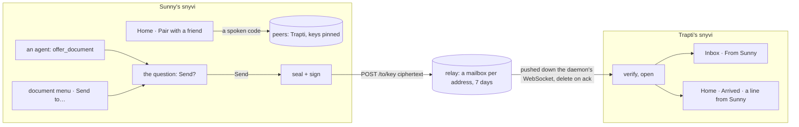
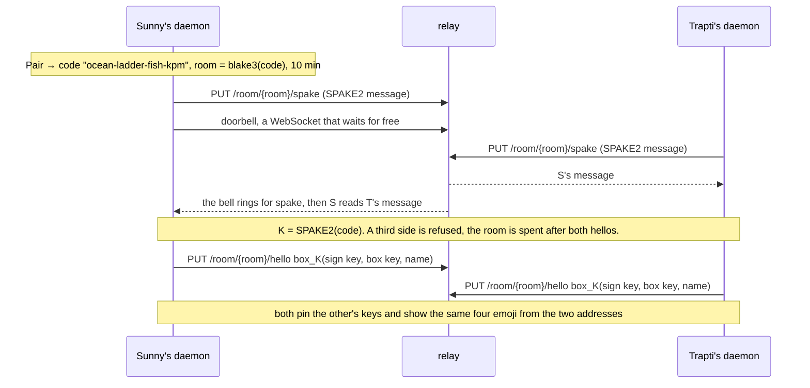
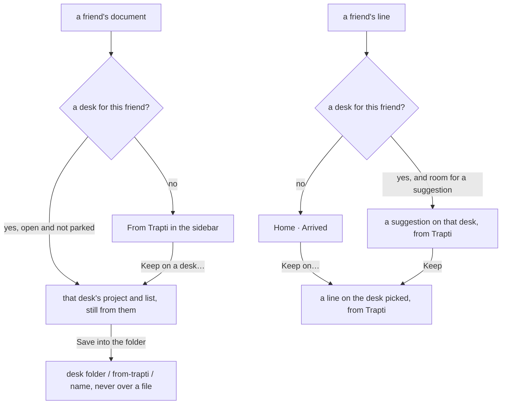
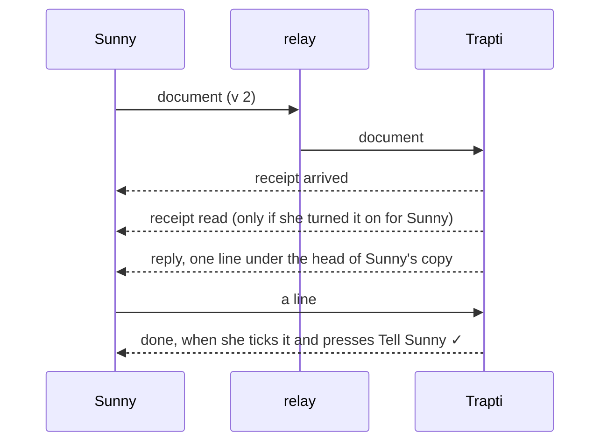

# A friend's snyvi

Two people, each running snyvi, hand each other documents. Sunny sends the
plan for the garden; it shows up on Trapti's Home and in her sidebar under
**From Sunny**, and she reads it like any document. Trapti's agent can offer
one back, and Trapti presses Send. Nothing else travels: no typing into a
desk, no messages, no presence. This page writes down how it works and
what each party sees.

## The shape



Both daemons sit behind NAT and one of them is asleep, so they do not talk
to each other: each has a mailbox at `relay.snyvi.com`, one Cloudflare
Worker (`relay/`), and leaves sealed frames in the other's. The relay sees
two public keys, a size and a time, and holds a frame until it is acked or
seven days have passed. A daemon with a friend keeps one WebSocket open to
its own mailbox, and the relay pushes a frame down it the moment it lands;
the mailbox sleeps in between.

## Keys

A daemon has one identity: an Ed25519 signing key and an X25519 box key,
minted the first time anyone pairs and kept where a desk's key values go
(`src/secrets.rs`): the Keychain on macOS, the Credential Manager on
Windows, a 0600 file on Linux, under desk 0 as `SNYVI_PEER_KEY`. The
signing key's public half, base64url, is the daemon's address at the relay.
No panel's environment ever gets this key: `desk::keys` lists names from
the store, and this name is in no row there.

## Pairing



The code is three words from the EFF short list and three check letters,
spoken or sent however the two like. SPAKE2 means a relay that saw every
byte, or anyone who guessed at the room, learns nothing without the code,
and a wrong code fails the exchange rather than pairing with a stranger.
Both sides then compare four emoji derived from the two public keys; a
mismatch means the room had a third party, and the row is removed.

## A frame

```
version(1) ‖ sender's signing key(32) ‖ nonce(24) ‖ box(payload) ‖ signature(64)
```

The box is XChaCha20-Poly1305 under a key blake3 derives from the X25519
shared secret and both box keys, with the version and sender as associated
data. The signature is Ed25519 over everything before it. The payload is a
JSON header (`kind`, `title`, `lang`, `name`, the sender's document id) and
the document's bytes, or a note's text.

A receiver finds the sender among its pinned keys first. The relay's
listing names the sender, so a frame from a key the daemon has not met is
not even downloaded: it is acked and gone. Then the signature against the
pinned key, then the box. Anything that does not check is dropped and the
relay is told to forget it.

## What arrives

A document goes through `receive::receive` like every document, with
`origin = peer`, the sender's name on it, and a project of its own: root
`peer:<address>`, named **From Trapti**. It is there within a second while
snyvi runs, and already in the Inbox when the window opens after a night. The sidebar gains one project row
per friend and nothing else, sent to the page as `friend` and with no root:
it is no folder, so it has no desk glyph, no New desk here, no Copy path
and no file manager, only Rename and Remove. The head says *from Trapti · verified*. A
second send of the same file is a version of the same row. A muted
friend's documents arrive read.

A line for the notes waits on Home, in **Arrived** -- *"water the beans"
from Trapti* -- with **Keep on…**, which puts it on the desk the reader
picks in one click, and ✕. The line on the desk keeps who sent it
(`desk_notes.sent_by`): the rail says *from Trapti* under it and the brief
writes `#93 water the beans (from Trapti)`. Ticking it sends nothing back
by itself: from 1.23 a ticked line from a friend shows **Tell Trapti ✓**,
and one press sends it back done, with the tick's commit (`done`, below).
Arrived cannot be hidden, so a line is never out of sight. Nothing received
is typed into a desk or run; a frame is content.

### Pictures

A Markdown page's own pictures travel inside it. On the way out, each
`` that is a png, jpeg, gif or webp beside the file and
inside its project becomes a `data:image/…;base64` URL, while the whole
stays under the 8 MB a frame carries. On the way in, the sanitizer keeps a
`data:` URL only on an `` and only for those four types: no SVG, no
page, no `data:` link. A picture that did not travel -- too large, outside
the project, or sent by a snyvi from before 1.19 -- reads *a picture that
stayed with Trapti: shot.png* where it stood, rather than a broken image.

## Keeping what arrives



A friend may be given a desk, on their line in Home's Friends (`→ Garden`;
`peers.desk_id`, 0 for their own row). From then on their documents land
in that desk's project and on its list, and their lines arrive as
suggestions on it (three may wait, as an agent's; past that, Arrived). A
desk that is closed or parked when something comes counts as none, so
nothing lands out of sight. Changing it moves nothing already here.

**Keep on a desk…**, in a friend's document's head and menu, moves it and
every version of it into a desk's project (`POST /api/docs/{id}/keep`);
**Keep all on a desk…** on their sidebar row does every one. Still *from
Trapti · verified*, now *on Garden*. Nothing is written to disk.

**Save into the folder** is the one step that writes a friend's bytes to
disk (`POST /api/docs/{id}/save`): into the desk's folder as
`from-trapti/<their file name>`, or the title as a name, and never over a
file -- a second save is `-2`. From there the desk's agents and git see it.
Both are the window's, behind the desk's capability.

## What comes back (1.23)



Three kinds answer a frame, each by the frame's id (the relay's id for it,
which both sides know) or the sender's id for a document:

| kind | carries | lands |
|---|---|---|
| `receipt` | `of` (frame id), `state`: arrived / read | the friend's row on Home: *sent → arrived → read* |
| `reply` | `re` (the sender's document id), `text` ≤ 200 | under the head of the sender's document, every version |
| `done` | `of` (a line's frame id), `text`, `commit?` | the line's row: *✓ done · abc1234*, and a toast |

*Arrived* is sent for every document and line kept. *Read* is sent when a
friend's document is opened, only for a friend the reader turned it on for
(**Tell them when read**, under ⋯ in their row; off by default). A reply is
one line, from **Reply to Trapti…** in the head of her document. A done
goes only when the reader presses **Tell Trapti ✓**. An answer to anything
that did not go to that friend is nothing.

Every frame says `v`, the version of what its snyvi reads (2 from 1.23),
and each friend's last `v` is kept (`peers.v`). The new kinds go only to a
friend at 2: a receipt for an older one is dropped, a reply or a done waits
in the outbox saying *their snyvi is older; this goes once they update*,
and goes the moment a frame from them says 2. A 1.22 that is sent one
anyway keeps it unread (`peer_held`) and reads it after its update.

## What an agent gets

One tool, `offer_document(to, id)`, listed only to a reader with a friend
(`tools/list` asks the daemon, and lists it when the daemon does not say).
The desk brief names the friends. The
daemon writes an offer and the reader sees the question where they are,
with the agent's name on it: Send, or Not now. An offer not answered when
the panel's program ends is answered No. Nothing leaves on an agent's word;
the friend's agent gets the same tool and nothing more. From 1.23 its
sibling `offer_line(to, text)` offers a line the same way: the reader sees
the line, and Send puts it in the outbox as a line from the reader.

## What goes out

A document or a line goes into the outbox (`peer_outbox`; a line is a row
with `text` and no document) and is tried at once. A relay that cannot be
reached keeps it there, and the link sends it when it is back: the sheet
says *Queued for Trapti* rather than failing. A document is one row per
recipient, so a resend replaces the first; a line is its own row each time.
Send to a friend… is in a document's menu and head only once there is a
friend.

## The relay

`relay/src/index.ts`, one Worker, two Durable Object classes. Routes:

| Route | Who | What |
|---|---|---|
| `PUT /room/{id}/{stage}` | either side | leave a pairing message, get the other's if it is there |
| `GET /room/{id}/ws?side=` + `Upgrade: websocket` | either side | the doorbell: `{"ready":stage}` when the other's lands; the room hibernates while it waits |
| `GET /room/{id}/{stage}?wait=` | either side | the other's message: at once with `wait=0`; up to 25 s for 1.18.0, which has no doorbell, one poll per side |
| `POST /to/{address}` | the sender's key (1.18.0: anyone) | leave a frame under `x-snyvi-id`; the same id from the same sender replaces; pushed to the link if one is open; 404 when nobody has signed in as the address |
| `GET /inbox/{address}` + `Upgrade: websocket` | the address's key | the link: every waiting frame, then each as it lands, as `{"frame":{id,sender,size,at}}` and, under 128 KB, its bytes; `{"ack":id}` back |
| `GET /inbox/{address}` | the address's key | what is waiting (id, sender, size), at once |
| `GET /inbox/{address}/{id}` | the address's key | the frame |
| `DELETE /inbox/{address}/{id}` | the address's key | ack |

Reads of a mailbox carry `x-snyvi-auth: <seconds>.<sig>`, an Ed25519
signature over the method, path and time, good for ninety seconds; the
upgrade may carry the same as `?auth=` instead, for a client that cannot
set a header. A deposit carries the same, by the sender's key, with the
sender named in `x-snyvi-from` -- the sender the frame names, or it is
refused. 1.18.0 daemons cannot sign, so an unsigned deposit is taken until
the relay's `REQUIRE_SIGNED` is turned on, about two weeks after 1.19.0;
it never replaces a signed one.

A mailbox takes nothing until its owner has signed in (the link, or a
listing; pairing signs in at its end), so an address made up costs the
relay nothing. Twenty frames may wait in it, five from any one sender, and
40 MB in all; past that the sender is told to try later and the frame
waits in its outbox, which does not count the wait as a failed try. The
frames' tables go with the last frame, and a mailbox with nothing waiting
whose owner has not been here for ninety days goes whole. A room takes two
sides and dies after ten minutes. Rooms and mailboxes hold their sockets
through hibernation, so a daemon's link costs nothing while nothing moves,
and "ping" is answered by the runtime without waking it.

Limits are counted by who is asking -- the signed address, the signed
sender, the room -- and by IP only where nothing else is: the first
sign-in of a mailbox and the first message of a room (once per install,
once per pairing), unsigned deposits, and a backstop of 600 calls a minute.
Many people can share an IP; what a limit refuses waits and goes again.
Workers Logs are off. `relay/README.md` has the deploy and the numbers.

## The threat model, in seven lines

- The relay is honest-but-curious at worst: it holds ciphertext, two
  public keys per frame, sizes and times. It cannot read, forge or replay
  a frame into a daemon (the signature is the sender's, the box is the
  recipient's, an id is one document's).
- A stranger who knows an address can leave five frames in its mailbox;
  the link acks them unread. They cannot read it (reads are signed), nor
  replace a friend's frame (the same id from another sender is kept out).
  An address nobody has signed in as takes nothing at all.
- A wrong or guessed code fails SPAKE2; a room is two sides and ten minutes.
- A stolen `SNYVI_PEER_KEY` is the identity: remove the friend row on the
  other side and pair again. Nothing else is derived from it.
- Nothing received runs: a document is rendered, a line waits for a hand.
- No account, no directory, no presence: two people who have met once.
- Someone with many IPs can still mint keys and fill mailboxes of their
  own, slowly; on the free plan a full relay refuses writes, it never bills.

## Where it lives

`src/peer.rs` (keys, code, frame, relay client, the link's pieces, the
tables), `src/server/api_peer.rs` (routes, pairing tasks, what to do with
a frame), `src/server/peer_link.rs` (the socket to the relay),
`ui/peer.js` (the sheets), `ui/home.js` (Arrived, Friends), `relay/` (the Worker).
`SNYVI_RELAY` points a daemon at another relay.
