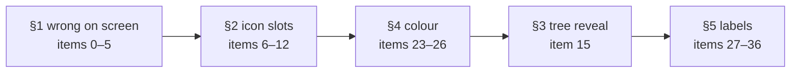
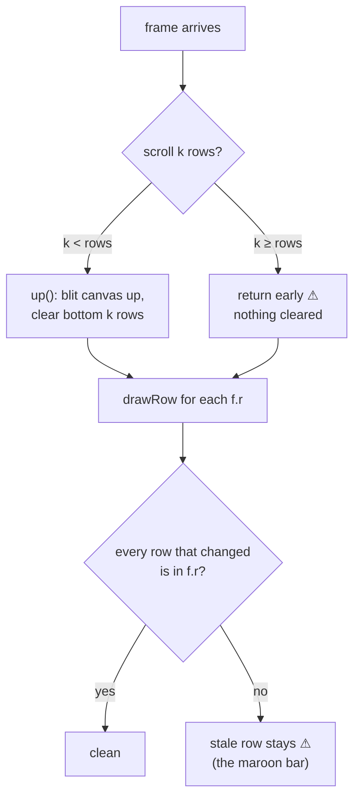
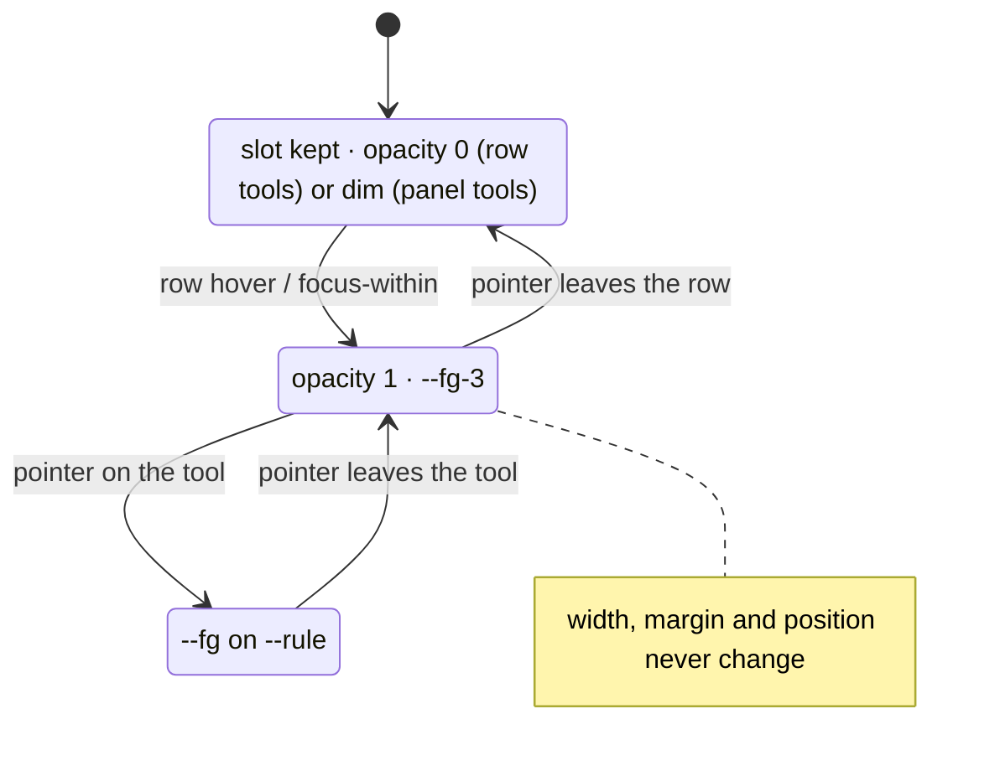
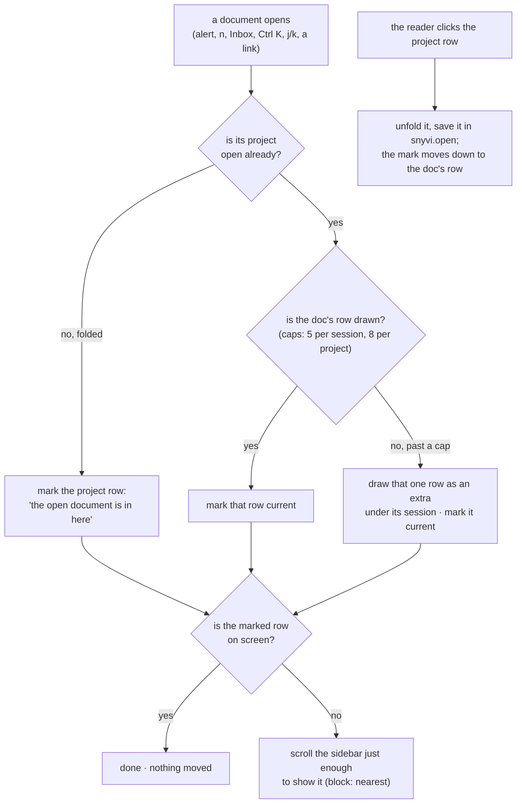
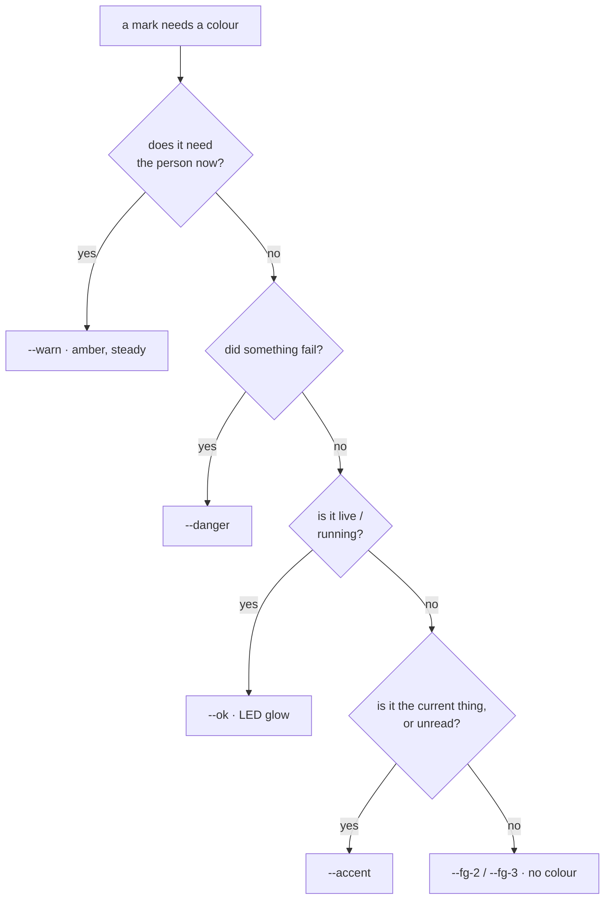
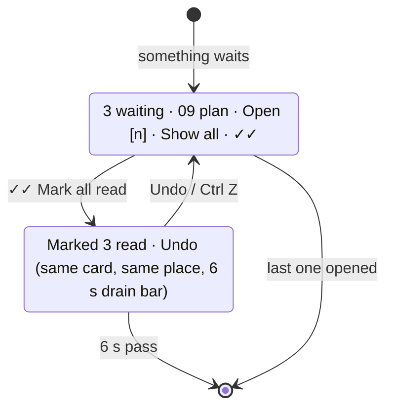
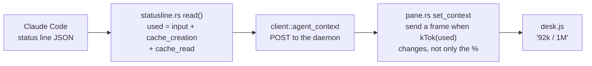
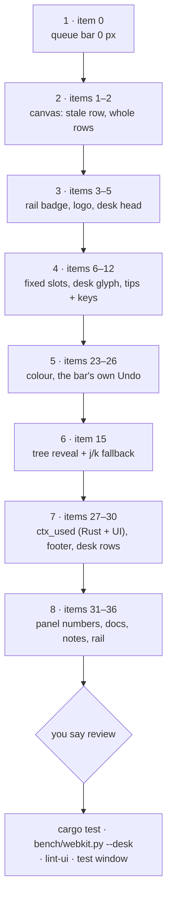

# UI audit — desk, sidebar, rail

2026-09-28 · v4 · from three screenshots and the 11 open desk notes (#19–#34), traced to the code in `claude/fixes` (1.8.0, `~/Projects/snyvi-fixes`) · nothing built yet

**New in v4.**
- `ctx_used` is approved, and its plan is written (items 27–29). The Claude Code docs show `total_input_tokens` is already the tokens in the window now, not a running total. So the exact figure is a small change, and the real bug is that it isn't sent often enough.
- Item 33 is decided: notes clamp to 2 lines, and the full text and the editor lay over the list, so nothing moves.
- No questions are open. Coding starts next session.

**New in v3.**
- Your answers are in: projects and desks stay separate, and the sidebar keeps its layout. Section 3 is now one change: opening a document from the alert or anywhere else outside the tree marks where it lives and unfolds nothing (item 15). The other sidebar items are parked in §6.

**New in v2.**
- Every item is traced to its file and line.
- Two of the four questions are answered from the code: the 7 counts connected agents, and `22% ● 1` is the fullest context window, a live dot and the number of panels.
- Section 4 now follows `docs/DESIGN.md` §5.2 rather than contradicting it.
- The screenshots came from an older build than `claude/fixes`. Items 3 and 26 are partly fixed there already, and each item says so.
- Flow diagrams and before/after mockups throughout.

Line numbers are for `claude/fixes` at 67175a8 plus its staged changes, so they will drift a little.

## In one paragraph

The app works, but the screen says too many things in too many places. The accent colour means seven things, and hover icons move the layout around.

Four problems are simply wrong and come first:
- a 10 px layout shift when the waiting alert appears;
- a stray bar painted in a panel;
- a half-cut top row in every panel;
- a count of 7 that looks like the waiting count but is not.

After that the work falls into four groups: one icon system, one meaning per colour, a quieter tree when a document opens, and small fixes to labels and numbers.

## Rules this brief holds to

- **Feedback where the click was.** Use the lowest rung of DESIGN §4.1's ladder: the thing itself changes, then the row, then the point. The corner is only for news that nobody clicked.
- **No layout shift, ever.** Nothing that appears, changes or goes away may move anything else. It lays over the page, or takes a place that was set aside for it.
- **Hover never moves anything.** Hover changes opacity and colour only. Every icon has a fixed slot.
- **One glyph, one meaning.** DESIGN §8.3: one SVG set, no text glyphs as icons.
- **One colour, one meaning.** DESIGN §5.2:
  - the accent means *current · unread*;
  - `--warn` means *needs you*;
  - `--ok` means *live*;
  - `--danger` means *failed*.
- **snyvi never deletes.** A ✕ removes from view, and the removal can always be undone.
- **The sidebar keeps its layout.** Same sections, same order, one row per project and one per desk. Only what is marked or unfolded changes.
- **Only the reader unfolds.** A project opens because the reader clicked it, never because a document in it was opened from somewhere else.

## The order of work



Section 1 goes first because it is wrong information. Section 2 comes next because one set of rules fixes six notes. Colour is small and makes the screen quieter at once. The tree reveal is one self-contained change. The labels can go in any gap.

---

## 1. Wrong on screen — fix first

### Item 0 · The waiting alert moves the page 10 px

**Now.** The bar is meant to take up no height, so the alert lays over the page. It does not.

```css
/* ui/app.css:968 */
#queue-bar { position: sticky; top: var(--head-h); height: 0;
             padding: 10px 48px 0; box-sizing: border-box; … }
```

With `border-box`, `height: 0` cannot squeeze out the padding, so the box is 10 px tall. When the alert appears:
- on a document, the text drops 10 px under the reader;
- on a desk, `#doc` stays at `height: 100%` inside `#main { overflow: hidden }`, so the whole desk slides down and its bottom 10 px is cut off.

When the alert goes, everything slides back.

```
  NOW                                   AFTER
  ┌──────────────────────────────┐      ┌──────────────────────────────┐
  │▒▒▒▒▒▒ 10 px of #queue-bar ▒▒▒│      │ desk head ┌─────────────────┐│
  │ desk head      ┌───────────┐ │      │ [1] shell │ 3 waiting · Open││ ← the card lays
  │ [1] shell      │ 3 waiting │ │      │ ░░░░░░░░░ └─────────────────┘│   over the page
  │ ░░░░░░░░░░░░░░ └───────────┘ │      │ ░░░░░░░░░░░░░░░░░░░░░░░░░░░░ │
  │ ░░░░░░░░░░░░░░░░░░░░░░░░░░░░ │      │ ░░░░░░░░░░░░░░░░░░░░░░░░░░░░ │
  └──────────────────────────────┘      └──────────────────────────────┘
   everything moved down 10 px           nothing moved
   and the bottom row is cut
```

**Change.** Keep the bar at exactly 0 and move the 10 px onto the card:

```diff
- #queue-bar { … height: 0; margin: 0 auto; padding: 10px 48px 0; box-sizing: border-box; … }
+ #queue-bar { … height: 0; margin: 0 auto; padding: 0 48px; box-sizing: border-box; … }
+ #queue-bar .qb { position: relative; top: 10px; }
```

Don't use `margin-top` on the card, because it collapses through the parent and shifts the page again. The rule `#queue-bar:not([hidden]) ~ #find { padding-top: 58px }` stays as it is, since the bar is still 0 tall.

**Verify.** Read the top edge before and after the alert appears; the two numbers must match:

```js
const y = () => document.querySelector(":root[data-view=desk] .dk-head, #doc > :first-child").getBoundingClientRect().top;
const a = y(); /* make something wait */ const b = y(); console.assert(a === b, a, b);
```

This is a screenshot-proof check. A still screenshot can't show a shift.

### Item 1 · A stray bar painted in panel [4]

**Now.** A solid maroon bar sits between "Zesting…" and the input line and stops about three-quarters of the way across. It looks like a canvas row that was never cleared. The desk-paint canvas has already shipped (it is in `claude/fixes`, not only in the old `claude/desk-paint` branch). These are the paths that can leave a row stale:

| Path | Where | Risk |
|---|---|---|
| Scroll blit `up()` returns early when `k >= v.rows` | `ui/desk.js:758` | Neither the cells nor the canvas shift, so correctness depends on the frame redrawing every row |
| `drawRow` clears only the dirty cell range `c0−1..c1+1` | `desk.js:703–704` | A wide or selection-coloured span that ends outside the range stays |
| A panel out of sight sets `v.behind`, and `catchUp` calls `drawAll` | `desk.js:159–162` | If `behind` is missed, old paint stays until the next full draw |
| The hidden text layer syncs once a second (`TEXT_MS`) | `desk.js` | Selection text can lag behind the paint (it does not paint itself) |



**Change.**
1. Reproduce it under `bench/webkit.py --desk`, using a Claude panel with a spinner line above the input.
2. When `k >= v.rows`, clear the canvas and call `drawAll` instead of returning.
3. Add a debug check behind a flag: after each frame, compare every row's cells with a hash of what was painted. Log the first mismatch with its row number.

**Verify.** The debug check stays quiet through 10 minutes of a busy agent, and the screen shows no bar.

### Item 2 · Every panel's top row is cut in half

**Now.** `fit()` (`desk.js:1017`) does `rows = floor((clientHeight − 8) / LINE_PX)`. The leftover `(clientHeight − 8) mod LINE_PX` pixels (0–15 at the default 16 px row) show as a sliver of scrollback directly under the header. That is because the view is pinned with `scrollTop = scrollHeight` and nothing snaps it to a whole row.

```
  NOW                                    AFTER
  ┌ [1] shell ▾ main  ● working ✎ ⤢ ┐    ┌ [1] shell ▾ main  ● working ✎ ⤢ ┐
  │ ▀▀▀▀▀▀ half a row ▀▀▀▀▀▀▀▀▀▀▀▀▀ │    │ $ cargo test                     │ ← whole first row
  │ $ cargo test                     │    │    Compiling snyvi v1.8.0        │
  │    Compiling snyvi v1.8.0        │    │ test result: ok. 214 passed      │
  │ test result: ok. 214 passed      │    │ $ █                              │
  │ $ █                              │    │                                  │ ← leftover px, blank,
  └──────────────────────────────────┘    └──────────────────────────────────┘   at the bottom
```

**Change.** Size `.pn-body` to whole rows and let the leftover be blank panel space at the bottom:

```js
// fit(), desk.js:1017
const r = Math.floor((v.body.clientHeight - 8) / LINE_PX);
v.el.style.setProperty("--pn-rows", r);
```
```css
.pn-body { height: calc(var(--pn-rows) * var(--pn-line) + 8px); flex: none; }
```

The leftover strip sits below the prompt, where it reads as padding. When the panel resizes, the strip changes size but no text moves, because the text is anchored to the top.

### Item 3 · The "7" is connected agents, and it reads as waiting

**The answer.**
- The header pill `#live` counts **connected agents** (`renderLive`, `app.js:1546`).
- The Waiting label, the queue bar and the rail's Inbox badge all read `state.waiting` in the same render, so they cannot disagree.
- 7 vs 3 is therefore agents vs waiting documents.

**Already in `claude/fixes`.** The header pill is grey with a green LED (`app.css:467–471`) and has the tooltip "7 agents connected". The red pill in the screenshot is the older build.

**Still wrong.** The rail's copy of the count, `#rail-live`, takes the shared `.badge` style, which fills with the accent (`app.css:340`). So on the rail it's an unlabelled red 7 beside the red Inbox 3.

```
  RAIL NOW        RAIL AFTER
  ┌────┐          ┌────┐
  │ ✉ ③│ accent   │ ✉ ③│ accent (unread)
  │ ◉ ⑦│ accent   │ ◉ 7│ --ok LED, plain figure, tip "7 agents connected"
  └────┘          └────┘
```

**Change.** Add a `.badge.live` variant: no fill, the figure in `--fg-2`, and a 6 px `--ok` LED (DESIGN §8: pills and counts).

### Item 4 · The logo is clipped and off-centre in the folded rail (note #26)

**Now.** The rail column is 44 px (`--side-c`, `app.css:244`). `.side-head` turns into a column with padding `14px 0 4px` (`app.css:331`). The brand mark is 20 px (`app.css:395`) while the icons are 28 px (`app.css:475`). So the mark's box doesn't share the icons' centre line, and its top padding differs.

```
  NOW              AFTER
  ┌──────┐         ┌──────┐
  │▟█    │         │  ◆   │  mark in a 28 px box, centred like the icons
  │  ☰   │         │  ☰   │
  │  ✉   │         │  ⌕   │  search moves up (item 34)
  │  ◉   │         │  ✉   │
```

**Change.** `.side-head .brand { width: 28px; height: 28px; display: grid; place-items: center; }`. Check it in the real window with the sidebar hidden, because that is where note #26 was seen.

### Item 5 · A stray "S" peeks out beside the rail

**Now.** The desk head `.dk-head` gets a right offset for the window buttons (`desk.js:2690`, `frame.js:34`) but no left offset. `#chrome` gets `padding-left: 36px` only in the mac frame (`frame.js:38–39`). The cause on Linux is **not confirmed**.

**Change.** Start `.dk-head` at the main area's left edge plus the same inner padding `#chrome` uses, so the desk name can't slide under the rail. Confirm the cause in the real window before changing anything.

---

## 2. One icon system

**The problem.** Icons appear on hover, push each other aside and collide. Notes #21, #29, #32, #33 and #34 are all symptoms of the same thing: some tools reserve their space and some don't.

| Where | How a tool hides | Moves on hover? |
|---|---|---|
| Project row ✕ `.row-x` | `width: 0; padding: 0`, then `width: auto` on hover (`app.css:713–714`) | **yes, about 17 px** |
| Project row desk icon `.b-new` | opacity (`app.css:747–751`) | pushed by the ✕ |
| Doc and desk rows | absolutely placed, opacity (`app.css:723–727`) | no |
| Panel ✎ `.pn-ren` | opacity, hover only (`desk.js:2712–2713`) | no, but it shows on one panel and not another |
| Panel ⤢ `.pn-full` | opacity, on hover **or focus** (`desk.js:2708–2709`) | no, but its −4 px margin pulls it onto the status |

### The system

```
  a row, 28 px tall (--row-h)                              fixed slots, right-aligned
  ┌────────────────────────────────────────────────────┬──────┬──────┐
  │ ▣  label ………………………………………… ▾  meta             │ act  │  ✕   │
  └────────────────────────────────────────────────────┴──────┴──────┘
    icon  label (flex: 1, ellipsis)   chevron            22 px   22 px   ← --ib row size
                                                          always there; opacity only
```

- **Slots belong to the row**, not to the hover. Each action slot is 22 px (DESIGN §8 `--ib`: 28 chrome · 22 row · 18 inline). The glyph is 16 px in the chrome and 14 px in the rail (§8.3).
- **Hidden means opacity 0 in its slot.** Never `width: 0`, `display: none` or a negative margin.
- **Hover and focus change opacity and colour only.** Rest is 0, row hover or `:focus-within` is 1, and hovering the tool itself raises it to `--fg` on a `--rule` background.
- **Every icon has a tip** with its name and its key, through `data-tip` and `data-key` and `keyHint()` (`app.js:1864`, `tip.js`). The panel header still uses raw `title` attributes, and those move to the tip.
- **One glyph per meaning**, recorded in DESIGN §8.3's table.



### Item 6 · The project row's desk icon jumps left (note #34)

```
  NOW, rest                                   NOW, hover
  │ ▣ snyvi-winget                    ▣ │     │ ▣ snyvi-winget               ▣  ✕ │
                                     ^                                    ^ moved 17 px

  AFTER, rest                                 AFTER, hover
  │ ▣ snyvi-winget                 ▦    │     │ ▣ snyvi-winget                 ▦  ✕ │
                                   ^ fixed                                 ^ same place
```

**Change.**

```diff
- .row-x { width: 0; padding: 0; overflow: hidden; … }
- .t-proj > summary:is(:hover, :focus-visible) .row-x { width: auto; margin-left: auto; padding: 2px 4px; overflow: visible; }
+ .row-x { width: var(--ib-row); height: var(--ib-row); display: grid; place-items: center; opacity: 0; … }
+ .t-proj > summary:is(:hover, :focus-within) .row-x, .row-x:focus-visible { opacity: 1; }
```

The same change applies to `.b-new`. Also fix a specificity bug: the dim `.b-new:not(.has)` at .45 (`app.css:760`, specificity 0,3,1) beats the hover rule (`app.css:751`, 0,2,1), so the "New desk" icon never lights on hover.

### Items 7 and 8 · Panel header tools: always there, never colliding (notes #32, #33)

**Now.**
- ✎ shows only on hover. ⤢ also shows on the focused panel (`.pn.on`). So the focused panel shows ⤢ alone, and a hovered panel shows both.
- In full view ⤡ is forced visible, and its `margin: -2px -4px -2px 2px` pulls it onto `● working 9%`.
- The tab strip adds `::after " ⤢"` to the active tab (`desk.js:2700`), so ⤡ and ⤢ are on screen together.

```
  NOW, panel [1] focused, panel [4] not
  ┌ [1] claude  ▾ main   ● working 9%    ⤢ ┐  ┌ [4] claude  ▾ ui   ● working 22%     ┐
    (✎ only on hover)                           (nothing until hover)

  NOW, full view
  ┌ [1] claude  ▾ main   ● working 9%✎⤡ ┐    tabs:  [1] ⤢   [4]      ← two opposite glyphs
                                     ^^ collide

  AFTER, every panel, grid or full view
  ┌ [1] claude  ▾ main          ● working   ✎  ⤢ ┐
                                            ^^  ^^  two 22 px slots, --fg-3 at rest, --fg on hover
  AFTER, full view
  ┌ [1] claude  ▾ main          ● working   ✎  ⤡ ┐    tabs:  [1]   [4]    ← the current tab is marked
                                                                          by the accent, not a glyph
```

**Change.**
- `.pn-ren` and `.pn-full` are always at opacity 1, in `--fg-3`, with no negative margins, each in a 22 px slot.
- Full view swaps only the drawing, maximise to restore, both SVG (§8.3).
- Drop the tab's `::after " ⤢"`.
- Context use leaves the header (item 29), which frees its width.

### Item 9 · One glyph meant "open desk", "a desk" and "the Desks section" (note #29)

**Now.** `projDeskBtn` (`app.js:281–286`) draws the desk icon (`app.js:184`), which looks like a terminal prompt. The Desks section and the rail use the same drawing.

**Change.** Give desks a glyph of their own, a 2×2 grid of panels (`▦`), since a desk *is* panels. The terminal drawing then means a real shell, or nothing. Add a row to DESIGN §8.3:

| Concept | Glyph | Replaces |
|---|---|---|
| desk | svg 2×2 panels | the terminal prompt |
| terminal / shell | svg prompt | — (only for an actual shell) |

### Item 10 · Bright and dim desk icons on project rows

**The answer.**
- **Bright** (`.b-new.has`, opacity 1) means this project *has* a desk, and the tip reads "Show its desk".
- **Dim** (.45) means it doesn't, and clicking makes one ("New desk").

The difference is real, but nothing on screen says so.

**Change.**
- Keep both states in the same fixed slot (item 6), so the row's layout doesn't change.
- **Has a desk:** the desk glyph at full `--fg-3`, tip "Show its desk".
- **No desk:** the slot sits at opacity 0 until the row is hovered, tip "New desk".
- The meaning stays, but it now comes from the tip and from being visible at rest, not from a half-opacity that looks like a bug. This also fixes the specificity bug (item 6), so "New desk" lights on hover.

### Item 11 · The ◑ before a panel title

**The answer.** snyvi doesn't draw it. It's Claude Code's spinner frame in the terminal title, stored raw (`src/screen.rs:1356`) and shown in `.pn-cmd` (`desk.js:1108`). The rail strips leading symbols with `short()` (`desk.js:1545`); the panel header doesn't.

**Change.** Run the header's title through `short()` as well. The state already sits in `.pn-state`.

### Item 12 · Keys on every tip (note #21)

The tip machinery is in `claude/fixes` already (`tip.js`, `data-key`, `keyHint()`). What's missing is the data on each icon. Keys are shown as glyphs on macOS and words on Linux and Windows (DESIGN Q8).

| Icon | Tip | Key |
|---|---|---|
| Panel ✎ | Rename panel | F2 |
| Panel ⤢ / ⤡ | Full view / Back to the grid | Ctrl Alt Z |
| New panel | New panel | Ctrl Alt N |
| Close panel | Close panel | Ctrl Alt W |
| Rail search, header search | Search | Ctrl K |
| Rail Inbox | Inbox · 3 waiting | I |
| Queue bar Open | Open next waiting | N |
| Hide / show sidebar | Sidebar | \ |
| Desk swap | Switch desk | Ctrl ` |

The single-letter keys work only after Ctrl B turns keys on (`keys.js:127–168`). Their tips should say so once, in the tip's sub-line: "Keys on: Ctrl B".

---

## 3. The sidebar: open a document without unfolding the tree

**Decided 2026-09-28.**
- Projects and desks stay separate rows.
- The sidebar keeps its layout: same sections, same order, no new headings.
- The only sidebar change in this pass is how the tree reacts when a document is opened from somewhere other than the tree.

### Item 15 · Opening a doc unfolds its whole project (note #30)

**What you see.** You click a document in the waiting alert (or press `n`, or pick it from the Inbox or Ctrl K). The sidebar then:
- unfolds the document's whole project;
- draws the document's session uncapped;
- keeps the project open afterwards.

A project like bos_dog then takes the full height, and the project you were working in goes off screen.

**Why, in the code (`claude/fixes`):**

| Step | Where | What it does |
|---|---|---|
| 1 | `projOpen` `app.js:292` | A project is drawn `open` if the reader opened it, **or the document on screen is in it**, or it is the only project |
| 2 | `wholeWf` `app.js:597` | The session holding the document on screen is drawn whole, past the 5-row cap |
| 3 | `renderTree` `app.js:701–702` | Before each redraw, every `.t-proj[open]` in the page is added to `openProjects`, so a project forced open in step 1 counts as one the reader opened |
| 4 | toggle handler `app.js:883–884` | An element created with `open` fires `toggle` in Chrome and WebKit, which adds the project to `openProjects` and **saves it** (`snyvi.open`) |

So step 1 is a reveal, and steps 3 and 4 turn it into a permanent unfold. The reader never clicked the project, but it stays open across redraws and restarts.

**The rule.** *Only the reader's own click unfolds a project.* Opening a document from anywhere else marks where it lives and unfolds nothing.



**What it looks like.** In both cases below, the open document is `09 plan` in bos_dog.

```
  NOW: click "09 plan" in the waiting alert
  ┌───────────────────────────────┐
  │ ✉ Inbox                     3 │
  │ Waiting ③                     │
  │ ▣ snyvi              ▾      ▦ │   ← the project you were working in
  │ ▣ bos_dog            ▴      ▦ │   ← unfolded by itself
  │    Brief                      │
  │    ▤ 25 launch                │
  │    ▤ 24 prices                │
  │    ▤ …  (whole session, 25)   │
  │    ▤ 09 plan    ◀ current     │
  │    ▤ …                        │   the rest of the sidebar
  │ ▣ everything.dog     ▾        │   is pushed off screen
  └───────────────────────────────┘

  AFTER: same click
  ┌───────────────────────────────┐
  │ ✉ Inbox                     3 │
  │ Waiting ③                     │
  │ ▣ snyvi              ▾      ▦ │
  │▌▣ bos_dog            ▾      ▦ │   ← stays folded; marked "the doc is in here"
  │ ▣ everything.dog     ▾        │
  │ ▣ everythingdog      ▾        │   nothing below moved
  │ Desks …                       │
  └───────────────────────────────┘

  AFTER: the reader clicks bos_dog
  │ ▣ bos_dog            ▴      ▦ │   ← unfolded because the reader asked
  │    Brief                      │
  │    ▤ 25 launch                │
  │    ▤ …  (capped at 5)         │
  │   ▌▤ 09 plan                  │   ← the mark moved to the doc's row,
  │    20 more                    │     drawn even though it is past the cap
```

**The mark on a folded project.** It says "what you are reading is in here", and it is a quieter version of the current-row mark (DESIGN §5.2, where the accent means current):

| Row | Mark |
|---|---|
| The doc's own row (drawn) | current: `--accent-bg` tint, accent icon, `aria-current="page"` |
| Its folded project row | a 2 px accent bar on the left and the project icon in the accent, no tint; `aria-current="location"`; tip "09 plan is open · click to show it" |

Both marks are colour only, so neither moves anything.

**Change, in the code:**

```diff
  // app.js:292 — a project is open only because the reader opened it
- const projOpen = p => openProjects.has(String(p.id)) || (state.doc && state.deskBehind == null && state.doc.project_id === p.id) || state.tree.length === 1 || (gone && …);
+ const projOpen = p => openProjects.has(String(p.id)) || state.tree.length === 1 || (gone && …);

  // app.js:597 — the open doc's session is no longer drawn whole; its own row rides past the cap
- const wholeWf = w => liftedWorkflows.has(w.id) || (state.doc && state.doc.workflow_id === w.id);
+ const wholeWf = w => liftedWorkflows.has(w.id);
+ // in projectRows: if the doc on screen is in w and not in `docs`, append its row after the capped rows
```

- **`markActive()`** (`app.js:248`): when the doc's row isn't in the page, mark `.t-proj[data-pid="…"] > summary` with the class `holds-current` and `aria-current="location"`. Then scroll the sidebar to that row only if it is off screen. `scrollIntoView` does nothing in WebKitGTK inside skipped content (`app.js:2256`), so use the same set-`scrollTop` fallback the document uses.
- **Steps 3 and 4:** with step 1 gone, a project is only drawn `open` when it is in `openProjects` already, so the DOM sweep and the `toggle` from a newly created `open` element add nothing new. No change is needed there. Test for it anyway (see Verify).
- **`j` / `k`** (`keys.js:136`) walk `order()`, which reads the **drawn** rows (`app.js:1070`). With the project folded, the open doc isn't among them, so `j` would jump to the first drawn row. Make `order()` fall back to the doc's project and session data (`state.sub`) when its row isn't drawn. `[` and `]` already read data (`siblings()`, `app.js:1080`) and need no change.
- **Unchanged:** a document read over a desk (`deskBehind`) still leaves the sidebar alone, and a project that is the only one is still drawn open.

**Verify** under `bench/webkit.py` or the test window on a spare port (never 7777):
1. With bos_dog folded, open a bos_dog doc from the waiting alert. bos_dog stays folded and carries the mark, and the top of every other row is unchanged (read `getBoundingClientRect().top` before and after).
2. Reload. bos_dog is still folded, and `snyvi.open` doesn't contain it.
3. Click bos_dog. It unfolds, the doc's row carries the mark, and the session is capped at 5 plus that row.
4. Press `j` and `k` with the project folded. They step through bos_dog's documents in order.
5. Open a doc in a project that is already open. Only the mark moves.

---

## 4. One colour, one meaning

**What changed from v1.** v1 said "red means needs you". DESIGN §5.2 had already decided otherwise (Q12):
- the accent means **current · unread**;
- `--warn` (amber) means **needs you**.

This brief now follows DESIGN. The screen still has too much accent, because it is used for things that are neither current nor unread.



### Item 23 · Every accent on screen, sorted

| Mark | Where | Is it current or unread? | After |
|---|---|---|---|
| Brand mark | `.bm-body` → `--mascot`, `app.css:397` | brand | stays |
| Waiting count pill, solid fill | `.t-label .n`, `app.css:614` | unread | accent **figure**, no fill (item 25) |
| Unread doc icons | `app.css:610` | unread | stays |
| Active row | `app.css:584, 586, 603, 777` | current | `--accent-bg` tint + 2 px accent bar; text stays `--fg` (item 24) |
| Rail Inbox badge | `.badge`, `app.css:340` | unread | stays |
| Rail agent badge | `.badge` on `#rail-live` | **no, live** | `--ok` LED + plain figure (item 3) |
| Rail aside dot | `#rail-note i`, `app.css:345` | unread aside | stays, and gets the tip "An aside is waiting" instead of "Aside" |
| Queue bar count | `.qb-n`, `app.css:982` | unread | stays; it is the one that interrupts |
| Ghost bar, `.t-undo` | `app.css:647, 742` | an action | Undo text in the accent, per DESIGN §8 `-undo` |
| Pin | `app.css:655` | neither | `--fg-2`, with a filled pin when pinned |
| Links, the TOC's current entry | `app.css:229, 1117` | current / link | stays |

### Item 24 · The current desk looks like an alert

```
  NOW                                AFTER
  │█ snyvi   22% ● 1 ████████│       │▌ snyvi            ● 2 working │
   solid accent, reads "alarm"        ^ 2 px accent bar, --accent-bg tint, --fg text
```

### Item 25 · Waiting is announced three times

**Now.** The Waiting pill (solid fill), the rail Inbox badge and the queue bar all announce the same 3 at the same moment.

**Change.** While the bar is showing, it is the one that interrupts. The pill becomes a plain accent figure with no fill, and the rail badge keeps its dot but not its fill.

### Item 26 · Closing the waiting alert (note #19)

**Already in `claude/fixes`.** `clearQueue()` (`app.js:530–550`) now marks all read and anchors an Undo toast where the bar stood, for 6 s. The corner toast in the screenshot is the older build.

**Still to do.** The answer should come from the bar itself (rung 1, DESIGN §4.4 `.ghost`), not from a bubble beside it.



```
  ┌──────────────────────────────────────────────────────────┐
  │ ☺ 3 waiting · 09 plan · snyvi     Open n   Show all   ✓✓ │   before the click
  └──────────────────────────────────────────────────────────┘
  ┌──────────────────────────────────────────────────────────┐
  │ Marked 3 read                                      Undo  │   same card, same size
  │▔▔▔▔▔▔▔▔▔▔▔▔▔▔▔▔▔▔▔▔▔▔▔▔▔▔▔▔▔▔▔▔▔▔▔▔▔▔                    │   the drain bar, 6 s
  └──────────────────────────────────────────────────────────┘
```

The card lays over the page exactly as the bar does (item 0), so neither state moves anything.

---

## 5. Labels, numbers, footer

### Items 27–29 · The panel line and context use (notes #28, #31)

**Now.**
- The meta pane (`desk.js:1654–1682`) repeats Desk and Folder from the title above. It shows `[1] · Opus 5.5 · 9% of 1M · working 3m`, which wraps to two lines.
- The header shows `● working` and `9%` side by side (`.pn-state`, `.pn-ctx`).

**Where the numbers come from.** `snyvi statusline` reads Claude Code's status-line JSON after every reply (`src/statusline.rs:42–66`). According to [Claude Code's status-line docs](https://code.claude.com/docs/en/statusline.md), the context window looks like this:

```json
"context_window": {
  "total_input_tokens": 15500,          // input of the latest response, so this IS what's in the window now
  "total_output_tokens": 1200,
  "context_window_size": 200000,
  "used_percentage": 8,                 // = input + cache_creation + cache_read, output not counted
  "remaining_percentage": 92,
  "current_usage": {                    // null before the first call, and again right after /compact
    "input_tokens": 8500,
    "output_tokens": 1200,
    "cache_creation_input_tokens": 5000,
    "cache_read_input_tokens": 2000
  }
}
```

| snyvi field | Source today | Finding |
|---|---|---|
| `model` | `model.display_name` | fine |
| `ctx_pct` | `used_percentage` | rounded to a whole %; can be null early in a session |
| `ctx_size` | `context_window_size` | the "1M" |
| `ctx_in` | `total_input_tokens` | **already the tokens in the window now** (v2 wrongly guessed it was a running total). But it lags: `set_context` (`pane.rs:681–684`) only sends a frame when model, % or size change, and at 1M, 1% is 10k tokens |

**Decided (2026-09-28): add `ctx_used`, so the figure is exact.**



1. **`src/statusline.rs`.** Add `used: Option<u64>` to `Seen`. It is the sum of `current_usage.input_tokens`, `cache_creation_input_tokens` and `cache_read_input_tokens` (the same basis as `used_percentage`, with output not counted).
   - If `current_usage` is null, fall back to `total_input_tokens`.
   - If both are null (before the first call, or just after `/compact`), use `None`.
   - Unit-test `read()` with the docs' example (expect 15500), with `current_usage: null`, and with the whole block missing.
2. **`src/client.rs`, `src/server.rs:4013–4075`.** Carry `used` in the context POST, next to `input`. An older binary that doesn't send it must still work, so the field is optional.
3. **`src/pane.rs`.**
   - Add `ctx_used: Option<u64>` to the status (`pane.rs:148–160`), and clear it with the others when the session ends (`pane.rs:164–169`).
   - In `set_context`, send a frame when the **shown** figure changes: `used / 1000` for values under 1M, and `used / 100_000` for values of 1M and above, matching `kTok`. The line runs after every reply; this keeps the frames rare and the figure never stale.
   - Drop `ctx_in`, which `ctx_used` replaces. It is only read by the two tips in `desk.js:1131, 1668`.
4. **`ui/desk.js`.**
   - `used(s) = s.ctx_used ?? (s.ctx_pct != null && s.ctx_size ? Math.round(s.ctx_pct * s.ctx_size / 100) : null)`. The fallback covers a daemon or status line older than this change.
   - Show `kTok(used) / kTok(size)`, e.g. `92k / 1M`.
   - `kTok` (`desk.js:1113`) drops a trailing `.0` (`1M`, not `1.0M`) and keeps one decimal above that (`1.2M`).
   - Warm and hot thresholds stay on the %.
   - When `used` is null (before the first call, or just after `/compact`), show `— / 1M` in `--fg-3` rather than an old number.

**Verify.**
- The `cargo test` cases above pass.
- In a live panel: `/compact` shows `— / 1M` until the next reply, and after 5 short replies the figure moves each time while the % may not.

```
  META NOW                               META AFTER
  Desk     snyvi  ✎ ✕                     [1] Opus 5.5 · 92k / 1M · working 3m
  Folder   ~/Projects/snyvi               In  ~/Projects/snyvi/ui      ← only when it differs
  Panel    [1] · Opus 5.5 · 9% of 1M ·
           working 3m

  HEADER NOW                             HEADER AFTER
  ┌ [1] claude ▾ main  ● working 9% ✎ ⤢ ┐  ┌ [1] claude ▾ main  ● working  ✎ ⤢ ┐
                                          ┌ [1] claude ▾ main  ● working  88k/100k  ✎ ⤢ ┐
                                            ^ context appears in the header only when warm (≥70%)
                                              or hot (≥85%, --warn), using the space set aside
                                              for it, so nothing moves
```

The desk's name and folder are already in the desk head, and rename and ✕ move to its context menu. `kTok` (`desk.js:1113`) already formats `92k` and `1.0M`; drop the `.0`.

### Item 30 · The desk row's `22% ● 1`

**The answer.**
- **22%** is the fullest context window among the desk's panels (`fullest()`, `app.js:2895`). It goes amber at 85%.
- **●** is `mark3` (`app.js:2893`): green when a panel is running, amber `!` when one is blocked, `○` when idle.
- **1** is the number of panels.

With every desk running one agent, it's always `● 1`, which says nothing.

```
  NOW                        AFTER
  │ ▦ snyvi   22% ● 1 │      │ ▦ snyvi              ● │   live, nothing unusual
  │ ▦ OMD      8% ● 1 │      │ ▦ OMD                  │   idle: no dot
                             │ ▦ ledger   ! needs you │   --warn, the one thing worth a word
                             │ ▦ api      91% ● 2     │   % only when ≥ 85, count only when > 1
```

The tip carries everything: "2 panels · 1 working · context 91% (Opus 5.5)".

### Item 31 · Panels skip from [1] to [4]

**The answer.** A number is the panel's **slot**, not its position. A new panel takes the lowest free slot (`src/desk.rs:319, 347`), and closing a panel never renumbers the others. The number is also the panel's key, Ctrl Alt 1–4. Separately, `room()` (`desk.js:1191`) shows at most 4 panels above 720 px, 2 above 560 px and 1 below that; the rest become `[n]` tabs.

**Change (differs from v1).** Keep the numbers, since renumbering would move the keys under the reader's fingers. Instead, make the number explain itself:
- the slot's tip reads "Panel 4 · Ctrl Alt 4";
- when panels are tabbed away, the tab strip reads `[2] [3]` in `--fg-3` with the tip "Not enough room · Ctrl Alt 2";
- when a slot is just empty, show nothing.

### Items 32–36

| # | Now | Where | Change |
|---|---|---|---|
| 32 | The docs list has no heading, titles end in a CSS ellipsis at the column width, and the `[1]` chip is unexplained | `desk.js:2882, 2901, 2903`; `DOCS_SHOWN = 8` | A "Documents" label. Titles clamp to 2 lines (`-webkit-line-clamp: 2`). The chip becomes the sending panel's name in `--fg-3`, with the tip "Sent by [1] claude" |
| 33 | Notes wrap in full; one takes 6 lines | `.dk-note > .nm`, `desk.js:2928` | Clamp to 2 lines; the full note lays over the list, never pushes it (see below) |
| 34 | Search is at the rail's bottom (`margin-top: auto`) but in the sidebar's header | `app.css:338` | Put it straight under the brand mark in the rail, in the same order as the sidebar |
| 35 | The rail doesn't show which desk you're on; `.icon.on` only marks an open popover | `app.css:337`, `menu.js:481` | The current desk's rail icon gets item 24's "you are here": an `--accent-bg` tint and a 2 px accent bar |
| 36 | Group labels, ages, "less" and "32 more" are hard to read | `--fg-3` | Labels follow DESIGN Q4 (weight 600, `--fg-3`). Ages and the "more" / "less" links rise to `--fg-2`. `bench/lint-ui` checks 4.5:1 in all 8 themes |

```
  item 32, NOW                   item 32, AFTER
  ┌──────────────────────┐       ┌──────────────────────┐
  │ ▤ UI audit — desk… [1]│       │ Documents            │
  │ ▤ Perf scope 2026… [1]│       │ ▤ UI audit — desk,   │
  │                       │       │   sidebar, rail      │
                                  │   claude · 4m        │
```

### Item 33 · Long notes: clamp to 2 lines, and show the rest over the list

**Decided (2026-09-28).** A note never grows in place, because that would push every note below it down. The full text lays over the list instead, the way a tip does.

**Now.** A note's text is a button (`data-a="note-edit"`, `desk.js:1774`): a click turns it into a one-line `<input>` for rewriting (`desk.js:1769`). A 6-line note becomes a single line you can't see while editing it.

**Change, in two parts:**

| When | What happens | Moves anything? |
|---|---|---|
| At rest | The note clamps to 2 lines (`-webkit-line-clamp: 2`) and ends in a 1-line fade to the row's background | no; the row is always 2 lines at most |
| Hover (450 ms) or keyboard focus | The snyvi tip shows the **whole** note, placed left, like every tip on the desk's right rail (DESIGN §8.1). Only when it's clamped (`data-tip-overflow`) | no; the tip is its own layer |
| Click (rewrite) | The editor opens **over** the note as a card: same left edge and width, a `<textarea>` that grows to fit, laid over the notes below it (`--bg-raise`, `--shadow-2`, `--z-pop`). Enter saves, Shift+Enter adds a line, and Esc or a click outside cancels | no; the row underneath keeps its 2 lines |

```
  AT REST                               HOVER                            CLICK TO REWRITE
  ┌─ Notes ───────────────────────┐     ┌─ Notes ─────────────────┐      ┌─ Notes ───────────────────────┐
  │ ☐ When we close the banner   │    ◂│ When we close the banner │      │ ☐ ┌───────────────────────────┐│
  │   for new doc alert then th░ │     │ for new doc alert then   │      │   │When we close the banner   ││
  │ ☐ shortcut key on mouseover  │     │ the toast message come   │      │   │for new doc alert then the ││
  │ ☐ bug: when hide the side b░ │     │ to bottom right but our  │      │   │toast message come to      ││ ← laid over
  │   the snyvi icon is not ali░ │     │ rule is that message …   │      │   │bottom right but our rule… ││   the notes
  │ ☐ add option to add image    │     └──────────────────────────┘      │   │                     ↵ save││   below
  └───────────────────────────────┘      tip, left of the rail            │ ☐ └───────────────────────────┘│
                                                                          └───────────────────────────────┘
```

**Code.**
- `.dk-note > .nm` gets `display: -webkit-box; -webkit-line-clamp: 2; -webkit-box-orient: vertical; overflow: hidden;` plus `data-tip="<full text>" data-tip-overflow`.
- **`tip.js:64`** checks only width (`scrollWidth > clientWidth`). A line clamp cuts height, so add `|| c.scrollHeight > c.clientHeight + 1`.
- The **edit field** becomes an absolutely placed `<textarea>` inside the `.dk-note` (the row is `position: relative`). It auto-grows by `scrollHeight`, is capped at 12 lines and then scrolls. The row keeps its own height underneath.
- The **new-note field** (`desk.js:1747`) stays a one-line input. It's at the end of the list, so a new note that needs two lines wraps into its 2-line row when saved.
- A note ticked with `done_by` keeps its by-line under the 2 lines. The by-line is part of the row's fixed height, not something that comes and goes.

**Verify.** Read the list's row tops before and after hovering, and before and after opening the editor. They must match.

---

## 6. Not part of this pass

- **Images in notes (note #27).** This is a feature, not a fix: pasting or dropping, storage, and the notes' bytes budget (53 KB now). It gets its own plan.
- **Sidebar layout (decided 2026-09-28: keep it).** Parked from v2, with none of them built:

| # | Parked | Why it's parked |
|---|---|---|
| 13 | One row for a project and its desk; "Open now" at the top | Decided: they stay separate |
| 14 | Move Desks above Projects | The layout stays |
| 16 | A "Projects" heading | Adds a row; the layout stays |
| 17 | One wording for the expand links ("Show 8 more" / "Show less") | Wording only; can come back on its own |
| 18 | Parent folder dimmed after near-identical names | Adds text to rows |
| 19 | Sort numbered docs by number | Changes the order |
| 20 | Group label that isn't a filename | Wording only; can come back on its own |
| 21 | One truncation style that never cuts inside brackets or an extension | Can come back on its own |
| 22 | "+ Open folder" styled as an action | Can come back on its own |

---

## Where each note lands

| Note | What it says | Items |
|---|---|---|
| #19 | The toast goes to the corner after closing the banner | 26 |
| #21 | Shortcut keys on hover | 12 |
| #26 | The logo is misaligned with the sidebar hidden | 4 |
| #27 | Images in notes | §6 |
| #28 | Tokens shown as k | 28 |
| #29 | The terminal icon isn't appropriate | 9, 10 |
| #30 | Opening a doc expands the whole tree | 15 |
| #31 | The footer's meta details | 27 |
| #32 | Edit and zoom always visible | 7 |
| #33 | Icons collide in zoom | 8 |
| #34 | The terminal icon moves on hover; make a system | 6, §2 |

## Build plan for next session

**Where.** Build on `claude/fixes` in `~/Projects/snyvi-fixes` (1.8.0), not on this checkout's `claude/desk-paint`, which is the old 1.6.0 line. That worktree has staged changes from another session: stage by hunk, and don't touch files that aren't yours. Everything goes on this one branch and is pushed once at the end.

**How.** Write all the code first. No builds, restarts or bench runs until you say "review". Then test in the separate test window on a spare port, never 7777.



| Step | Commit | Files | Checked by |
|---|---|---|---|
| 1 | The waiting bar takes no height | `ui/app.css` | top edges match with the bar on and off |
| 2 | Every panel row is painted or cleared, and panels show whole rows | `ui/desk.js` (`up`, `fit`, `.pn-body`) | the debug paint check stays quiet; `bench/webkit.py --desk` stays under 15% CPU |
| 3 | The rail's agent count is live, not unread; the mark and the desk head line up | `ui/app.css`, `ui/app.js`, `ui/desk.js` | a look in the test window, sidebar hidden |
| 4 | One slot per tool, one glyph per meaning, a key on every tip | `ui/app.css`, `ui/app.js`, `ui/desk.js`, `docs/DESIGN.md` §8.3 | row tops and icon lefts don't move on hover (measured) |
| 5 | The accent for current and unread only; the bar answers its own Undo | `ui/app.css`, `ui/app.js` | `lint-ui` counts don't go up; the flow in item 26 |
| 6 | A document opened from elsewhere marks its folded project and unfolds nothing | `ui/app.js`, `ui/keys.js` | item 15's five checks |
| 7 | The exact tokens in the window: `92k / 1M` | `src/statusline.rs`, `src/client.rs`, `src/server.rs`, `src/pane.rs`, `ui/desk.js` | `cargo test` for `read()`; `/compact` in a live panel |
| 8 | Panel numbers explain themselves; docs and notes lists; rail search and current desk | `ui/desk.js`, `ui/app.css`, `ui/tip.js` | row tops match around a hover and an edit |

**Every step also checks:**
- Nothing that comes or goes moves anything else. Measure row tops; a screenshot can't show a shift.
- No `title` attributes left in the touched code (DESIGN §8.1).
- All 8 themes, light and dark.
- The bytes budget (`bench/bytes.mjs`).

---

## Questions for you

None open. Coding starts next session.

Answered:
- **Item 28:** yes, add `ctx_used` (your answer, 2026-09-28). The plan is under items 27–29.
- **Item 33:** decided: clamp to 2 lines; the full note and its editor lay over the list, never push it.
- **Project and desk rows** stay separate, and the sidebar keeps its layout (your answer, 2026-09-28).
- **Note #30:** a document opened from outside the tree unfolds nothing; its folded project row is marked, and the tree opens only when you click it (your answer, item 15).
- **The 7** counts connected agents (item 3).
- **`22% ● 1`** is the fullest context window, a live dot and the number of panels (item 30).
