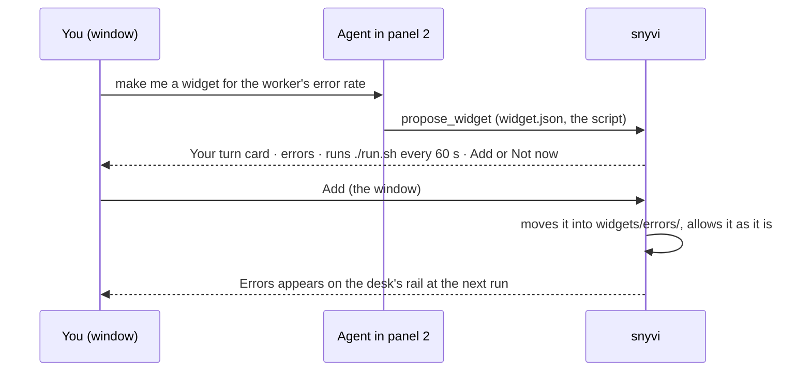

# Widgets and the sidebars

snyvi's two sidebars are made of sections, and you arrange them on
`/sidebars` (⌘K → Arrange sidebars, or right-click any section's head).
Widgets are small sections that anything can fill: an agent, a script, or a
widget file snyvi runs on a timer.

> **The left is global. The right is the desk you are on.** A section's
> scope decides its side, so nothing changes sides, and the sidebars never
> redraw because you clicked somewhere.

## Arranging

| Side | Sections, in today's order |
|---|---|
| Left, on every page | Inbox · Desks · Folders · Widgets (the global ones) |
| Right, on a desk | **Your turn** (fixed) · Panels · Points · Documents · Notes · Widgets (this desk's) |

- Drag a row on `/sidebars`, or move it with Alt+↑ ↓. Each change is saved
  as you make it, and the sidebars move with it, in every window.
- A switch turns a section off. Off is not gone: it stays on the list, and
  the same switch brings it back. **Reset to default** brings back today's.
- Your turn is always first on the right and can't be turned off or folded.
- Every section folds from its head, and a folded head keeps its count.
  Folds are per browser; the layout is the daemon's.

## Three ways to fill a widget

| Way | Who | Lives |
|---|---|---|
| MCP `set_widget` | an agent in a desk's panel | on that desk until cleared; dims after `stale_after` (30 min), and says "panel 2 closed" when its panel closes |
| `snyvi widget set` | scripts, git hooks, cron, CI | until cleared; on a desk with `--desk ID`, global otherwise (or the panel's desk, run inside one) |
| a widget file | you, or an agent through `propose_widget` | while it is switched on, run while it is in view |

All three send the same thing: **Markdown**, or **one JSON object**:

```json
{ "body": "**deploy** 3/5 green", "tone": "ok", "count": "3/5", "lines": 2, "stale_after": 600 }
```

| Field | | |
|---|---|---|
| `body` | Markdown, 1,500 characters at most | text, bold, code, links, lists. No HTML, pictures (their alt text instead), tables or diagrams. Empty clears the widget |
| `tone` | `ok`, `warn`, `bad`, `none` | colours the count |
| `count` | 8 characters at most | beside the name, kept while folded: `3`, `!2`, `3/5` |
| `lines` | 1–6 (3) | the body's room, 20 px a line. A longer body is cut and opens on a click; a new one never moves what's below |
| `stale_after` | seconds (1800); 0 is never | after it the widget dims |

Names are lowercase letters, digits and dashes, 32 at most. A desk has six
widgets at most and the left eight. A name a widget file has is that file's:
a push to it is refused.

```sh
snyvi widget set backups --tone ok --count "03:00" "Nightly backup **done**"
snyvi widget set ci --desk 3 < ci-summary.json
snyvi widget clear backups
```

## A widget file

```
~/.config/snyvi/widgets/git/
  widget.json
  run.sh
```

```json
{
  "name": "git",
  "title": "Git",
  "scope": "desk",
  "run": { "command": "./run.sh", "every": 30, "timeout": 5 },
  "lines": 2,
  "settings": {
    "base": { "type": "string", "label": "Compare against", "default": "main" }
  }
}
```

```sh
#!/bin/sh
# stdin: {"desk":{"id":3,"name":"snyvi","folder":"/home/you/snyvi"},"settings":{"base":"main"},"snyvi":"1.27.0"}
# cwd: the desk's folder (a desk widget), or this folder (a global one)
base=$(sed -n 's/.*"base":"\([^"]*\)".*/\1/p')
ahead=$(git rev-list --count "${base:-main}"..HEAD 2>/dev/null || echo 0)
dirty=$(git status --porcelain | wc -l | tr -d ' ')
tone=ok; [ "$dirty" -gt 0 ] && tone=warn
printf '{"body":"**%s** · %s ahead of %s","tone":"%s","count":"%s"}\n' \
  "$(git branch --show-current)" "$ahead" "${base:-main}" "$tone" "$dirty"
```

- `snyvi widget new git` writes a starter (`--global` for one on the left).
  `snyvi widget check git` runs it once in your terminal and prints what
  snyvi would draw, or why it wouldn't.
- **scope** `desk` runs it in the folder of each desk on a page you can see,
  on that desk's rail; `global` runs it in its own folder, on the left.
- **settings** are drawn by snyvi on `/sidebars` as rows: `string`,
  `number`, `choice` (with `choices`) or `boolean`. The run gets them on
  stdin. A widget never draws its own settings.
- A failure (a non-zero exit, a timeout, more than 4 KB, a body snyvi
  refuses) is one dim line in its seat, over the last good body, and the rest
  of the sidebar draws as ever.
- A widget that keeps a file between runs keeps it outside its folder
  (`$TMPDIR`): a change to the folder asks for Allow again.

### How snyvi runs it

- **Only while in view.** A desk widget runs while a page you can see shows
  its desk; a global one while any page can be seen. A widget switched off,
  a run still going, and a desk with no folder don't run.
- `sh -c <command>` (`cmd /C` on Windows), with your login shell's `PATH`
  read once when snyvi starts, your home and language, and nothing else
  from snyvi's environment: not its token, not a desk's keys.
- Every `every` seconds (5 at least), for `timeout` seconds (30 at most),
  two at a time, 4 KB of output read. A timeout stops the whole process
  group, so nothing it started lives on.

### Allow, honestly

Nothing in a widget file runs until you **Allow** it. The seat asks
("*Git wants to run ./run.sh every 30 s · Allow*"), and so does `/sidebars`.
Allow takes the **whole folder** as it is now; a change to any file in it
asks again ("changed"), unless you switch **Rerun my edits** on for that
widget, which is for one you are writing yourself.

Only the snyvi window can allow. The token an agent holds can't, and
neither can a browser tab.

**This is consent, not a sandbox.** A widget runs as you, with your PATH,
like anything in your shell. Agents in a desk's panels have a shell as you
too, so they could write into the widgets folder. That is why every widget
file needs Allow whoever wrote it, and why a changed one asks again.

### An agent proposing one

`propose_widget` writes the folder where proposals wait
(`widgets/.proposed/`, where nothing runs) and puts a card on Your turn
with its command. **Add** moves it in with the rest and allows it as it is.
**Not now** leaves it be.


