# Windows first run: audit of the findings

An audit of *Windows first run: sidebar and Welcome clicks do nothing*, the findings note sent to snyvi on 2026-10-02. Each claim was checked against the source at `aebe39a` (1.11.0), against the installed 1.11.0 on Windows 11 (10.0.26200), or against a separate empty daemon (`SNYVI_DATA_DIR`, `SNYVI_CONFIG_DIR`, `SNYVI_PORT=7790`). This is an audit only; no code has changed.

**Verdict:** the main diagnosis holds. The Windows folder picker is a PowerShell dialog started by the background daemon, so it opens where you can't see it, and the page and the daemon both stay locked while it's open. Most claims check out. One claim about paths was wrong and is corrected below. The audit also found two problems the note missed: hidden dialogs can pile up, and the daemon has no way to give up on a stuck dialog.

## How claims were checked

| Mark | Meaning |
|---|---|
| **Verified (code)** | Read in the source at the cited line |
| **Verified (live)** | Seen on the running install: process list, window list, `/api/*` |
| **Verified (repro)** | Reproduced in the separate empty daemon |
| **Inferred** | Follows from the code, but no click was made in the real window |
| **Corrected** | The note was wrong or overstated |

## Claim by claim

### Symptom and entry points

| # | Claim in the note | Result | Evidence |
|---|---|---|---|
| 1 | An empty library at `/` is drawn as the Inbox view | Verified (code) | `shell_home`, `src/server.rs:1420-1428`: `if empty { return shell_inbox(..) }`. The window opens `http://127.0.0.1:7777?window=1` (`src/desktop.rs:18`), which is `/` |
| 2 | On an empty library, Inbox and All documents redraw Welcome | Verified (code + repro) | `ui/app.js:1468-1472`. On port 7790, clicking All documents changed the URL to `/inbox`, and the `h1` stayed "All your passion projects, in one calm place." |
| 3 | Desks `+` and "Give a project a desk" go to the picker when no place is known | Verified (code) | `ui/app.js:1075`. Both buttons carry `data-newdesk` (`ui/app.js:2964-2966`) |
| 4 | Folders "Open a folder to read" goes to the picker | Verified (code) | `ui/app.js:1065`, `[data-pick]`, then `act("pick")` |
| 5 | Welcome "Choose its folder…" goes to the picker | Verified (code) | `ui/about.js:819` `data-w="pick"`, then `ui/app.js:1614` `act("pick", true)` |
| 6 | "New desk in…" → "Another folder…" goes to the picker | Verified (code) | `ui/menu.js:351` |
| 7 | In a browser tab these say "Folders open from the snyvi window" | Verified (repro) | Toast seen on port 7790; the gate is `ui/menu.js:31` |

### The picker on Windows

| # | Claim | Result | Evidence |
|---|---|---|---|
| 8 | Windows runs `powershell -NoProfile -STA` with `FolderBrowserDialog` | Verified (code) | `src/platform.rs:252-262` |
| 9 | It is started with `CREATE_NO_WINDOW` by a detached daemon | Verified (code) | `src/platform.rs:297-298`, and `spawn_daemon` with `DETACHED_PROCESS \| CREATE_NO_WINDOW` (`src/platform.rs:799`) |
| 10 | It opens without focus and stays behind | Verified (live) | PID 12276, started by daemon PID 3172 at 16:41:10, was still running more than 15 minutes later. Its `#32770` "Browse For Folder" window was visible but never in the foreground |
| 11 | It has no taskbar button because of a hidden parent | Verified (live), mostly | The `#32770` window has a parent (`owner=328356`), and a window with a parent gets no taskbar button. That the parent is the hidden `WindowsForms10.Window` window is likely, but the handle was not matched to it |
| 12 | Windows won't bring a background process's window to the front | Windows behaviour, consistent with what was seen | The documented `SetForegroundWindow` rules; not tested in isolation |
| 13 | The page's `picking` flag makes later clicks return silently | Verified (code) | `ui/menu.js:32`: `if (picking) return;` with no toast |
| 14 | The daemon's `PICKING` refuses a second dialog with 409 | Verified (code) | `src/server.rs:5586-5592` |
| 15 | "Both locks clear only when the dialog closes" | **Corrected** | See finding A. The page's flag does clear only when the request returns, which is when the dialog closes. The daemon's flag also clears when the request is dropped (a reload, the window closed), while the dialog stays open |

### After a document, and after a desk

| # | Claim | Result | Evidence |
|---|---|---|---|
| 16 | The first document opens by itself on an empty Inbox | Verified (code) | `ui/app.js` doc event: `opens = state.view === "inbox" && !state.waiting` |
| 17 | With one project and no desk, `+` shows the "New desk in…" menu | Inferred | `deskPlaces()` returns the project, so `askWhere` is used (`ui/app.js:1075`, `2920-2927`) |
| 18 | With one project that has a desk, `+` goes back to the picker | Verified (code + live) | Live: `/api/tree` has one project at `\\?\D:\workspaces\snyvi`; `/api/desks` has one desk on the same root. `deskPlaces()` leaves out roots that already have a desk, so it returns nothing and `act("pick", true)` runs |
| 19 | The desk page's new-desk button always shows the menu | Verified (code) | `ui/desk.js:2565` `ctx.make(b)`, then `make: (el) => el ? askWhere(el) : …` (`ui/app.js:3028`) |
| 20 | Its "A shell in your home folder" still works | Inferred | `make(ctx, null)` posts `/api/desks {}`, which doesn't use the picker. Not clicked, so as not to create a desk |

### Linux and Windows

| # | Claim | Result | Evidence |
|---|---|---|---|
| 21 | The JavaScript click logic is the same on every system | Verified (code) | `ui/app.js:1075` has no OS branch |
| 22 | Linux uses `zenity`, `kdialog` or `yad` as standalone windows | Verified (code) | `src/platform.rs:263-290` |
| 23 | Windows `canonicalize()` returns `\\?\` paths, Linux doesn't | Verified (code + live) | `src/project.rs:20`; live roots are `\\?\D:\workspaces\snyvi`; no `dunce` in `Cargo.toml` |
| 24 | "A folder picked as plain `D:\…` won't match a project stored as `\\?\D:\…`" | **Corrected** | See finding B. A picked folder goes through `Browse::open`, which also calls `canonicalize()` (`src/browse.rs:159-162`). Both are `\\?\`, so they match |
| 25 | `tilde()` never shortens to `~` on Windows | Verified (code) | `ui/about.js:817` checks `home + "/"`. The home folder (`C:\Users\incre`) has neither `/` nor `\\?\` |
| 26 | `\\?\` shows in the UI | Inferred | Project tips (`data-tip="${esc(p.root)}"`, `ui/app.js` row) and Welcome's place list print the root as stored |

### Fix direction

| # | Proposal | Result | Note |
|---|---|---|---|
| 27 | Show the picker from the window with Tauri's dialog | Possible, not free | `tauri-plugin-dialog` is **not** a dependency (`Cargo.toml:103-145`). The page is served by the daemon over `http://127.0.0.1:7777`, so calling Tauri from it needs that origin allowed in the window's capabilities. One alternative: the daemon keeps the picker, uses the modern `IFileOpenDialog` with `FOS_PICKFOLDERS`, parents it to the snyvi window, and `snyvi-app` calls `AllowSetForegroundWindow` first |
| 28 | Use `dunce` or remove the `\\?\` prefix | Sound | Stops the paths showing, and fixes the home check in finding C |
| 29 | Show the menu even when `deskPlaces()` is empty | Sound | The menu's "A shell in your home folder" works with no picker, so `+` would never be a dead click |
| 30 | Toast instead of returning silently; add cancel and a timeout | Sound | See finding A for why the timeout must also end the PowerShell process |

## Corrections and new findings

### A. Hidden dialogs can pile up (new; replaces claim 15)

`browse_pick` clears `PICKING` in a `Drop` guard (`src/server.rs:5594-5604`), so dropping the request clears it. But the dialog runs in `tokio::task::spawn_blocking(crate::platform::pick_folder)` (`src/server.rs:5605`), which can't be cancelled. When the page reloads or the window closes while a dialog is up:

1. the fetch is aborted, so the request is dropped and `PICKING` becomes `false`,
2. the PowerShell process and its hidden dialog keep running,
3. the page's `picking` flag starts fresh after the reload, so the next click starts **a second hidden dialog**.

Each one also holds a thread in the daemon's blocking pool. On a machine where every dialog opens hidden, reloading and clicking again stacks them up. The fix should end the child process when the request is dropped, not only clear the flag.

### B. The path mismatch was overstated (corrects claim 24)

Picked folders and project roots both go through `canonicalize()`, so both carry `\\?\` and match each other. The real path problems on Windows are smaller:

- **Shown to the user:** `\\?\D:\…` appears in project tips and in Welcome's place list.
- **Home check:** `deskPlaces()` drops a place equal to `state.desks.home`. Home is `C:\Users\incre` (plain), while a project there would be `\\?\C:\Users\incre`. So a project in the home folder is not dropped (finding C).
- **Separators:** `deskPlaces()`'s `trim` only strips a trailing `/`. After `canonicalize()` there is rarely a trailing `\`, so this almost never matters.

### C. Home folder check never matches on Windows (new)

`deskPlaces()` (`ui/app.js:2922-2923`) compares the trimmed root to the trimmed home as plain strings. On Windows the home comes from the environment without `\\?\`, and roots come from `canonicalize()` with it, so they never match. The effect is small, an extra entry in the menu, but it disappears once paths are stored without `\\?\`.

### D. The daemon never gives up on a dialog (new)

`pick_folder` calls `cmd.output()` (`src/platform.rs:300`) with no timeout. A dialog that is never seen is never closed, so its request waits forever. The page's `fetch` (`ui/menu.js:36`) has no `AbortSignal` or timeout either. Neither side ever gives up.

## What the user sees, corrected

| State | Desks `+` / "+ New desk" | "Open a folder to read" | Welcome "Choose its folder…" | Inbox |
|---|---|---|---|---|
| Empty library | Picker: hidden, then dead | Picker: hidden, then dead | Picker: hidden, then dead | Redraws Welcome |
| One project, no desk | Menu; the project works; "Another folder…" is dead | Dead | (Welcome no longer shown) | Works |
| One project with a desk | Picker: hidden, then dead | Dead | (not shown) | Works |
| Any state, desk page new-desk button | Menu; home shell works; "Another folder…" is dead | n/a | n/a | n/a |

"Dead" means: the first click starts a hidden dialog, and later clicks do nothing until it is closed, or until the page reloads, which can start another one (finding A).

## What to change, in order

Each fix below shows the current behaviour (**Before**) and the proposed behaviour (**After**) as a diagram, then the current code next to a sketch of the change. The **Before** code is quoted from `aebe39a`. The **After** code is a sketch: nothing has been compiled or changed.

| # | Fix | Fixes | Size |
|---|---|---|---|
| 1 | The picker opens in front of snyvi | Claims 10–12; four dead clicks | M (option A) / S (option B) |
| 2 | Never a silent click | Claim 13 | S |
| 3 | Clean up stuck dialogs | Findings A, D | S–M |
| 4 | `+` always shows the menu | Claims 18, 29 | S |
| 5 | Windows paths without `\\?\` | Findings B, C; claims 25–26 | S |
| 6 | An empty Inbox that looks like one | Claim 2 | S |

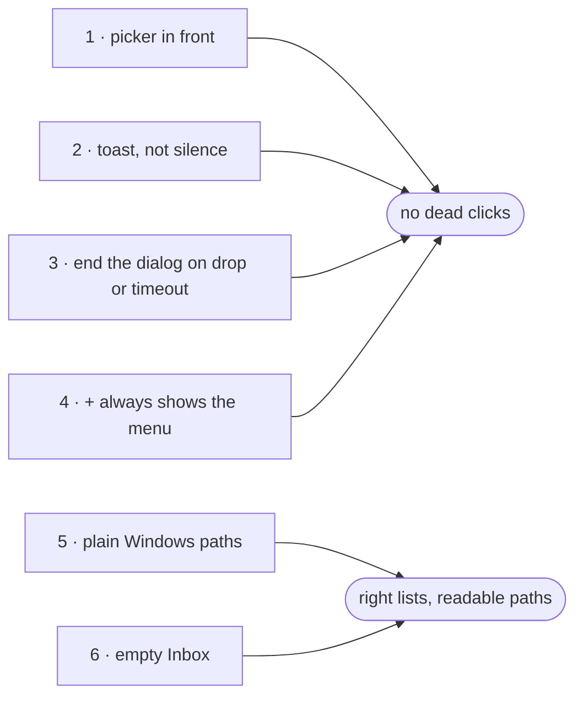

### 1. The picker opens in front of snyvi

**Before:** the daemon starts a hidden PowerShell dialog with no tie to the snyvi window.

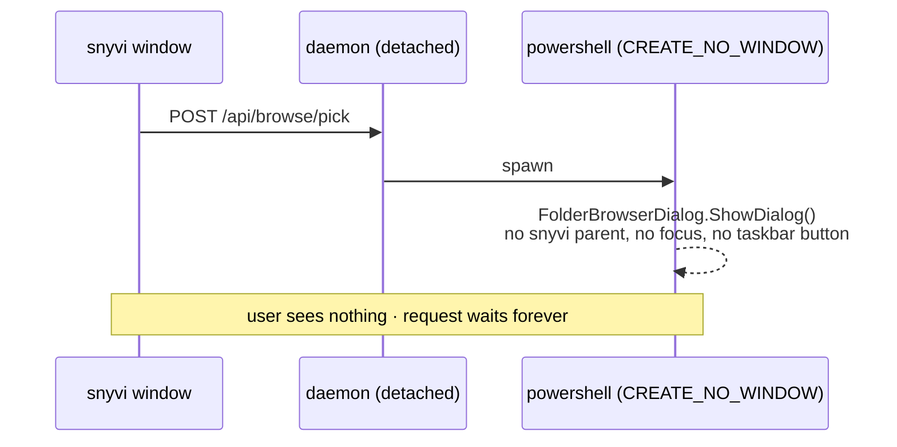

**After (option A, preferred):** the window shows the dialog itself, with the snyvi window as its parent.

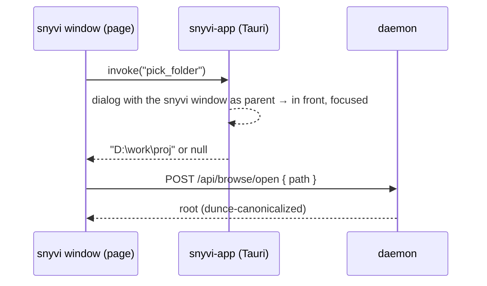

**Before:** `src/platform.rs:252-262`

```rust
#[cfg(target_os = "windows")]
let tries: Vec<Vec<String>> = vec![vec![
    "powershell".into(), "-NoProfile".into(), "-STA".into(), "-Command".into(),
    format!(
        "Add-Type -AssemblyName System.Windows.Forms; $d = New-Object System.Windows.Forms.FolderBrowserDialog; \
         $d.Description = '{}'; $d.ShowNewFolderButton = $false; \
         if ($d.ShowDialog() -eq 'OK') {{ $d.SelectedPath }}",
        ps_quote(title)
    ),
]];
```

**After, option A** (sketch): `src/bin/app.rs`. This needs `tauri-plugin-dialog`, which is not a dependency yet. The window's capability file also has to allow `http://127.0.0.1:<port>` as a remote origin.

```rust
#[tauri::command]
async fn pick_folder(window: tauri::WebviewWindow) -> Option<String> {
    use tauri_plugin_dialog::DialogExt;
    window.dialog().file()
        .set_parent(&window)                 // in front, with focus
        .set_title("Open a folder in snyvi")
        .blocking_pick_folder()
        .map(|p| p.to_string())
}
```

```js
// ui/menu.js pick(), window only
const dir = await window.__TAURI__.core.invoke("pick_folder");
if (!dir) return;                            // cancelled
const r = await fetch("/api/browse/open", { method: "POST",
  headers: { "content-type": "application/json", "x-snyvi-capability": capability },
  body: JSON.stringify({ path: dir }) });
```

**After, option B** (smaller patch, sketch): keep PowerShell, but give the dialog a topmost parent window so it opens above snyvi.

```powershell
Add-Type -AssemblyName System.Windows.Forms
$o = New-Object System.Windows.Forms.Form -Property @{ TopMost = $true; ShowInTaskbar = $false;
       StartPosition = 'CenterScreen'; Size = '1,1'; Opacity = 0 }
$o.Show(); $o.Activate()
$d = New-Object System.Windows.Forms.FolderBrowserDialog
$d.Description = 'Open a folder in snyvi'; $d.ShowNewFolderButton = $false
if ($d.ShowDialog($o) -eq 'OK') { $d.SelectedPath }
$o.Close()
```

| | Option A: Tauri dialog | Option B: topmost parent |
|---|---|---|
| In front, focused | Yes: the snyvi window is its parent | In front, yes; focus not guaranteed |
| Dialog look | Modern Windows folder picker | Old "Browse For Folder" tree |
| New dependency | `tauri-plugin-dialog`, plus permission for the page to call Tauri | None |
| Works from a browser tab | No (window only, as today) | No (as today) |

### 2. Never a silent click

**Before:** a second click while a dialog is open does nothing.

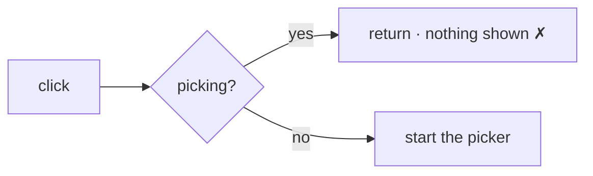

**After:** the click says what is going on and offers a way out.

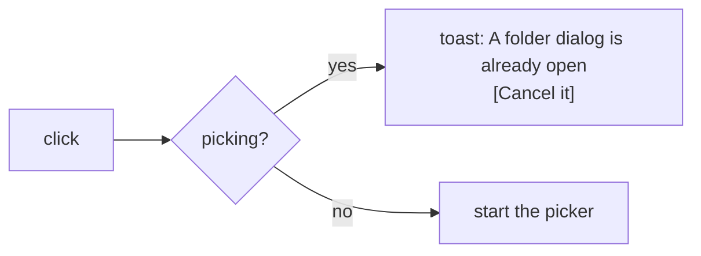

**Before:** `ui/menu.js:31-33`

```js
if (!capability) { toast("Folders open from the snyvi window", { ... }); return; }
if (picking) return;
picking = true;
```

**After** (sketch):

```js
if (!capability) { toast("Folders open from the snyvi window", { ... }); return; }
if (picking) {
  toast("A folder dialog is already open", {
    sub: "It may be behind this window · Alt+Tab to it",
    action: { label: "Cancel it", run: () => post("/api/browse/pick/cancel") },
  });
  return;
}
picking = true;
```

### 3. Clean up stuck dialogs

**Before:** a reload clears the lock but leaves the dialog running, so dialogs pile up.

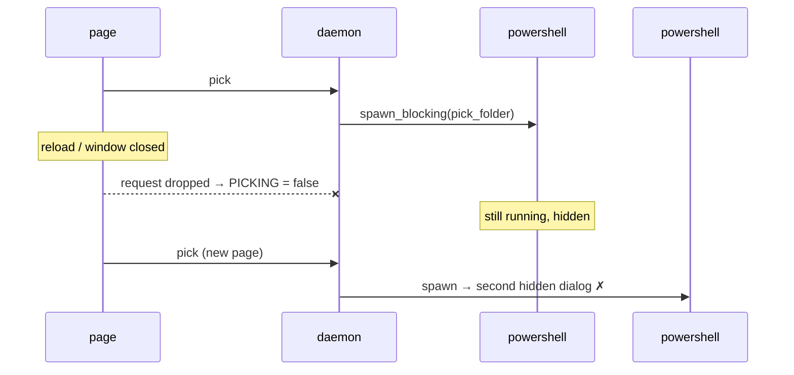

**After:** dropping the request, or a timeout, ends the dialog's process.

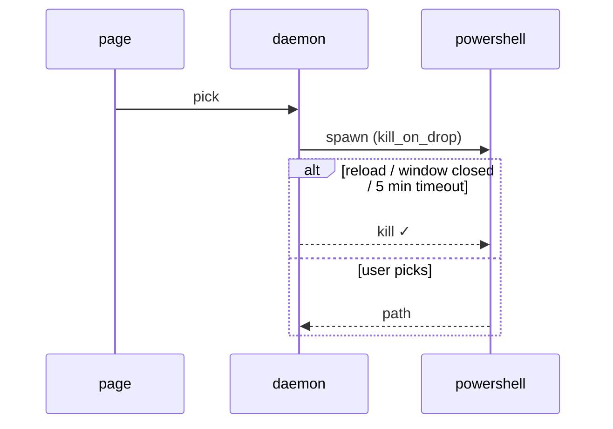

**Before:** `src/server.rs:5605` and `src/platform.rs:300`

```rust
let picked = tokio::task::spawn_blocking(crate::platform::pick_folder).await;
// … in pick_folder:
let Ok(out) = cmd.output() else { continue; };   // blocks forever if never seen
```

**After** (sketch). This needs tokio's `process` feature, which `Cargo.toml:38` does not enable today.

```rust
let mut cmd = tokio::process::Command::new(program);
cmd.args(rest).stdin(Stdio::null()).stderr(Stdio::null()).kill_on_drop(true);
#[cfg(windows)] cmd.creation_flags(CREATE_NO_WINDOW);
let out = match tokio::time::timeout(Duration::from_secs(300), cmd.output()).await {
    Ok(Ok(out)) => out,
    Ok(Err(_)) => continue,                       // not installed: try the next one
    Err(_) => return Ok(None),                    // timed out; the child is killed on drop
};
```

### 4. `+` always shows the menu

**Before:** when the place list is empty (the first run, or every project already has a desk), `+` skips the menu and goes straight to the picker.

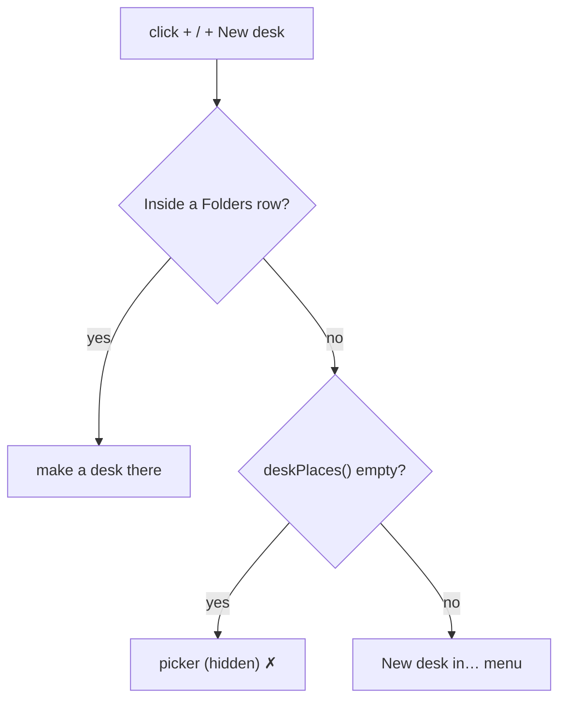

**After:** the menu always opens, and "A shell in your home folder" is always there, so a click on `+` always shows something.

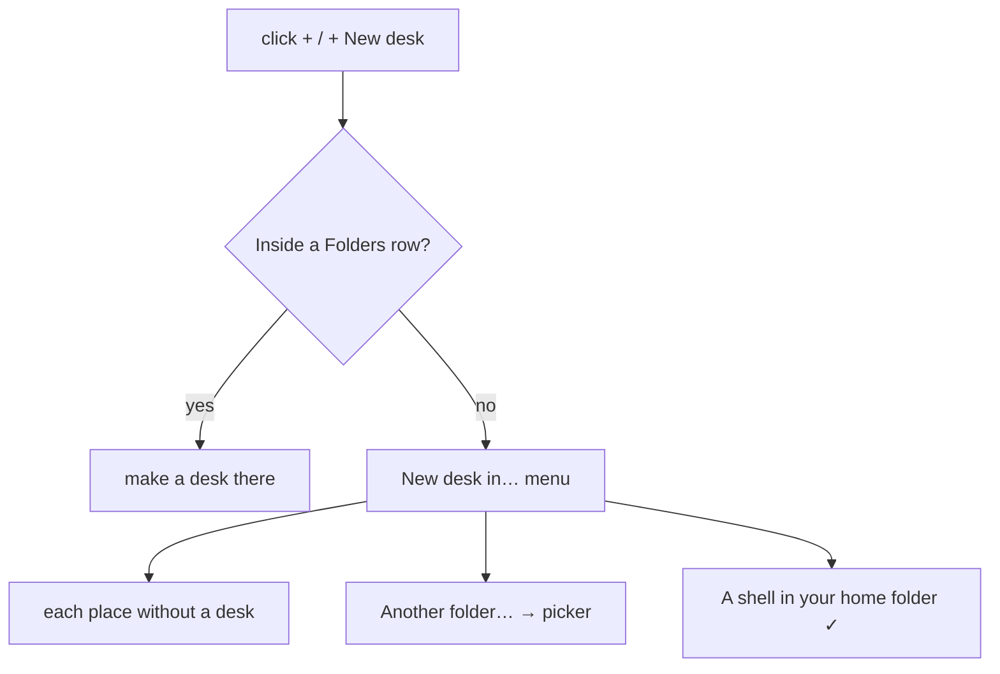

**Before:** `ui/app.js:1075`

```js
if (f) act("make", f); else if (capability && !deskPlaces().length) act("pick", true); else askWhere(nd, e.detail === 0);
```

**After** (sketch):

```js
if (f) act("make", f); else askWhere(nd, e.detail === 0);
```

| State | Before | After |
|---|---|---|
| Empty library | Hidden picker | Menu: Another folder… · Home shell |
| 1 project, no desk | Menu | Menu (no change) |
| 1 project with a desk | Hidden picker | Menu: Another folder… · Home shell |

### 5. Windows paths without `\\?\`

**Before → After**, as the user sees them:

| Where | Before | After |
|---|---|---|
| Project root (`/api/tree`) | `\\?\D:\workspaces\snyvi` | `D:\workspaces\snyvi` |
| Project tip, Welcome's place list | `\\?\C:\Users\incre\proj` | `~\proj` |
| A project in the home folder in "New desk in…" | Listed (home check misses) | Left out, as on Linux |

**Before:** `src/project.rs:20` (and `src/browse.rs:122,161,257`, `src/server.rs:348`)

```rust
let start = start.canonicalize().unwrap_or(start);
```

**After** (sketch, adds the `dunce` crate):

```rust
let start = dunce::canonicalize(&start).unwrap_or(start);   // no \\?\ prefix when the plain path is safe
```

**Before:** `ui/app.js:2921` and `ui/about.js:817`

```js
const trim = p => p && p.replace(/(.)\/+$/, "$1");
const tilde = p => (home && p.startsWith(home + "/") ? "~" + p.slice(home.length) : p);
```

**After** (sketch): one shared path key, used by both.

```js
// Windows: drop \\?\, either slash, any case. Elsewhere: only the trailing slash.
const pathKey = p => !p ? p : /^(\\\\\?\\)?[A-Za-z]:[\\/]/.test(p)
  ? p.replace(/^\\\\\?\\/, "").replace(/\//g, "\\").replace(/(.)\\+$/, "$1").toLowerCase()
  : p.replace(/(.)\/+$/, "$1");
const trim = pathKey;
const tilde = p => { const k = pathKey(p), h = pathKey(home);
  return h && (k === h || k.startsWith(h + (k.includes("\\") ? "\\" : "/"))) ? "~" + p.replace(/^\\\\\?\\/, "").slice(h.length) : p; };
```

### 6. An empty Inbox that looks like one

**Before:** clicking Inbox on an empty library redraws Welcome, so the click looks dead.

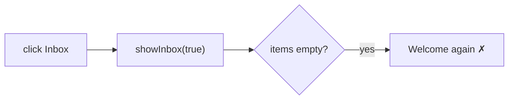

**After:** Welcome only on first load at `/`; a click on Inbox shows an empty Inbox.

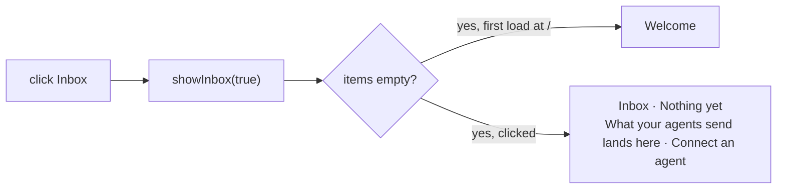

**Before:** `ui/app.js:1469-1472`

```js
if (items && !items.length) {
  if (capability && !state.desks) await loadDesks();
  if (!capability || !(state.desks && state.desks.desks.length)) welcomeHtml = await welcomePage();
}
```

**After** (sketch):

```js
if (items && !items.length) {
  if (capability && !state.desks) await loadDesks();
  const welcome = !push && (!capability || !(state.desks && state.desks.desks.length));
  welcomeHtml = welcome ? await welcomePage()
    : `<div class="inbox-head"><h1>Inbox</h1></div><p class="empty">Nothing yet. What your agents send lands here. <a href="/connect" data-nav="connect">Connect an agent</a></p>`;
}
```

### All six together

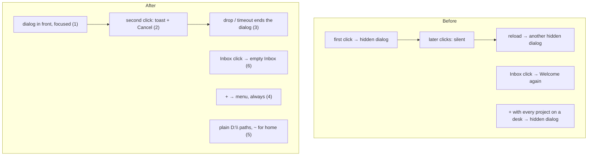

## State of this machine during the audit

- Daemon `snyvi serve` PID 3172 on `127.0.0.1:7777`; window `snyvi-app` PID 14808.
- A stuck picker: PowerShell PID 12276, started 16:41:10, still open.
- Library: 1 project (`snyvi`, `\\?\D:\workspaces\snyvi`); 1 desk on the same root, home `C:\Users\incre`.
- The separate empty daemon on port 7790 was stopped after use.
