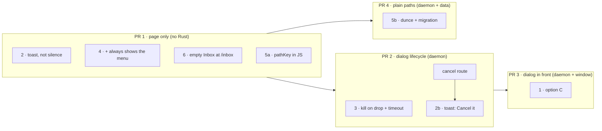
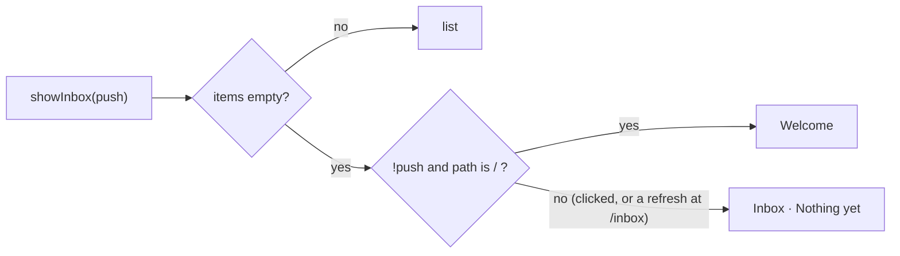
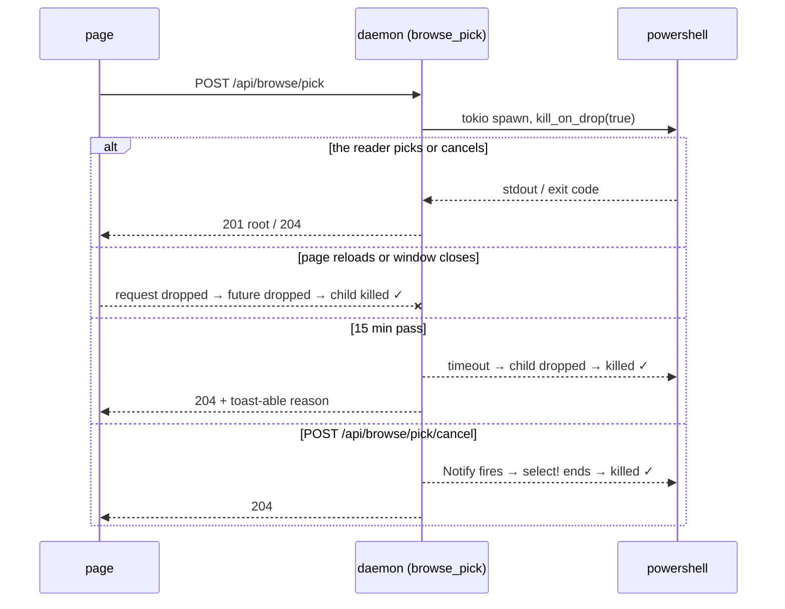
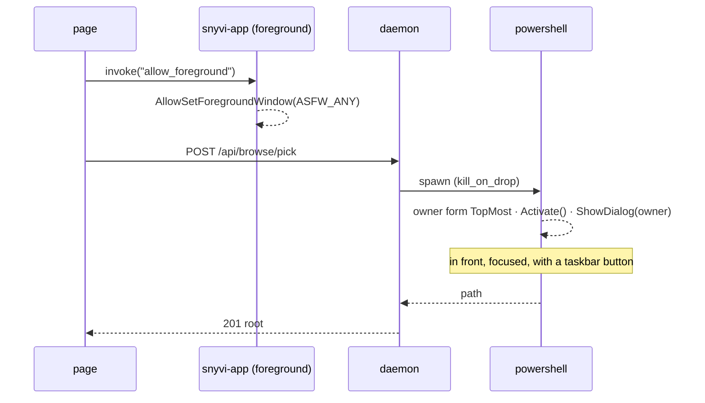
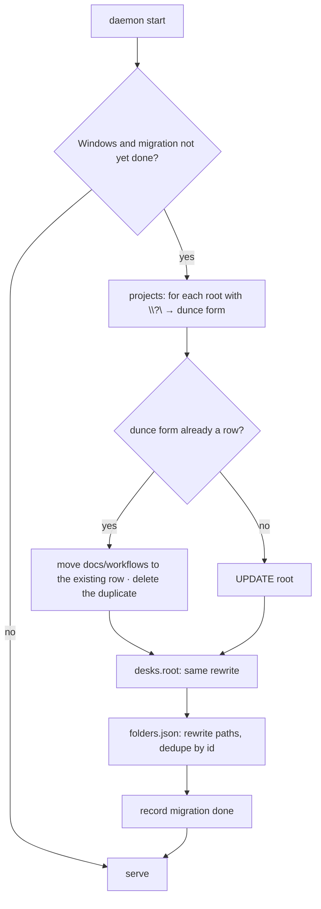

# Windows first run: implementation plan

The plan for the six fixes in [WINDOWS-FIRST-RUN-AUDIT.md](WINDOWS-FIRST-RUN-AUDIT.md), checked again against the source at `aebe39a` (1.11.0). The scope is Windows only: every Rust change is `#[cfg(windows)]` or has no effect off Windows (`dunce` does nothing on Linux and macOS), and the JS changes behave the same on Linux as today.

Re-reading the code turned up **three problems with the audit's sketches**. The plan below works around each one:

| # | Problem | Where | Effect on the plan |
|---|---|---|---|
| P1 | Option A's sketch has the page `POST /api/browse/open { path }`. That route needs the write **token** (`authorized`, `src/server.rs:5544`), which the page doesn't have. It also breaks a rule the code depends on: *"nothing a page sends ever names a directory"* (`src/platform.rs:240-243`, `ui/menu.js:24-27`). `snyvi-app` can't reach the daemon for the page either, because it is built so that it can't read the token (`src/bin/app.rs:154-160`) | Fix 1 | Option A as sketched is **dropped**. The plan uses **option C**: the daemon still owns the dialog, and the window gives it permission to come to the front |
| P2 | Moving to `dunce::canonicalize` changes how **roots already stored** compare. `projects.root` is `UNIQUE` (`src/store.rs:144`), `desks.root` (`src/desk.rs:55`) and `folders.json` (`src/browse.rs:154`) hold `\\?\D:\…`. Once the change ships, the same folder canonicalizes to `D:\…`, so the next hook would create a **second project** for it. `src/server.rs:2013-2014` also compares two `canonicalize()` results, so all the call sites have to change together | Fix 5 | Fix 5 needs a **one-time migration**, and one shared helper used at every call site |
| P3 | Fix 6's sketch uses `!push` to mean "first load". But `showInbox(false)` is also how every live refresh redraws the page (`ui/app.js:388, 593, 626, 635`). A refresh on an empty Inbox the reader clicked into would turn it back into Welcome | Fix 6 | Decide by **address** instead: Welcome at `/`, an empty Inbox at `/inbox` |

## Shape of the work

Four PRs, smallest risk first. Each one can ship and be released without the others.



| PR | Fixes | Files | Size | Risk | Bumps `app_min`? |
|---|---|---|---|---|---|
| 1 | 2 (toast only), 4, 6, 5a | `ui/menu.js`, `ui/app.js`, `ui/about.js` | S | Low: page only | No |
| 2 | 3, 2b | `Cargo.toml`, `src/platform.rs`, `src/server.rs`, `ui/menu.js` | S–M | Medium: process lifetime | No |
| 3 | 1 | `src/platform.rs`, `src/bin/app.rs`, `ui/menu.js`, `Cargo.toml` | M | Medium: Win32 focus rules | **Yes**, it changes `src/bin/app.rs` |
| 4 | 5b | `Cargo.toml`, `src/platform.rs` (helper), every `canonicalize` call that stores or compares a root, `src/store.rs`, `src/desk.rs`, `src/browse.rs` | M | **Highest**: changes stored data | No |

After PR 1 alone, three of the four dead clicks in the audit's "What the user sees" table are gone, and the fourth (the picker itself) at least tells the reader where it is.

---

## PR 1: page-only fixes

### 1.1 Never a silent click (fix 2, first half)

`ui/menu.js:32`. There's no cancel route yet, so the toast only tells the reader where the dialog is. PR 2 adds the button.

```js
if (picking) {
  toast("A folder dialog is already open", { sub: "It may be behind this window · Alt+Tab to it", face: null });
  return;
}
```

### 1.2 `+` always shows the menu (fix 4)

`ui/app.js:1075`. The audit's sketch is correct as written.

```js
if (f) act("make", f); else askWhere(nd, e.detail === 0);
```

Check: the menu built by `askWhere` must still show **Another folder…** and **A shell in your home folder** when `deskPlaces()` is empty. Read `menuFor` (`ui/app.js:2928`→) to confirm it doesn't hide itself when it has no place rows. If it does, remove that early return.

| State | Before | After |
|---|---|---|
| Empty library | Hidden picker | Menu: Another folder… · Home shell |
| 1 project, no desk | Menu | Menu (no change) |
| 1 project with a desk | Hidden picker | Menu: Another folder… · Home shell |

### 1.3 Empty Inbox at `/inbox` (fix 6, corrected for P3)

`ui/app.js:1469-1472`. Welcome belongs to `/`. A click on Inbox (`push = true`) and every refresh at `/inbox` show an empty Inbox.

```js
if (items && !items.length) {
  if (capability && !state.desks) await loadDesks();
  const atWelcome = !push && location.pathname === "/";
  if (atWelcome && (!capability || !(state.desks && state.desks.desks.length))) welcomeHtml = await welcomePage();
  else welcomeHtml = `<div class="inbox-head"><h1>Inbox</h1></div>
    <p class="empty">Nothing yet. What your agents send lands here. <a href="/connect" data-nav="connect">Connect an agent</a></p>`;
}
```



Check: `shell_home` (`src/server.rs:1420-1428`) renders Welcome on the server for `/`. Confirm that the first client draw at `/` calls `showInbox(false)` (`ui/app.js:2758` handles `/inbox` only) so the two agree. Also check that the "All documents" link goes through the same path, since claim 2 names it.

### 1.4 `pathKey` in the page (fix 5, first half)

`ui/app.js:2921` (`trim` inside `deskPlaces`) and `ui/about.js:817` (`tilde`). Put one `pathKey` in a module both files already import, or define it twice if they share none. It removes `\\?\`, and it fixes the home check (finding C) and `~` (claim 25) **before** PR 4. It keeps working after PR 4, when there is no prefix left to remove.

```js
// Windows: drop \\?\, either slash, any case. Elsewhere: only the trailing slash.
const pathKey = p => !p ? p : /^(\\\\\?\\)?[A-Za-z]:[\\/]/.test(p)
  ? p.replace(/^\\\\\?\\/, "").replace(/\//g, "\\").replace(/(.)\\+$/, "$1").toLowerCase()
  : p.replace(/(.)\/+$/, "$1");
```

Use `pathKey` only for comparing. Shown text, such as tips and Welcome's place list, uses `shown = p => p.replace(/^\\\\\?\\/, "")` so the reader's own capital letters are kept.

| Input | `pathKey` | `tilde` (home `C:\Users\incre`) |
|---|---|---|
| `\\?\D:\workspaces\snyvi` | `d:\workspaces\snyvi` | `D:\workspaces\snyvi` |
| `\\?\C:\Users\incre\proj` | `c:\users\incre\proj` | `~\proj` |
| `C:\Users\incre\` | `c:\users\incre` | `~` |
| `/home/me/proj/` (Linux) | `/home/me/proj` | `~/proj` (same as today) |

**Verify PR 1:** run an empty daemon (`SNYVI_DATA_DIR`, `SNYVI_CONFIG_DIR`, `SNYVI_PORT=7790`) and go through the audit's "What the user sees" table. Every cell should either do something or show a toast. On Linux, the menu and Inbox should behave the same way, and no paths should change.

---

## PR 2: the dialog's lifetime (fix 3, findings A and D)

### 2.1 The daemon



| Step | Change |
|---|---|
| a | `Cargo.toml:38`: add `"process"` to tokio's features |
| b | `src/platform.rs`: `pick_folder` becomes `async fn pick_folder(cancel: &Notify)`, using `tokio::process::Command`, `.kill_on_drop(true)`, and `CREATE_NO_WINDOW` through `tokio::process::Command::creation_flags` (it has the same method on Windows) |
| c | Wrap `cmd.output()` in `tokio::select!` with `tokio::time::sleep(PICK_TIMEOUT)` (900 s, 15 min; see Decisions) and `cancel.notified()`. Both of those branches return `Ok(None)` |
| d | `src/server.rs:5605`: drop `spawn_blocking` and call `crate::platform::pick_folder(&CANCEL).await` directly. The existing `Done` guard stays and still clears `PICKING`. Dropping the handler's future now also drops the child, which kills it |
| e | New `static CANCEL: Notify` next to `PICKING`, and a route `POST /api/browse/pick/cancel` that calls `refuse_desk` first and then `CANCEL.notify_waiters()` |
| f | Add the new route to the gate test's route list (`src/server.rs:6254`→), and add an assert that `browse_pick_cancel` calls `refuse_desk` before `CANCEL` |

```rust
// src/platform.rs (sketch)
pub async fn pick_folder(cancel: &tokio::sync::Notify) -> Result<Option<PathBuf>, String> {
    // … `tries` exactly as today …
    for args in tries {
        let Some((program, rest)) = args.split_first() else { continue };
        let mut cmd = tokio::process::Command::new(program);
        cmd.args(rest).stdin(Stdio::null()).stderr(Stdio::null()).kill_on_drop(true);
        #[cfg(target_os = "windows")]
        cmd.creation_flags(CREATE_NO_WINDOW);
        let out = tokio::select! {
            r = cmd.output() => match r { Ok(o) => o, Err(_) => continue },   // not installed: next
            _ = tokio::time::sleep(PICK_TIMEOUT) => return Ok(None),          // dropped → killed
            _ = cancel.notified() => return Ok(None),
        };
        let picked = String::from_utf8_lossy(&out.stdout).trim().to_string();
        return Ok((out.status.success() && !picked.is_empty()).then(|| picked.into()));
    }
    // … errors as today …
}
```

Note: `kill_on_drop` ends `powershell.exe` itself. The dialog belongs to that process, so it closes with it. There is no grandchild to clean up.

### 2.2 The page

`ui/menu.js` `pick()`:

- Give the `fetch` an `AbortController` with no deadline of its own, since the daemon owns the timeout. Abort it on `pagehide`, so the server sees the drop right away instead of when the socket closes.
- The "already open" toast gets `action: { label: "Cancel it", run: () => fetch("/api/browse/pick/cancel", { method: "POST", headers: { "x-snyvi-capability": capability } }) }` (the toast supports `action`, `ui/toast.js:132`).

### 2.3 Tests

| Test | Kind |
|---|---|
| A fake "dialog" (`powershell -Command Start-Sleep 600` on Windows, `sleep 600` elsewhere) is killed when the future is dropped. Assert the PID is gone | `#[tokio::test]` in `src/platform.rs` tests, using a test-only seam that takes `tries` |
| Cancel ends it within 1 s | same seam |
| Timeout with `PICK_TIMEOUT` set short under `cfg(test)` | same seam |
| Gate test includes `/api/browse/pick/cancel` | existing test, extended |

**Verify PR 2 by hand:** click "Open a folder to read", reload the window 3 times, and click again each time. `Get-Process powershell` should never show more than one picker. Close the window while a dialog is up, and the process should disappear.

---

## PR 3: the dialog in front (fix 1, option C)

Option C keeps the dialog in the daemon, so no path ever comes from the page (P1). It deals with the two separate reasons the dialog stays hidden:

1. **No owner** → give it a topmost owner form that is visible but transparent (the audit's option B).
2. **Foreground lock**: a process started by a detached daemon may not take the foreground. The **window**, which is in the foreground because the reader just clicked in it, calls `AllowSetForegroundWindow(ASFW_ANY)` right before the fetch. That lets the next process that asks take the foreground once.



| Step | Change |
|---|---|
| a | `src/platform.rs` Windows script: the owner-form version from the audit (option B). Set `ShowInTaskbar = $true` on the owner so the reader can always get back to it. Add `[System.Windows.Forms.Application]::EnableVisualStyles()` so the dialog looks like the system's |
| b | `src/bin/app.rs`: `#[tauri::command] fn allow_foreground()` → `windows_sys::Win32::UI::WindowsAndMessaging::AllowSetForegroundWindow(ASFW_ANY)`. It does nothing off Windows |
| c | Add `allow_foreground` to `PAGE_WINDOW_COMMANDS`, so it uses the same run-time `dynamic-acl` grant for the daemon's origin (`src/bin/app.rs:230-245`). No capability file and no new plugin |
| d | `Cargo.toml` `windows-sys` features: add `"Win32_UI_WindowsAndMessaging"`. Check that the `desktop` binary resolves the same `windows-sys` |
| e | `ui/menu.js` `pick()`: `await window.__TAURI__?.core?.invoke("allow_foreground").catch(() => {})` before the fetch. Use the same `tauri` handle `ui/frame.js:76` uses. An older window that lacks the command fails quietly, and the dialog then behaves as it did in PR 2 |
| f | `Cargo.toml` `[package.metadata.snyvi] app_min` → the version being released, because `src/bin/app.rs` changed |

Why not option A: it needs `tauri-plugin-dialog`, a new remote-origin grant, **and** a new route that takes a path from the page, which the codebase deliberately refuses (P1). Option C gets the dialog in front with one Win32 call. A modern `IFileOpenDialog` look can follow later as a separate change, from inside the same PowerShell script through `Add-Type` COM interop, without changing any of the plumbing.

| | Option A (audit) | **Option C (plan)** |
|---|---|---|
| Dialog in front, focused | Yes | Yes (owner form + `ASFW_ANY`) |
| Page names a path | **Yes, breaks the trust rule** | No |
| New dependency | `tauri-plugin-dialog` | One `windows-sys` feature |
| Works with an older window | No | Yes, without the focus fix |

**Verify PR 3** on Windows 11 with the installed build: from the window, for each of the four entry points in the audit (claims 3–6), check that the dialog is in front, has focus, and has a taskbar button. Repeat with a second app focused just before the click, for example after Alt+Tab back to snyvi.

---

## PR 4: plain Windows paths (fix 5, second half, corrected for P2)

### 4.1 One helper, every call site

```rust
// src/platform.rs
/// A folder's one spelling: canonical, without `\\?\` where Windows allows.
pub fn canon(p: &Path) -> std::io::Result<PathBuf> { dunce::canonicalize(p) }
```

Change these call sites together. These are the ones that **store or compare** a root:

| File:line | Today |
|---|---|
| `src/project.rs:20` | project root from a hook's cwd |
| `src/browse.rs:122, 161, 257` | Folders roots |
| `src/server.rs:348` | path from a request |
| `src/server.rs:2013-2014` | two roots compared |
| `src/git.rs:117, 124` | repo root, comparison |
| `src/session.rs:78`, `src/watch.rs:225` | confirm whether these compare against stored roots, and switch them if so |

Leave alone the calls that only find an **executable** (`src/setup.rs`, `src/main.rs:245`, `src/desktop.rs:103`, `src/update.rs:620`). They don't take part in matching roots.

### 4.2 One-time migration



- Use whatever schema version the stores already have (`src/store.rs:298` mentions migrations). Otherwise add a `meta` row such as `paths = 'dunce'`.
- Rewrite with `dunce::simplified(Path::new(root))` and **not** `canonicalize`. A stored folder may no longer exist, and simplifying the string must not fail on it.
- Run each store's rewrite and merges in one transaction.
- Merges should almost never happen. They only happen if a 1.11 build ever stored both forms. Log each merge once.

### 4.3 Tests

| Test | Kind |
|---|---|
| `canon` on Windows returns no `\\?\` for `C:\…`, and keeps it for a path longer than `MAX_PATH` (what `dunce` does) | unit, `cfg(windows)` |
| Migration: a store seeded with `\\?\D:\x` → `D:\x`. Docs keep their project id | unit, temp store |
| Migration with both `\\?\D:\x` and `D:\x` present → one row, docs merged | unit |
| Migration runs once (second start changes nothing) | unit |
| `folders.json` with `\\?\` paths is rewritten and stays loadable | unit in `src/browse.rs` tests |

**Verify PR 4:** copy this machine's real data folder (one project at `\\?\D:\workspaces\snyvi` and one desk) into `SNYVI_DATA_DIR` on port 7790, start the new build, and check the following. `/api/tree` shows `D:\workspaces\snyvi`. There is still **one** project, and the desk is on it. A new hook from `D:\workspaces\snyvi` adds no new project.

---

## Done when

| Audit item | Closed by | Check |
|---|---|---|
| Claims 10–12: hidden dialog | PR 3 | Dialog in front, focused, with a taskbar button, at all 4 entry points |
| Claim 13: silent second click | PR 1, PR 2 | Toast every time, and Cancel works |
| Finding A: dialogs pile up | PR 2 | ≤ 1 `powershell` picker after reload ×3 |
| Finding D: never gives up | PR 2 | Child gone after `PICK_TIMEOUT` |
| Claims 18, 29: dead `+` | PR 1 | Menu in all three library states |
| Claim 2: Inbox redraws Welcome | PR 1 | Empty Inbox at `/inbox`, Welcome at `/` |
| Findings B, C; claims 25–26 | PR 1 (display), PR 4 (data) | No `\\?\` in UI or `/api/tree`; `~\…` tips; home project left out of the menu |

## Decisions

| # | Question | Decision | Why |
|---|---|---|---|
| 1 | `PICK_TIMEOUT` | **15 minutes** (`900 s`) | After PR 3 the dialog can be seen, so the timeout only cleans up a dialog that was forgotten or never seen. A long timeout costs nothing, because Cancel (PR 2) and closing the window already end a stuck dialog straight away. A short one could close the dialog on a reader who is still looking through a large drive. |
| 2 | Merge rule in PR 4 | **Keep the older row (lower `id`)**, with its name. Move docs, workflows and desks from the newer row to it, delete the newer row, and log the merge once | The older id is the one existing links and desks already point to, so keeping it breaks the fewest references. Name clashes should almost never happen, since both rows come from the same folder. |
| 3 | Modern folder dialog (`IFileOpenDialog`) | **Left out of this plan.** Note it as a follow-up | It changes how the dialog looks, not whether it works. With option C it can be done later inside the PowerShell script alone, so leaving it out now doesn't make it harder later, and this plan stays focused on the dead clicks. |
